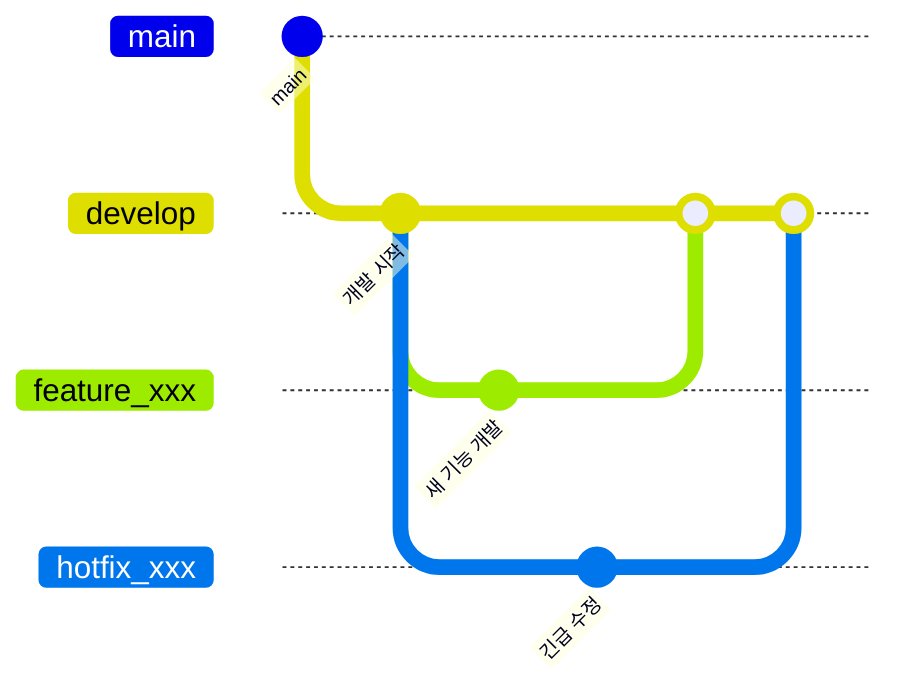
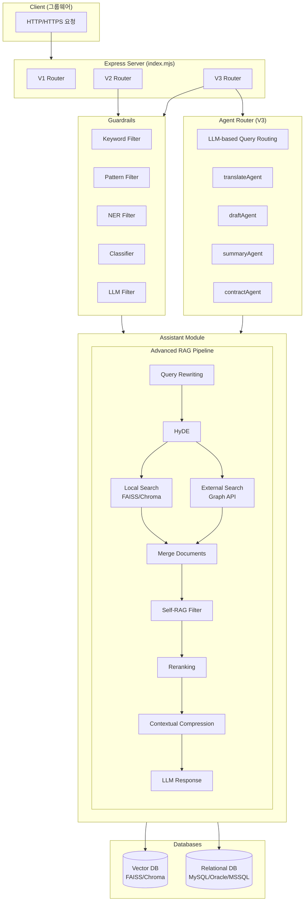
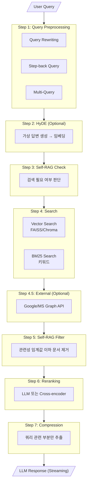
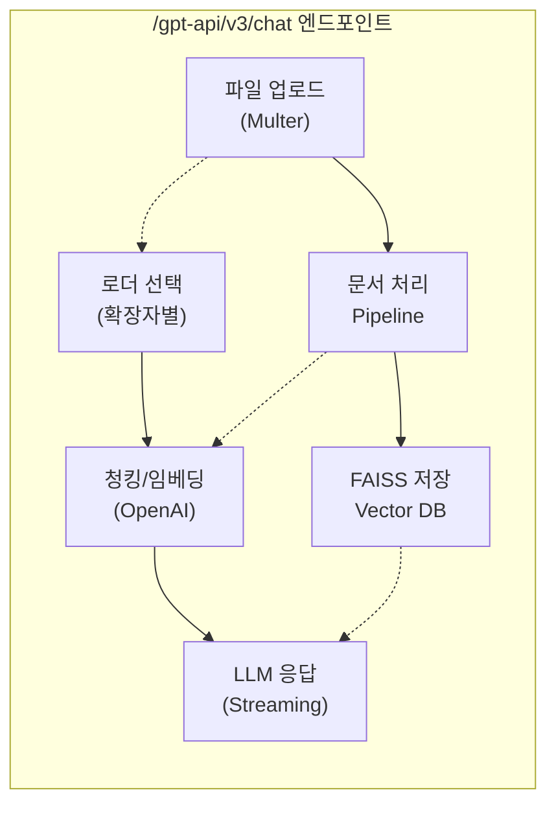
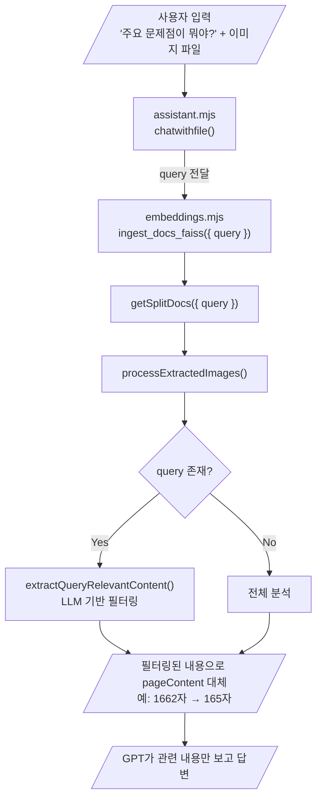
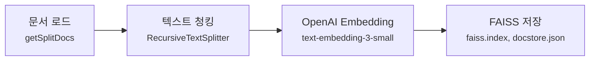
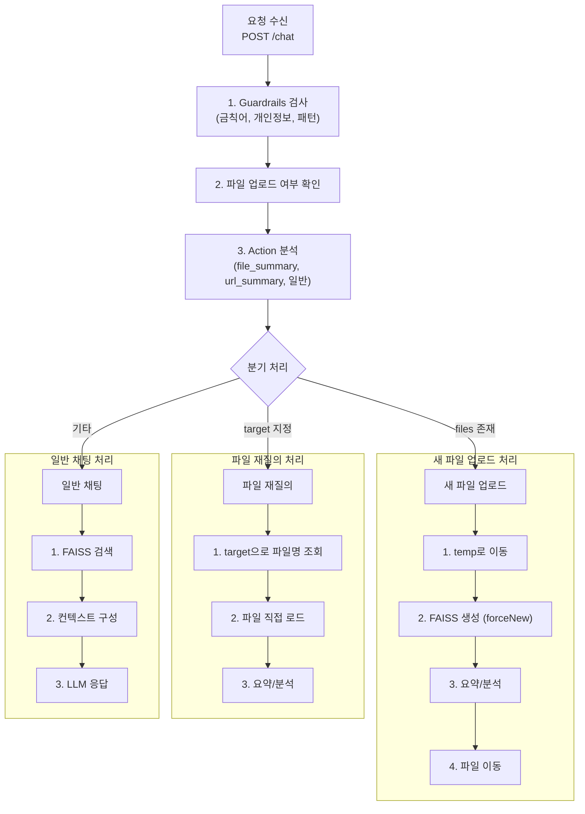
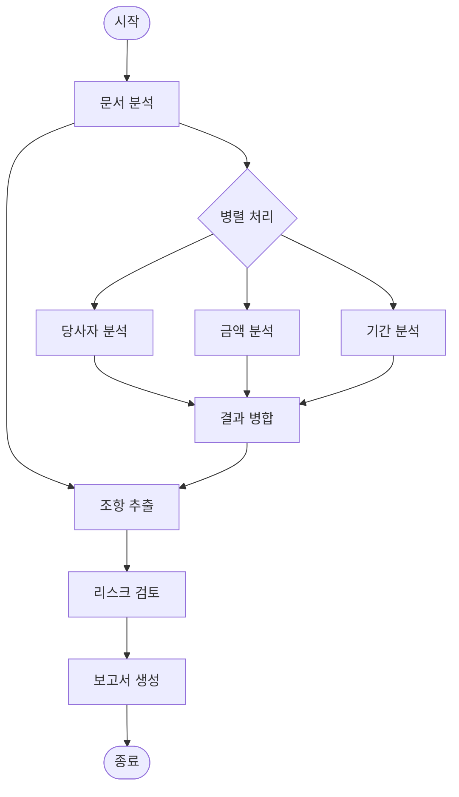

# CoviAI에 오신 것을 환영합니다!

안녕하세요! CoviAI 프로젝트에 관심을 가져주셔서 감사합니다.

이 문서는 **처음 이 프로젝트를 접하는 분들**을 위해 작성되었어요. 신규 입사자분이든, 오픈소스에 처음 기여하시는 분이든, 이 문서만 읽으면 프로젝트의 전체 그림을 이해하실 수 있을 거예요.

걱정 마세요. 천천히 하나씩 설명해 드릴게요!

---

## 이 프로젝트가 뭔가요?

**CoviAI**는 한마디로 **"AI 비서가 탑재된 그룹웨어 API 서버"**입니다.

코비젼 그룹웨어를 사용하는 회사에서, 직원들이 AI에게 질문하면 회사 내부 문서(게시판, 결재문서, 메일 등)를 참고해서 답변해주는 시스템이에요.

예를 들면:
- "지난달 회의록에서 결정된 사항이 뭐였지?"
- "휴가 신청서 양식 어디 있어?"
- "이 계약서 검토해줘"

이런 질문에 AI가 회사 문서를 찾아서 답변해주는 거예요. 단순히 ChatGPT를 연결한 게 아니라, **회사 데이터를 학습(임베딩)**해서 맥락에 맞는 답변을 제공합니다.

이런 기술을 **RAG(Retrieval-Augmented Generation)**이라고 불러요. 어려운 용어 같지만, 그냥 "검색해서 답변하기" 정도로 이해하시면 돼요.

---

## 어떤 기술을 사용하나요?

기술 스택을 처음 보면 복잡해 보일 수 있는데, 하나씩 쉽게 설명해 드릴게요.

### 서버 (백엔드)

```
Node.js + Express.js
```

자바스크립트로 서버를 만드는 가장 대중적인 조합이에요. 웹 개발 경험이 있으시다면 익숙하실 거예요.

특이한 점은 파일 확장자가 `.mjs`라는 건데요, 이건 ES Modules 방식을 사용한다는 표시예요. `require()` 대신 `import/export`를 쓴다는 것만 기억하시면 돼요.

### AI 엔진

```
OpenAI GPT-4o + LangChain
```

ChatGPT의 API를 사용하고 있어요. **LangChain**이라는 프레임워크가 OpenAI와 우리 시스템 사이에서 다리 역할을 해줍니다.

LangChain이 뭔지 모르셔도 괜찮아요! 그냥 "AI를 쉽게 쓸 수 있게 해주는 도구"라고 생각하시면 됩니다.

### 데이터베이스

두 가지 종류의 DB를 사용해요:

1. **벡터 DB (FAISS)**: 문서를 숫자로 변환해서 저장하는 곳. "비슷한 문서 찾기"에 사용해요.
2. **관계형 DB (MySQL 등)**: 일반적인 데이터(사용자 정보, 설정 등) 저장

벡터 DB가 낯설게 느껴지실 수 있는데, 자세한 건 나중에 필요할 때 공부하셔도 돼요!

---

## 프로젝트 구조 한눈에 보기

폴더 구조가 처음엔 복잡해 보이지만, 핵심만 알면 쉬워요.

```
coviAI/
├── src/                        # 소스코드는 여기!
│   ├── index.mjs              # 서버 시작점 (여기서 시작!)
│   ├── routes/                # API 엔드포인트들
│   │   ├── v1/                # 옛날 버전 (거의 안 씀)
│   │   ├── v2/                # 현재 운영 버전 ⭐
│   │   └── v3/                # 최신 고급 버전 ⭐⭐
│   ├── crawler/               # 문서 임베딩 관련
│   └── assistant/             # AI 응답 생성 로직
│
├── faiss_storage/             # 벡터 DB 파일들
├── settings.env               # 설정 파일 (비밀번호 등)
└── sample_settings.env        # 설정 파일 예시
```

**팁**: 처음엔 `src/index.mjs` → `src/routes/v3/index.mjs` → `src/routes/v3/assistant/assistant.mjs` 순서로 코드를 따라가 보세요. 전체 흐름이 보일 거예요!

---

## API 버전이 왜 3개나 있나요?

프로젝트가 발전하면서 버전이 나뉘게 됐어요.

### V1 - 초기 버전
> "일단 돌아가게 만들자!"

처음 만들었던 버전이에요. 지금은 거의 사용하지 않고, 기존 시스템 호환을 위해 남겨두고 있어요.

### V2 - 현재 운영 버전 ⭐
> "그룹웨어 모든 기능을 AI로!"

지금 가장 많이 쓰이는 버전이에요. 62개 이상의 API가 있고, 메일 요약, 결재문서 분석, 번역 등 다양한 기능을 제공해요.

주요 기능:
- `/chat` - AI와 대화하기
- `/summary/mail` - 메일 요약
- `/translate` - 번역
- `/approval` - 결재문서 분석

### V3 - 최신 고급 버전 ⭐⭐
> "더 똑똑하게, 더 정확하게!"

V2의 모든 기능에 더해서 고급 AI 기능이 추가됐어요:

- **Advanced RAG**: 더 정확한 문서 검색
- **멀티 에이전트**: 여러 AI가 협력해서 작업 (예: 계약서 검토)
- **외부 데이터 연동**: Google Drive, Microsoft 365 연결

---

## 처음 실행해보기

직접 서버를 띄워보고 싶으시다면, 이 순서대로 따라해 보세요!

### 1단계: 설정 파일 만들기

```bash
# 설정 파일 템플릿을 복사해요
cp sample_settings.env settings.env
```

### 2단계: 설정 파일 수정하기

`settings.env` 파일을 열어서 필수 값들을 입력해주세요:

```ini
# OpenAI API 키 (필수!)
OPENAI_SK=sk-xxxxxxxxxxxxxxxx

# 어떤 버전 API를 쓸지 (v2 권장)
API_VERSION=v2

# 그 외 DB 설정 등...
```

**주의**: `settings.env`에는 API 키 같은 비밀 정보가 들어가요. 절대 git에 올리면 안 돼요! (이미 `.gitignore`에 등록되어 있어요)

### 3단계: 의존성 설치

```bash
npm install
```

패키지가 많아서 시간이 좀 걸릴 수 있어요.

### 4단계: 서버 실행!

```bash
node src/index.mjs
```

### 5단계: 잘 되는지 확인

브라우저나 터미널에서:

```bash
curl http://localhost:3000/gpt-api
```

`OK : 192.168.x.x` 같은 응답이 오면 성공이에요!

---

## 개발할 때 알아두면 좋은 것들

### 코드 스타일

```javascript
// ES Modules 방식 (require 대신 import)
import { something } from './module.mjs';

// 비동기는 async/await 사용
async function doSomething() {
    const result = await fetchData();
    return result;
}
```

### 새 API 만들기

새로운 기능을 추가하고 싶다면:

1. `src/routes/v3/index.mjs`를 열어요
2. 비슷한 API를 찾아서 복사해요
3. 수정해요!

```javascript
// 예시: 새로운 API 추가
router.post("/myNewApi", async (req, res) => {
    try {
        const { userInput } = req.body;

        // 여기에 로직 작성
        const result = await assistant.doSomething(userInput);

        res.json({ success: true, data: result });
    } catch (error) {
        console.error('[myNewApi] 오류:', error);
        res.status(500).json({ error: error.message });
    }
});
```

### 디버깅 팁

문제가 생겼을 때:

1. **콘솔 로그 확인**: 서버 터미널에 에러 메시지가 찍혀요
2. **settings.env 확인**: API 키가 제대로 들어갔는지 확인
3. **파일 경로 확인**: Windows와 Linux의 경로 구분자가 달라요 (`\` vs `/`)

---

## 자주 묻는 질문 (FAQ)

### Q: OpenAI API 키는 어디서 받나요?
**A**: https://platform.openai.com/api-keys 에서 발급받을 수 있어요. 회사 계정이 있다면 관리자에게 문의해 보세요.

### Q: 벡터 DB(FAISS)가 뭔가요?
**A**: 문서를 숫자(벡터)로 변환해서 저장하는 특수한 데이터베이스예요. "비슷한 문서 찾기"를 엄청 빠르게 할 수 있어요. 자세한 원리는 나중에 공부해도 돼요!

### Q: LangChain이 뭔가요?
**A**: AI 애플리케이션을 쉽게 만들 수 있게 해주는 프레임워크예요. OpenAI API를 직접 호출하는 것보다 훨씬 편하게 만들어줘요.

### Q: V2와 V3 중에 뭘 써야 하나요?
**A**:
- 안정성이 중요하면 → **V2**
- 최신 기능이 필요하면 → **V3**

대부분의 경우 V2로 충분해요!

### Q: 에러가 나요! 어떻게 하죠?
**A**:
1. 에러 메시지를 잘 읽어보세요 (힌트가 있어요)
2. `settings.env` 설정을 확인해보세요
3. 동료에게 물어보세요!

---

## 기술 명세 상세

여기서부터는 좀 더 기술적인 내용이에요. 필요할 때 참고하세요!

### 지원하는 데이터베이스

| DB 종류 | 설정값 | 용도 |
|--------|--------|------|
| SQLite | `RDB_TYPE=sqlite` | 개발/테스트용 (설정 간단) |
| MySQL | `RDB_TYPE=mysql` | 운영 환경 권장 |
| Oracle | `RDB_TYPE=oracle` | 기업용 |
| MSSQL | `RDB_TYPE=mssql` | Microsoft 환경 |
| Tibero | `RDB_TYPE=tibero` | 국산 DB |

### 지원하는 문서 형식

임베딩(벡터화)할 수 있는 파일들:

| 형식 | 설명 |
|------|------|
| PDF | Adobe PDF 문서 |
| DOCX/DOC | Microsoft Word |
| XLSX/XLS | Microsoft Excel |
| PPTX/PPT | Microsoft PowerPoint |
| HWP | 한글 문서 (Java 필요) |
| TXT, CSV, HTML | 텍스트 기반 파일들 |

### 보안 기능 (Guardrails)

사용자 입력을 필터링하는 5가지 보안 레이어:

1. **Keyword Guard**: 금지어 필터링
2. **Pattern Guard**: 정규식 패턴 매칭
3. **NER Guard**: 개인정보(이름, 전화번호 등) 감지
4. **Classifier Guard**: ML 기반 분류
5. **LLM Guard**: AI가 직접 판단

### Advanced RAG 기능 (V3)

V3에서 사용할 수 있는 고급 검색 기능들:

| 기능 | 설정 | 설명 |
|------|------|------|
| Semantic Chunking | `USE_SEMANTIC_CHUNKING=Y` | 문서를 의미 단위로 분할 |
| Query Rewriting | `USE_QUERY_REWRITING=Y` | 질문을 검색에 최적화된 형태로 변환 |
| HyDE | `USE_HYDE=Y` | 가상 답변을 만들어서 검색 정확도 향상 |
| Self-RAG | `USE_SELF_RAG=Y` | AI가 스스로 검색 결과 품질 판단 |
| Reranking | `USE_RERANKING=Y` | 검색 결과 재정렬 |

기본값은 모두 `N`(비활성화)이에요. 필요한 것만 켜서 사용하세요!

### 환경 설정 주요 항목

```ini
# === 기본 설정 ===
API_VERSION=v3          # 사용할 API 버전
SERVICE_PORT=3000       # 서버 포트

# === AI 설정 ===
GPT_MODEL=gpt-4o-mini           # 기본 모델
GPT_HIGH_MODEL=gpt-4.5-preview  # 고급 모델

# === DB 설정 ===
VECTOR_DB_TYPE=faiss    # 벡터 DB (faiss 또는 chroma)
RDB_TYPE=sqlite         # 관계형 DB

# === 보안 설정 ===
GUARDRAILS=Y            # 보안 필터 활성화
```

더 자세한 설정은 `sample_settings.env` 파일을 참고하세요!

---

## Git 브랜치는 어떻게 관리하나요?

### 브랜치 구조



### 작업 흐름

1. **새 기능 개발할 때**
   ```bash
   git checkout develop
   git checkout -b feature_내기능이름
   # 작업...
   # PR 생성 → develop에 병합
   ```

2. **긴급 수정할 때**
   ```bash
   git checkout develop
   git checkout -b hotfix_버그수정
   # 수정...
   # PR 생성 → develop에 병합
   ```

### 주요 브랜치들

| 브랜치 | 용도 |
|--------|------|
| `develop` | 개발 통합 브랜치 |
| `feature_Advanced_RAG` | Advanced RAG 기능 |
| `feature_contract_agent` | 계약서 검토 에이전트 |
| `feature_coviAI_ver3` | V3 API 개발 |

---

## 도움이 필요하면?

- **코드 이해가 안 될 때**: 주석을 읽어보거나, 동료에게 물어보세요
- **에러가 해결 안 될 때**: 에러 메시지 전체를 복사해서 공유해주세요
- **새 기능을 만들고 싶을 때**: 비슷한 기능의 코드를 참고하세요

이 프로젝트는 계속 발전하고 있어요. 질문이나 개선 아이디어가 있다면 언제든 환영합니다!

---

---

# 📘 공식 기술 명세서 (Technical Reference)

여기서부터는 공식 기술 문서입니다. API 명세, 아키텍처, 배포 가이드 등 상세한 기술 정보를 제공합니다.

---

## 시스템 아키텍처

### 전체 데이터 흐름



**구성 요소 설명:**

| 계층 | 구성 요소 | 설명 |
|------|----------|------|
| Client | 그룹웨어 | HTTP/HTTPS 요청 발생 |
| Express | V1/V2/V3 Router | API_VERSION 설정에 따라 선택 |
| Guardrails | 5개 필터 | 입력 검증 (Keyword, Pattern, NER, Classifier, LLM) |
| Agent Router | 4개 에이전트 | LLM 기반 라우팅 (V3 전용) |
| Assistant | Advanced RAG | 검색 → 필터 → 재순위 → 압축 → 응답 |
| Database | Vector/RDB | FAISS, Chroma / MySQL, Oracle 등 |

### Advanced RAG 파이프라인 (V3)



**파이프라인 단계별 환경변수:**

| 단계 | 기능 | 환경변수 | 설명 |
|------|------|----------|------|
| 1 | Query Preprocessing | `USE_QUERY_REWRITING=Y` | 쿼리 재작성 |
| 1 | | `USE_STEP_BACK_QUERY=Y` | Step-back 쿼리 |
| 1 | | `USE_MULTI_QUERY=Y` | 복합 쿼리 분해 |
| 2 | HyDE | `USE_HYDE=Y` | 가상 답변 문서 생성 |
| 3 | Self-RAG Check | `USE_SELF_RAG_NEEDS_RETRIEVAL=Y` | 검색 필요성 판단 |
| 4 | Search | `USE_FUSION_RETRIEVAL=Y` | BM25 + Vector 하이브리드 |
| 4.5 | External Search | `USE_EXTERNAL_DATA_SOURCES=Y` | 외부 API 연동 |
| 5 | Self-RAG Filter | `USE_SELF_RAG=Y` | 관련성 필터링 |
| 6 | Reranking | `USE_RERANKING=Y` | LLM 기반 재순위 |
| 6 | | `USE_CROSS_ENCODER_RERANKING=Y` | 로컬 모델 (무료) |
| 7 | Compression | `USE_CONTEXTUAL_COMPRESSION=Y` | 컨텍스트 압축 |

---

## 임베딩 및 채팅 엔드포인트 기술 상세

### 채팅 파일 처리 아키텍처



### 문서 로더 시스템

#### 지원 파일 형식 및 로더

| 확장자 | 로더 | 설명 |
|--------|------|------|
| `.pdf` | `PdfLoader` | Node.js 네이티브, 이미지 추출 지원 |
| `.docx` | `DocxLoader` | Mammoth 기반 |
| `.pptx` | `PptxLoader` | ADM-ZIP 기반 |
| `.xlsx`, `.xls` | `ExcelLoader` | SheetJS 기반 |
| `.hwp`, `.hwpx` | `FileConvertLoader` | JAR 변환기 사용 |
| `.png`, `.jpg`, `.jpeg`, `.gif`, `.webp`, `.bmp` | `ImageLoader` | GPT Vision 분석 |
| `.txt`, `.csv` | `NodeTextLoader` | 텍스트 직접 로드 |

#### 로더 선택 로직

```javascript
// embeddings.mjs - getSplitDocs()
const loaderMap = USE_NODE_LOADERS ? {
    ".pdf": (filePath) => new PdfLoader(filePath, { extractImages: USE_IMAGE_EXTRACTION }),
    ".jpg": (filePath) => new ImageLoader(filePath),
    // ...
} : { /* LangChain 기본 로더 */ };

const loader = new DirectoryLoader(docDirectory, loaderMap);
```

### 이미지 처리 파이프라인

#### 문서 분류 시스템 (Document Classifier)

```javascript
// documentClassifier.mjs
classifyDocument(textContent, images, pageCount) → {
    type: 'text_heavy' | 'image_heavy' | 'mixed',
    skipImageAnalysis: boolean,
    processAllImages: boolean,
    processTopImages: number
}
```

| 문서 유형 | 조건 | 처리 방식 |
|----------|------|-----------|
| `text_heavy` | 이미지/텍스트 비율 < 0.1 | 이미지 분석 스킵 가능 |
| `image_heavy` | 비율 > 0.5 | 모든 이미지 처리 |
| `mixed` | 0.1 ≤ 비율 ≤ 0.5 | 상위 N개 이미지만 처리 |

#### 이미지 분석 방식

**1) 개별 분석 (기존)**
```
이미지 1 → [유형 분석 API] → [설명 생성 API] → [키워드 추출 API]
이미지 2 → [유형 분석 API] → [설명 생성 API] → [키워드 추출 API]
... (이미지당 2-4회 API 호출)
```

**2) 통합 분석 (USE_UNIFIED_IMAGE_ANALYSIS=Y)**
```
이미지 1 → [통합 분석 API 1회] → { type, description, keywords, layout_elements }
이미지 2 → [통합 분석 API 1회] → { type, description, keywords, layout_elements }
... (이미지당 1회 API 호출)
```

#### 병렬 처리 (visionAnalyzer.mjs)

```javascript
async analyzeImagesWithLayoutParallel(images, options) {
    const batches = this.createBatches(images, concurrency); // 기본 3개씩
    for (const batch of batches) {
        const results = await Promise.all(
            batch.map(img => this.analyzeImageUnified(img))
        );
        // 배치 단위 병렬 처리
    }
}
```

### 쿼리 기반 섹션 추출 (Query-based Section Extraction)

이미지 문서에서 사용자 질문과 관련된 섹션만 정확하게 추출하는 기능입니다.

#### 동작 원리



#### 주요 함수

| 함수 | 파일 | 설명 |
|------|------|------|
| `extractQueryRelevantContent()` | `embeddings.mjs` | LLM 기반 쿼리 관련 내용 추출 |
| `analyzeImageWithQuery()` | `visionAnalyzer.mjs` | 단일 이미지 쿼리 기반 분석 |
| `analyzeImagesWithQuery()` | `visionAnalyzer.mjs` | 다중 이미지 쿼리 기반 분석 |
| `filterSectionsByQuery()` | `layoutDetector.mjs` | 키워드 기반 섹션 필터링 |
| `formatSectionResult()` | `layoutDetector.mjs` | 섹션 결과 포맷팅 |

#### 사용 시나리오

**쿼리 없이 파일만 업로드:**
```
사용자: [이미지 파일 첨부]
시스템: 전체 문서 분석 → 모든 섹션 포함
```

**쿼리와 함께 파일 업로드:**
```
사용자: "주요 문제점이 뭐야?" + [이미지 파일 첨부]
시스템: LLM 필터링 → "주요 문제점" 섹션만 추출 → 해당 내용만 답변
```

#### 환경변수

```ini
# 쿼리 기반 추출은 USE_IMAGE_PROCESSING=Y 일 때 자동 동작
USE_IMAGE_PROCESSING = Y
```

### FAISS 인덱스 생성 흐름



#### 주요 함수: `ingest_docs_faiss()`

```javascript
// embeddings.mjs
export async function ingest_docs_faiss(crawler_id, docDirectory, collection_directory, options = {}) {
    const { forceNew = false } = options;

    // forceNew: 기존 인덱스 완전 삭제 후 새로 생성 (데이터 혼재 방지)
    if (forceNew && fs.existsSync(collection_directory)) {
        fs.rmSync(collection_directory, { recursive: true, force: true });
    }

    // 문서 로드 및 처리
    const result = await getSplitDocs(docDirectory);
    const { docs, chunkSettings } = result;

    // 대용량 파일: 배치 임베딩
    if (useBatchEmbedding) {
        vectorStore = await batchEmbedDocuments(cleanedDocs, collection_directory);
    } else {
        vectorStore = await FaissStore.fromDocuments(cleanedDocs, new OpenAIEmbeddings());
    }

    await vectorStore.save(collection_directory);
    return docs;
}
```

#### 청킹 전략

| 방식 | 환경변수 | 설명 |
|------|----------|------|
| 기본 청킹 | - | `RecursiveCharacterTextSplitter` (4000자, 오버랩 200) |
| 시맨틱 청킹 | `USE_SEMANTIC_CHUNKING=Y` | 의미 경계 기반 자동 분할 |
| 대용량 파일 최적화 | 자동 감지 | 파일 크기에 따라 청크 크기 자동 조정 |

### 채팅 엔드포인트 요청 처리 흐름



#### 파일 재질의 로직

```javascript
// assistant.mjs - chatwithfile()

// actionInfo.target = 파일 ID (예: "20260121142130682")
if (actionInfo.target && actionInfo.target !== '') {
    filename = await util.getFilenameById(actionInfo.target, sorceDir);
    // filename = "20260121142130682_ChatGPT를 넘어 생성형 AI 시대로.pdf"
}

if (files?.length == 0 && filename) {
    // 재질의: FAISS 무시, 해당 파일 직접 로드 (다른 파일 데이터 혼재 방지)
    Docs = await embeddings.getFileSplitDoc(sorceDir, filename);
}
```

#### 스트리밍 응답

```javascript
res.setHeader('Transfer-Encoding', 'chunked');
let responseStream = new Readable();
responseStream.pipe(res);

// LLM 스트리밍 응답
for await (const chunk of llmStream) {
    responseStream.push(chunk);
}
responseStream.push(null); // 스트림 종료
```

### 이미지 처리 환경변수

```ini
USE_IMAGE_PROCESSING = Y           # 이미지 추출 + GPT Vision 분석
USE_LAYOUT_DETECTION = Y           # 레이아웃 분석
IMAGE_ANALYSIS_MODEL = gpt-4o-mini # Vision 모델
IMAGE_ANALYSIS_CONCURRENCY = 3     # 병렬 처리 동시성
USE_UNIFIED_IMAGE_ANALYSIS = Y     # 통합 분석 (API 호출 최소화)
```

### 문서 분류 환경변수

```ini
AUTO_CLASSIFY_DOCUMENT = Y         # 자동 분류 활성화
SKIP_IMAGE_FOR_TEXT_HEAVY = N      # 텍스트 위주 문서 이미지 스킵
TEXT_HEAVY_THRESHOLD = 0.1         # 텍스트 위주 판정 기준
IMAGE_HEAVY_THRESHOLD = 0.5        # 이미지 위주 판정 기준
MIXED_PROCESS_STRATEGY = top       # 혼합 문서: top(상위N개) 또는 all(전체)
MIXED_TOP_IMAGES = 5               # 혼합 문서 처리 이미지 수
```

### 파일 저장 구조

```
file_storage/
└── {assistant_path}/              # 예: routing-agent
    └── chat/
        └── {empno}/               # 사용자 ID
            ├── user_upload_file_temp/   # 임시 업로드 (처리 중)
            ├── user_upload_file/        # 처리 완료 파일 보관
            └── ingest_docs/             # FAISS 인덱스
                ├── faiss.index          # 벡터 인덱스
                └── docstore.json        # 문서 메타데이터
```

### 성능 최적화 포인트

| 최적화 | 적용 방식 | 효과 |
|--------|-----------|------|
| 문서 분류 | 텍스트/이미지 비율 분석 | 불필요한 이미지 처리 스킵 |
| 병렬 처리 | 배치 단위 Promise.all | 이미지 분석 시간 단축 |
| 통합 분석 | 단일 API 호출 | API 호출 2-4회 → 1회 |
| forceNew | FAISS 완전 초기화 | 데이터 혼재 방지 |
| 배치 임베딩 | 대용량 파일 자동 감지 | 메모리 효율화 |

### 주요 의존성

```json
{
  "@langchain/community": "FAISS, 문서 로더",
  "@langchain/openai": "OpenAI 임베딩, ChatOpenAI",
  "faiss-node": "FAISS 벡터 검색",
  "openai": "GPT Vision API",
  "multer": "파일 업로드 처리",
  "mammoth": "DOCX 파싱",
  "pdf-parse": "PDF 파싱"
}
```

---

## 디렉토리 구조 상세

```
coviAI/
├── src/
│   ├── index.mjs                    # 서버 진입점 (Express 초기화)
│   ├── util.mjs                     # 공통 유틸리티 함수
│   │
│   ├── assistant/                   # 공통 Assistant 모듈
│   │   └── assistant.mjs            # 기본 Assistant 클래스
│   │
│   ├── crawler/                     # RAG 파이프라인
│   │   ├── embeddings.mjs           # 문서 임베딩 & 벡터 저장
│   │   ├── advancedRag.mjs          # Advanced RAG 기능 (V3)
│   │   ├── externalDataSources.mjs  # 외부 데이터 소스 통합 레이어
│   │   ├── externalDataProviders.mjs # 외부 API 구현체
│   │   ├── fileDownloader.js        # 파일 다운로드 & 파싱
│   │   ├── fileConvertLoader.mjs    # HWP 등 변환 (Java 기반)
│   │   ├── fileLoaderProcess.mjs    # 파일 로더 프로세스 관리
│   │   │
│   │   ├── loaders/                 # 커스텀 문서 로더
│   │   │   ├── pdfLoader.mjs        # PDF 로더 (이미지 추출 지원)
│   │   │   ├── docxLoader.mjs       # DOCX 로더 (Mammoth 기반)
│   │   │   ├── pptxLoader.mjs       # PPTX 로더 (ADM-ZIP 기반)
│   │   │   ├── excelLoader.mjs      # Excel 로더 (SheetJS 기반)
│   │   │   ├── imageLoader.mjs      # 이미지 로더 (GPT Vision)
│   │   │   └── textLoader.mjs       # 텍스트 로더
│   │   │
│   │   ├── imageExtractor/          # 이미지 추출 및 분석
│   │   │   ├── visionAnalyzer.mjs   # GPT Vision 분석기
│   │   │   ├── documentClassifier.mjs # 문서 유형 분류기
│   │   │   ├── imageHelper.mjs      # 이미지 유틸리티
│   │   │   └── officeImageExtractor.mjs # Office 이미지 추출
│   │   │
│   │   └── layoutParser/            # 문서 레이아웃 분석
│   │       ├── layoutParser.mjs     # 레이아웃 파서 진입점
│   │       ├── layoutDetector.mjs   # 레이아웃 감지 & 쿼리 필터링
│   │       └── layoutElements.mjs   # 레이아웃 요소 정의
│   │
│   ├── sql/                         # 데이터베이스 연결
│   │   └── connection/
│   │       └── dbConnector.js       # DB Factory Pattern
│   │
│   └── routes/
│       ├── v1/                      # V1 API (Legacy)
│       │   ├── index.mjs            # V1 라우터
│       │   ├── assistant/           # V1 Assistant
│       │   ├── sql/                 # V1 SQL 쿼리
│       │   └── tools/               # V1 도구들
│       │
│       ├── v2/                      # V2 API (Production)
│       │   ├── index.mjs            # V2 라우터 (62+ 엔드포인트)
│       │   ├── assistant/
│       │   │   ├── assistant.mjs    # V2 Assistant 클래스
│       │   │   └── assistantDAO.mjs # 데이터 접근 객체
│       │   ├── sql/
│       │   │   ├── cp/              # Covision CP 플랫폼 SQL
│       │   │   ├── mp/              # Covision MP 플랫폼 SQL
│       │   │   ├── mysql/           # MySQL 쿼리
│       │   │   ├── oracle/          # Oracle 쿼리
│       │   │   ├── mssql/           # MSSQL 쿼리
│       │   │   └── tibero/          # Tibero 쿼리
│       │   └── tools/
│       │       ├── guardrail/       # 보안 Guardrails
│       │       │   ├── guardrail.mjs        # 메인 가드레일
│       │       │   ├── keywordGuard.mjs     # 키워드 필터
│       │       │   ├── patternGuard.mjs     # 패턴 필터
│       │       │   ├── nerGuard.mjs         # NER 필터
│       │       │   ├── classifierGuard.mjs  # 분류 필터
│       │       │   ├── llmContextGuard.mjs  # LLM 필터
│       │       │   ├── synonymMap.json      # 유의어 사전
│       │       │   ├── patternMap.json      # 패턴 사전
│       │       │   └── nerDictionary.json   # NER 사전
│       │       └── publisher/
│       │
│       └── v3/                      # V3 API (Advanced)
│           ├── index.mjs            # V3 라우터 (68+ 엔드포인트)
│           ├── assistant/
│           │   └── assistant.mjs    # V3 Assistant (Advanced RAG)
│           ├── agent/               # 멀티 에이전트 시스템
│           │   ├── agentRouter.mjs  # LLM 기반 에이전트 라우터
│           │   ├── agent_registry.json # 에이전트 등록 정보
│           │   └── contractAgent/   # 계약서 검토 에이전트
│           │       ├── graph/       # LangGraph 워크플로우
│           │       │   ├── contractGraph.mjs  # 메인 그래프
│           │       │   └── graphState.mmd     # 상태 다이어그램
│           │       ├── nodes/       # 그래프 노드들
│           │       │   ├── analyzeNode.mjs    # 분석 노드
│           │       │   ├── extractNode.mjs    # 추출 노드
│           │       │   └── reviewNode.mjs     # 검토 노드
│           │       └── tools/       # 에이전트 도구들
│           └── sql/
│
├── faiss_storage/                   # FAISS 벡터 저장소
│   └── {companycode}/
│       └── {vectordb_name}/
│           ├── faiss.index          # FAISS 인덱스 파일
│           └── docstore.json        # 문서 메타데이터
│
├── file_storage/                    # 업로드 파일 저장소
├── notebook_storage/                # 노트북 데이터
├── sqlite_storage/                  # SQLite DB 파일
├── certificate/                     # SSL 인증서
├── public/                          # 정적 파일
├── views/                           # EJS 템플릿
│
├── settings.env                     # 환경 설정 (gitignore)
├── sample_settings.env              # 환경 설정 템플릿
├── package.json                     # 의존성 정의
├── CLAUDE.md                        # Claude Code 가이드
└── HELLO.md                         # 개발자 가이드 (이 문서)
```

---

## API 엔드포인트 명세

### V2 API 엔드포인트 (62+)

#### 채팅/대화

| 엔드포인트 | 메서드 | 설명 | 요청 Body |
|-----------|--------|------|-----------|
| `/chat` | POST | RAG 기반 AI 채팅 | `{ query, history[], files[] }` |
| `/chatwithfile` | POST | 파일 기반 채팅 | `{ query, fileId }` |
| `/chatInit` | POST | 채팅방 초기화 | `{ roomId }` |
| `/saveGptChat` | POST | 대화 내역 저장 | `{ roomId, messages[] }` |
| `/getGptChat` | POST | 대화 내역 조회 | `{ roomId }` |
| `/deleteGptChat` | POST | 대화 내역 삭제 | `{ roomId }` |

#### 문서 처리

| 엔드포인트 | 메서드 | 설명 | 요청 Body |
|-----------|--------|------|-----------|
| `/summary/mail` | POST | 메일 요약 | `{ mailContent }` |
| `/summary/unreadmessage` | POST | 읽지 않은 메시지 요약 | `{ messages[] }` |
| `/approval` | POST | 결재문서 분석 | `{ documentContent }` |
| `/translate` | POST | 다국어 번역 | `{ text, targetLang }` |
| `/proofread` | POST | 맞춤법 검사 | `{ text }` |
| `/write` | POST | 문서 작성 | `{ prompt, style }` |
| `/replymail` | POST | 메일 답장 생성 | `{ originalMail, tone }` |

#### 프롬프트 관리

| 엔드포인트 | 메서드 | 설명 | 요청 Body |
|-----------|--------|------|-----------|
| `/setPrompt` | POST | 프롬프트 저장 | `{ title, content, category }` |
| `/getPromptList` | POST | 프롬프트 목록 | `{ category, page }` |
| `/getPromptDetail` | POST | 프롬프트 상세 | `{ promptId }` |
| `/deletePrompt` | POST | 프롬프트 삭제 | `{ promptId }` |
| `/sharePrompt` | POST | 프롬프트 공유 | `{ promptId, shareWith[] }` |
| `/setPromptFavorite` | POST | 즐겨찾기 설정 | `{ promptId, favorite }` |

#### 크롤링/임베딩

| 엔드포인트 | 메서드 | 설명 | 요청 Body |
|-----------|--------|------|-----------|
| `/crawler` | POST | 파일 업로드 및 임베딩 | `multipart/form-data` |
| `/crawler/board` | POST | 게시판 크롤링 | `{ boardId }` |
| `/crawler/board/all` | POST | 전체 게시판 크롤링 | `{ }` |
| `/crawler/delete` | POST | 임베딩 삭제 | `{ documentId }` |

#### 사용자/설정

| 엔드포인트 | 메서드 | 설명 | 요청 Body |
|-----------|--------|------|-----------|
| `/userSetting` | POST | 사용자 설정 관리 | `{ settings }` |
| `/chatgptsetting` | GET | ChatGPT 설정 조회 | - |
| `/namecard` | POST | 명함 인식 (OCR) | `multipart/form-data` |

### V3 추가 엔드포인트

#### 에이전트

| 엔드포인트 | 메서드 | 설명 | 요청 Body |
|-----------|--------|------|-----------|
| `/agent/route` | POST | 에이전트 라우팅 | `{ query }` |
| `/agent/contract` | POST | 계약서 검토 | `{ contractFile }` |
| `/agent/translate` | POST | 번역 에이전트 | `{ text, sourceLang, targetLang }` |
| `/agent/draft` | POST | 문서 초안 에이전트 | `{ topic, style }` |
| `/agent/summary` | POST | 요약 에이전트 | `{ content }` |

#### 노트북

| 엔드포인트 | 메서드 | 설명 | 요청 Body |
|-----------|--------|------|-----------|
| `/notebook/create` | POST | 노트북 생성 | `{ title }` |
| `/notebook/list` | GET | 노트북 목록 | - |
| `/notebook/upload` | POST | 노트북에 파일 업로드 | `multipart/form-data` |
| `/notebook/chat` | POST | 노트북 기반 채팅 | `{ notebookId, query }` |

---

## 핵심 모듈 상세

### 1. Assistant 모듈

**경로**: `src/routes/{version}/assistant/assistant.mjs`

Assistant 클래스는 모든 AI 기능의 핵심입니다.

```javascript
class Assistant {
    // 생성자
    constructor(options) {
        this.llm = new ChatOpenAI({ model: process.env.GPT_MODEL });
        this.embeddings = new OpenAIEmbeddings();
        this.vectorStore = null;
    }

    // 주요 메서드
    async chat(query, history, options)          // RAG 기반 채팅
    async chatwithfile(query, fileId, options)   // 파일 기반 채팅
    async summarize(content, type)               // 요약
    async translate(text, targetLang)            // 번역
    async proofread(text)                        // 맞춤법 검사
    async draft(prompt, style)                   // 문서 작성
}
```

### 2. Advanced RAG 모듈

**경로**: `src/crawler/advancedRag.mjs`

| 클래스 | 기능 | 환경변수 |
|--------|------|----------|
| `SemanticChunker` | 의미 기반 문서 분할 | `USE_SEMANTIC_CHUNKING` |
| `QueryTransformer` | 쿼리 재작성/확장 | `USE_QUERY_REWRITING` |
| `HyDERetriever` | 가상 문서 임베딩 | `USE_HYDE` |
| `SelfRAG` | 검색 필요성/관련성 판단 | `USE_SELF_RAG` |
| `Reranker` | LLM 기반 재순위화 | `USE_RERANKING` |
| `CrossEncoderReranker` | 로컬 모델 재순위화 | `USE_CROSS_ENCODER_RERANKING` |
| `FusionRetriever` | BM25 + Vector 하이브리드 | `USE_FUSION_RETRIEVAL` |
| `ContextualCompressor` | 컨텍스트 압축 | `USE_CONTEXTUAL_COMPRESSION` |

### 3. Guardrails 모듈

**경로**: `src/routes/v2/tools/guardrail/`

```javascript
// 사용 예시
import { guardrail } from './tools/guardrail/guardrail.mjs';

const result = await guardrail.checkInput(userInput);
if (result.blocked) {
    return res.status(400).json({
        error: result.reason,
        guard: result.triggeredGuard
    });
}
```

| 가드 | 파일 | 설정 파일 | 동작 |
|------|------|-----------|------|
| Keyword | `keywordGuard.mjs` | `synonymMap.json` | 금지어 및 유의어 매칭 |
| Pattern | `patternGuard.mjs` | `patternMap.json` | 정규식 패턴 매칭 |
| NER | `nerGuard.mjs` | `nerDictionary.json` | 개인정보 감지 |
| Classifier | `classifierGuard.mjs` | - | ML 기반 분류 (점수 임계값) |
| LLM | `llmContextGuard.mjs` | - | Ollama 로컬 LLM 판단 |

### 4. 외부 데이터 소스 모듈

**경로**: `src/crawler/externalDataSources.mjs`, `externalDataProviders.mjs`

```javascript
import {
    searchExternalSources,
    mergeDocuments,
    getDataSourceMode
} from './externalDataSources.mjs';

// 외부 소스 검색
const externalDocs = await searchExternalSources(query, {
    sources: ['google', 'microsoft', 'covision'],
    maxResults: 10,
    userContext: { userCode, empno }
});

// 로컬 + 외부 병합
const mergedDocs = mergeDocuments(localDocs, externalDocs, 'append');
```

**데이터 소스 모드**:
- `local`: 로컬 데이터만 (FAISS)
- `external`: 외부 데이터만 (Graph API)
- `merged`: 로컬 + 외부 병합 (기본값)

### 5. 이미지 분석 모듈 (Image Extractor)

**경로**: `src/crawler/imageExtractor/`

이미지 추출 및 GPT Vision 기반 분석을 담당하는 모듈입니다.

| 파일 | 클래스/함수 | 기능 |
|------|------------|------|
| `visionAnalyzer.mjs` | `VisionAnalyzer` | GPT Vision API 기반 이미지 분석 |
| `documentClassifier.mjs` | `classifyDocument()` | 문서 유형 분류 (text_heavy, image_heavy, mixed) |
| `imageHelper.mjs` | 유틸리티 | 이미지 크기, 포맷 변환 등 |
| `officeImageExtractor.mjs` | `extractImages()` | Office 문서 이미지 추출 |

#### VisionAnalyzer 주요 메서드

```javascript
class VisionAnalyzer {
    // 단일 이미지 분석
    async analyzeImage(image, options)

    // 통합 분석 (유형 + 설명 + 키워드 + 레이아웃)
    async analyzeImageUnified(image, options)

    // 배치 병렬 분석
    async analyzeImagesWithLayoutParallel(images, options)

    // 쿼리 기반 분석 (관련 섹션만 추출)
    async analyzeImageWithQuery(image, query, options)
    async analyzeImagesWithQuery(images, query, options)
}
```

#### 문서 분류 기준

| 유형 | 조건 | 처리 방식 |
|------|------|----------|
| `text_heavy` | 이미지/텍스트 비율 < 0.1 | 이미지 분석 스킵 가능 |
| `image_heavy` | 비율 > 0.5 | 모든 이미지 분석 |
| `mixed` | 0.1 ≤ 비율 ≤ 0.5 | 상위 N개만 분석 |

### 6. 레이아웃 분석 모듈 (Layout Parser)

**경로**: `src/crawler/layoutParser/`

문서 레이아웃 감지 및 쿼리 기반 섹션 추출을 담당합니다.

| 파일 | 클래스/함수 | 기능 |
|------|------------|------|
| `layoutParser.mjs` | - | 모듈 진입점, export 관리 |
| `layoutDetector.mjs` | `LayoutDetector` | 레이아웃 감지 및 섹션 추출 |
| `layoutElements.mjs` | `Rectangle`, `TextBlock`, `Layout` | 레이아웃 요소 정의 |

#### 주요 함수

```javascript
// layoutDetector.mjs

// GPT를 이용한 레이아웃 감지
class LayoutDetector {
    async detect(image, options)        // 레이아웃 감지
    async detectWithQuery(image, query) // 쿼리 기반 감지
}

// 쿼리 기반 섹션 필터링
function filterSectionsByQuery(sections, query)

// 섹션 결과 포맷팅
function formatSectionResult(sectionResult, relevantOnly)

// 키워드 추출
function extractKeywords(text)
```

#### 사용 예시

```javascript
import { LayoutDetector, filterSectionsByQuery } from './layoutParser/layoutParser.mjs';

const detector = new LayoutDetector();

// 전체 레이아웃 감지
const layout = await detector.detect(imageData);

// 쿼리 관련 섹션만 추출
const relevantSections = filterSectionsByQuery(layout.sections, "주요 문제점");
```

### 7. 유틸리티 모듈

**경로**: `src/util.mjs`

#### 주요 함수

| 함수 | 설명 |
|------|------|
| `cleanText(text)` | HTML 태그, 특수문자 제거 |
| `cleanTextForEmbedding(text)` | 임베딩용 텍스트 정제 (줄바꿈 정규화, 공백 제거) |
| `optimizeMetadata(metadata)` | 메타데이터 최적화 (불필요 필드 제거) |
| `generateContentHash(content)` | 콘텐츠 해시 생성 (중복 감지용) |
| `getFilenameById(fileId, dir)` | 파일 ID로 파일명 조회 |
| `getLLM(options)` | LLM 인스턴스 생성 |
| `getEmbeddings(options)` | 임베딩 인스턴스 생성 |

```javascript
import util from './util.mjs';

// 텍스트 정제
const cleanedText = util.cleanTextForEmbedding(rawText);

// 메타데이터 최적화
const optimized = util.optimizeMetadata(doc.metadata);

// 콘텐츠 해시 (중복 체크)
const hash = util.generateContentHash(content);
```

### 8. 멀티 에이전트 시스템 (V3)

**경로**: `src/routes/v3/agent/`

```javascript
// agent_registry.json 구조
{
    "agents": [
        {
            "name": "translateAgent",
            "agentName": "번역 에이전트",
            "skills": ["번역", "언어 변환"],
            "handler": "translate"
        },
        {
            "name": "contractAgent",
            "agentName": "계약서 검토 에이전트",
            "skills": ["계약서 분석", "리스크 식별"],
            "handler": "contractReview"
        }
    ]
}
```

**계약서 검토 에이전트 (LangGraph)**:



---

## 환경 설정 전체 레퍼런스

### 기본 설정

| 변수명 | 기본값 | 설명 |
|--------|--------|------|
| `API_VERSION` | `v2` | API 버전 (v1, v2, v3) |
| `SERVICE_PORT` | `3000` | HTTP 포트 |
| `SERVICE_PORT_SSL` | `3001` | HTTPS 포트 |
| `HTTP_PROTOCOL` | `Y` | HTTP 활성화 |
| `HTTPS_PROTOCOL` | `N` | HTTPS 활성화 |

### LLM 설정

| 변수명 | 기본값 | 설명 |
|--------|--------|------|
| `OPENAI_SK` | - | OpenAI API 키 (필수) |
| `ENC_OPENAI_API_KEY` | - | 암호화된 API 키 |
| `GPT_MODEL` | `gpt-4o-mini` | 기본 모델 |
| `GPT_HIGH_MODEL` | `gpt-4.5-preview` | 고급 모델 |
| `LLM_BASE_URL` | - | 커스텀 LLM URL (Ollama 등) |
| `TEMPERATURE` | `0.7` | 응답 창의성 (0.0~1.0) |

### Vector DB 설정

| 변수명 | 기본값 | 설명 |
|--------|--------|------|
| `VECTOR_DB_TYPE` | `faiss` | 벡터 DB 종류 (faiss, chroma) |
| `VECTOR_DB_URL` | - | Chroma 서버 URL |
| `EMBEDDING_MODEL` | `text-embedding-ada-002` | 임베딩 모델 |

### Relational DB 설정

| 변수명 | 기본값 | 설명 |
|--------|--------|------|
| `RDB_TYPE` | `sqlite` | DB 종류 |
| `DB_HOST` | `localhost` | DB 호스트 |
| `DB_PORT` | - | DB 포트 |
| `DB_USER` | - | DB 사용자 |
| `DB_PASSWORD` | - | DB 비밀번호 |
| `DB_NAME` | - | DB 이름 |

### Guardrails 설정

| 변수명 | 기본값 | 설명 |
|--------|--------|------|
| `GUARDRAILS` | `Y` | 가드레일 전체 활성화 |
| `GUARDRAILS_KEYWORD` | `Y` | 키워드 필터 |
| `GUARDRAILS_PATTERN` | `Y` | 패턴 필터 |
| `GUARDRAILS_NER` | `N` | NER 필터 |
| `GUARDRAILS_CLASSIFIER` | `N` | 분류 필터 |
| `GUARDRAILS_LLM` | `N` | LLM 필터 |

### Advanced RAG 설정 (V3)

| 변수명 | 기본값 | 설명 |
|--------|--------|------|
| `USE_SEMANTIC_CHUNKING` | `N` | 의미 기반 청킹 |
| `USE_QUERY_REWRITING` | `N` | 쿼리 재작성 |
| `USE_HYDE` | `N` | HyDE (가상 문서) |
| `USE_STEP_BACK_QUERY` | `N` | Step-back 쿼리 |
| `USE_MULTI_QUERY` | `N` | 멀티 쿼리 |
| `USE_SELF_RAG` | `N` | Self-RAG |
| `USE_FUSION_RETRIEVAL` | `N` | Fusion 검색 |
| `USE_RERANKING` | `N` | LLM 리랭킹 |
| `USE_CROSS_ENCODER_RERANKING` | `N` | Cross-encoder 리랭킹 |
| `USE_CONTEXTUAL_COMPRESSION` | `N` | 컨텍스트 압축 |

### 외부 데이터 소스 설정

| 변수명 | 기본값 | 설명 |
|--------|--------|------|
| `USE_EXTERNAL_DATA_SOURCES` | `N` | 외부 소스 활성화 |
| `DATA_SOURCE_MODE` | `merged` | 데이터 소스 모드 |
| `EXTERNAL_SOURCE_MAX_RESULTS` | `10` | 소스당 최대 결과 수 |
| `EXTERNAL_SOURCE_MERGE_STRATEGY` | `append` | 병합 전략 |
| `USE_GOOGLE_GRAPH` | `N` | Google Graph API |
| `USE_MS_GRAPH` | `N` | Microsoft Graph API |
| `USE_COVISION_GW` | `N` | Covision 그룹웨어 |

---

## 배포/운영 매뉴얼

### 개발 환경 설정

```ini
# settings.env (개발)
HTTP_PROTOCOL=Y
SERVICE_PORT=3000
USE_MANAGER=Y
USE_SWAGGER=Y
LOG_LEVEL=4
RDB_TYPE=sqlite
```

### 운영 환경 설정

```ini
# settings.env (운영)
HTTPS_PROTOCOL=Y
SERVICE_PORT_SSL=3001
USE_MANAGER=N
USE_SWAGGER=N
LOG_LEVEL=2
GUARDRAILS=Y

# SSL 인증서
SSL_KEY_PATH=./certificate/private.key
SSL_CERT_PATH=./certificate/certificate.crt
SSL_CA_PATH=./certificate/chain-bundle.pem
```

### 배포 체크리스트

```
□ 환경 설정 확인
  □ API 키 암호화 적용 (ENC_OPENAI_API_KEY)
  □ DB 연결 정보 확인
  □ HTTPS 인증서 경로 확인

□ 보안 설정
  □ USE_MANAGER=N
  □ USE_SWAGGER=N
  □ GUARDRAILS=Y
  □ CORS_ALLOWED 도메인 제한

□ 성능 설정
  □ LOG_LEVEL=2 (운영)
  □ 적절한 RAG 설정 (비용 vs 성능)

□ 외부 의존성
  □ Java 8+ 설치 (HWP 변환용)
  □ Oracle Client 설치 (Oracle DB 사용 시)

□ 디렉토리 생성
  □ ./faiss_storage/
  □ ./file_storage/
  □ ./sqlite_storage/ (SQLite 사용 시)
```

### 서버 실행

```bash
# 개발 모드
node src/index.mjs

# PM2로 운영 (권장)
pm2 start src/index.mjs --name coviAI
pm2 save
pm2 startup

# 로그 확인
pm2 logs coviAI
```

### 헬스체크

```bash
# HTTP
curl http://localhost:3000/gpt-api
# 응답: "OK : 192.168.x.x"

# HTTPS
curl -k https://localhost:3001/gpt-api
```

---

## 트러블슈팅 가이드

### 일반 오류

| 증상 | 원인 | 해결 |
|------|------|------|
| `OPENAI_SK is required` | API 키 미설정 | settings.env에 OPENAI_SK 설정 |
| `FAISS index not found` | 벡터 저장소 없음 | `./faiss_storage/` 디렉토리 생성 |
| `Connection refused` | DB 연결 실패 | DB 서버 상태 및 접속 정보 확인 |
| `ENOENT: chain-bundle.pem` | SSL 인증서 없음 | 인증서 파일 경로 확인 |

### HWP 변환 오류

```bash
# Java 설치 확인
java -version

# 환경변수 설정
NODE_JAVA_PATH=/usr/bin/           # Linux
NODE_JAVA_PATH=C://java-1.8.0.../bin//  # Windows
```

### Oracle 연결 오류

```bash
# Oracle Instant Client 설치
# settings.env 설정
ORA_CLIENT_SET_PATH=/opt/oracle/instantclient_19_8
```

### 메모리 부족

```bash
# Node.js 메모리 증가
node --max-old-space-size=4096 src/index.mjs
```

### 임베딩 실패

1. API 키 확인: `ENC_OPENAI_API_KEY` 또는 `OPENAI_SK`
2. 네트워크 확인: OpenAI API 접근 가능 여부
3. 파일 형식 확인: 지원되는 문서 형식인지 확인

---

## 성능 튜닝 가이드

### RAG 설정 프로필

**비용 최소화 (기본)**
```ini
USE_QUERY_REWRITING=N
USE_RERANKING=N
USE_HYDE=N
USE_SELF_RAG=N
```

**균형 (권장)**
```ini
USE_SEMANTIC_CHUNKING=Y
USE_FUSION_RETRIEVAL=Y
USE_CROSS_ENCODER_RERANKING=Y  # 무료, 빠름
```

**최고 품질 (비용 발생)**
```ini
USE_QUERY_REWRITING=Y
USE_HYDE=Y
USE_RERANKING=Y
USE_SELF_RAG=Y
USE_CONTEXTUAL_COMPRESSION=Y
```

### 청킹 최적화

| 문서 유형 | 권장 설정 |
|----------|----------|
| 짧은 문서 (FAQ) | `CHUNK_SIZE=500`, `CHUNK_OVERLAP=50` |
| 일반 문서 | `CHUNK_SIZE=1000`, `CHUNK_OVERLAP=200` |
| 긴 문서 (보고서) | `USE_SEMANTIC_CHUNKING=Y` |

### 검색 최적화

| 상황 | 권장 설정 |
|------|----------|
| 정확한 키워드 검색 | `USE_FUSION_RETRIEVAL=Y` (BM25 포함) |
| 의미 기반 검색 | `USE_HYDE=Y` |
| 노이즈 많은 결과 | `USE_SELF_RAG=Y`, `USE_RERANKING=Y` |

---

## Swagger API 문서

Swagger UI를 통해 API를 테스트할 수 있습니다.

### 활성화

```ini
USE_SWAGGER=Y
SWAGGER_HOST_NAME=https://your-domain:3000
```

### 접속

```
개발: http://localhost:3000/api-docs
운영: https://your-domain:3000/api-docs
```

---

## 마무리

여기까지 읽으셨다면, 이제 CoviAI의 전체적인 모습이 보이실 거예요.

처음엔 복잡해 보여도, 하나씩 파고들다 보면 금방 익숙해질 거예요. 모든 걸 한 번에 이해하려고 하지 마시고, 필요한 부분부터 차근차근 살펴보세요.

**환영합니다, 그리고 화이팅!**

---

> **문서 버전**: 1.0.8
> **최종 수정**: 2026-01-22
> **대상**: 신규 개발자, 오픈소스 기여자
