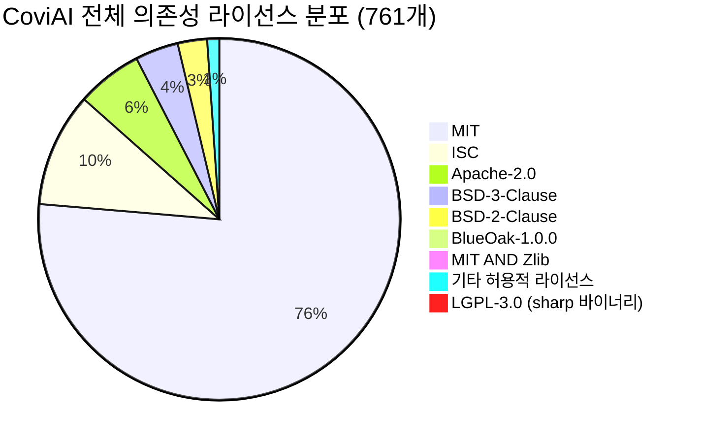
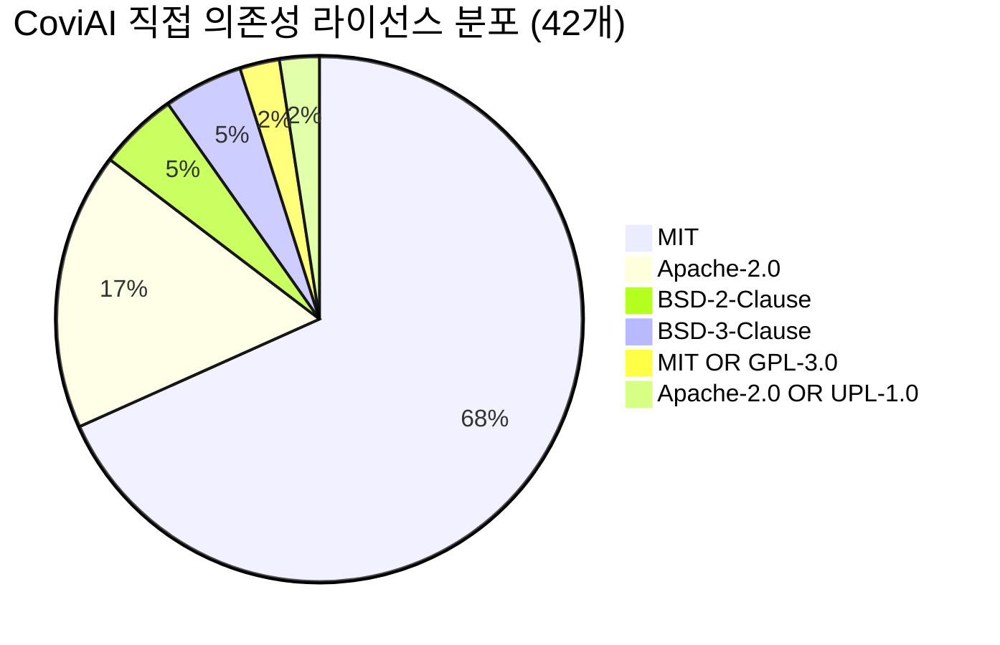
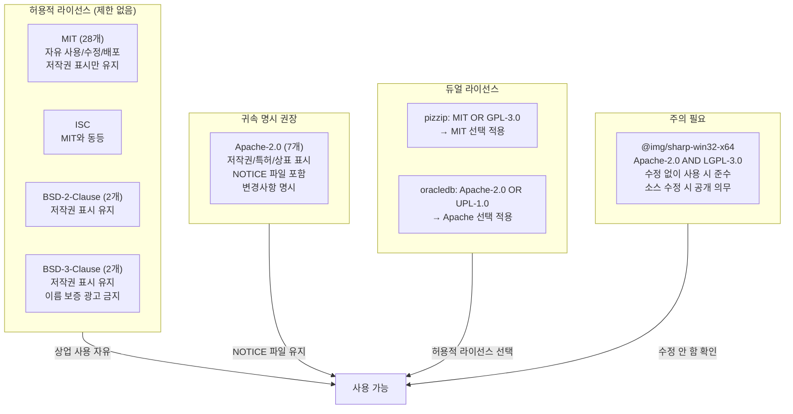

# CoviAI 오픈소스 라이선스 검증 보고서

> **검증일**: 2026-02-13
> **프로젝트**: CoviAI v1.0.6
> **직접 의존성**: 42개 (production 40 + dev 2)
> **전체 의존성** (간접 포함): 761개

---

## 라이선스 분포

---

## 전체 오픈소스 라이선스 목록

### LLM / AI 프레임워크

| 제품명 | 버전 | 라이선스 | 대상 | 용도 | 비고 |
|--------|------|----------|------|------|------|
| langchain | 0.3.36 | MIT | 서버 | LLM 오케스트레이션 메인 프레임워크 | |
| @langchain/core | 0.3.79 | MIT | 서버 | LangChain 코어 모듈 | |
| @langchain/community | 0.3.58 | MIT | 서버 | LangChain 커뮤니티 통합 | |
| @langchain/langgraph | 0.3.12 | MIT | 서버 | 멀티 에이전트 워크플로우 (계약서 검토 등) | |
| @langchain/google-genai | 2.1.11 | MIT | 서버 | Google Gemini LLM 연동 | |
| @langchain/ollama | 0.2.4 | MIT | 서버 | Ollama 로컬 LLM 연동 | |
| @langchain/textsplitters | 0.0.3 | MIT | 서버 | 문서 청킹/분할 | |
| openai | 4.104.0 | Apache-2.0 | 서버 | OpenAI API 클라이언트 | |
| @xenova/transformers | 2.17.2 | Apache-2.0 | 서버 | 로컬 임베딩/Cross-Encoder 모델 | |
| js-tiktoken | 1.0.21 | MIT | 서버 | OpenAI 토큰 카운팅 | |

### 벡터DB / 검색엔진

| 제품명 | 버전 | 라이선스 | 대상 | 용도 | 비고 |
|--------|------|----------|------|------|------|
| faiss-node | 0.5.1 | MIT | 서버 | FAISS 벡터 유사도 검색 엔진 | |

### 문서 파싱 / 변환

| 제품명 | 버전 | 라이선스 | 대상 | 용도 | 비고 |
|--------|------|----------|------|------|------|
| pdf-parse | 1.1.1 | MIT | 서버 | PDF 텍스트 추출 | |
| unpdf | 1.4.0 | MIT | 서버 | PDF 파싱 (대체 엔진) | |
| mammoth | 1.11.0 | BSD-2-Clause | 서버 | DOCX → HTML 변환 | |
| officeparser | 4.2.0 | MIT | 서버 | Office 문서 범용 파싱 | |
| @ohah/hwpjs | 0.1.0-rc.3 | MIT | 서버 | HWP(한글) 파일 파싱 | |
| xlsx | 0.18.5 | Apache-2.0 | 서버 | Excel 파일 읽기/쓰기 | **버전 고정** (0.20+ 비오픈소스) |
| docxtemplater | 3.67.5 | MIT | 서버 | DOCX 템플릿 기반 문서 생성 | |
| pizzip | 3.2.0 | MIT OR GPL-3.0 | 서버 | ZIP 처리 (docxtemplater 의존) | MIT 선택 적용 |
| adm-zip | 0.5.16 | MIT | 서버 | ZIP 압축/해제 | |
| rtf.js | 3.0.9 | MIT | 서버 | RTF 파일 파싱 | |
| csv-parse | 6.1.0 | MIT | 서버 | CSV 파일 파싱 | |
| d3-dsv | 2.0.0 | BSD-3-Clause | 서버 | CSV/TSV 데이터 처리 | |

### 이미지 처리

| 제품명 | 버전 | 라이선스 | 대상 | 용도 | 비고 |
|--------|------|----------|------|------|------|
| sharp | 0.33.5 | Apache-2.0 | 서버 | 이미지 리사이즈/포맷 변환 | |
| @img/sharp-win32-x64 | 0.33.5 | Apache-2.0 AND LGPL-3.0 | 서버 | sharp Windows 네이티브 바이너리 | 수정 없이 사용 → LGPL 준수 |

### 웹 프레임워크 / HTTP

| 제품명 | 버전 | 라이선스 | 대상 | 용도 | 비고 |
|--------|------|----------|------|------|------|
| express | 4.21.2 | MIT | 서버 | HTTP REST API 프레임워크 | |
| cors | 2.8.5 | MIT | 서버 | CORS 미들웨어 | |
| multer | 1.4.5-lts.2 | MIT | 서버 | 파일 업로드(multipart) 처리 | |
| ejs | 3.1.10 | Apache-2.0 | 서버 | HTML 템플릿 엔진 | |
| ws | 8.18.3 | MIT | 서버 | WebSocket 통신 | |
| node-fetch | 3.3.2 | MIT | 서버 | HTTP 클라이언트 (fetch 폴리필) | |

### 웹 스크래핑 / 크롤링

| 제품명 | 버전 | 라이선스 | 대상 | 용도 | 비고 |
|--------|------|----------|------|------|------|
| cheerio | 1.1.2 | MIT | 서버 | HTML 파싱/DOM 조작 | |
| jsdom | 22.1.0 | MIT | 서버 | 브라우저 DOM 에뮬레이션 | |
| @mozilla/readability | 0.6.0 | Apache-2.0 | 서버 | 웹페이지 본문 추출 (Readability) | |

### 데이터베이스 드라이버

| 제품명 | 버전 | 라이선스 | 대상 | 용도 | 비고 |
|--------|------|----------|------|------|------|
| mysql2 | 3.15.3 | MIT | 서버 | MySQL/MariaDB 드라이버 | |
| oracledb | 6.10.0 | Apache-2.0 OR UPL-1.0 | 서버 | Oracle Database 드라이버 | 듀얼 라이선스 (Apache 선택) |
| mssql | 10.0.4 | MIT | 서버 | Microsoft SQL Server 드라이버 | |
| sqlite3 | 5.1.7 | BSD-3-Clause | 서버 | SQLite 네이티브 바인딩 | |
| sqlite | 5.1.1 | MIT | 서버 | SQLite async 래퍼 | |

### 설정 / 유틸리티

| 제품명 | 버전 | 라이선스 | 대상 | 용도 | 비고 |
|--------|------|----------|------|------|------|
| dotenv | 16.6.1 | BSD-2-Clause | 서버 | 환경변수 파일(.env) 로드 | |

### 개발 도구 (devDependencies)

| 제품명 | 버전 | 라이선스 | 대상 | 용도 | 비고 |
|--------|------|----------|------|------|------|
| swagger-jsdoc | 6.2.8 | MIT | 개발 | JSDoc → Swagger 스펙 자동 생성 | 배포 미포함 |
| swagger-ui-express | 5.0.1 | MIT | 개발 | Swagger UI 웹 호스팅 | 배포 미포함 |

---

## 라이선스별 의무사항

---

## 조치 이력

| 날짜 | 조치 내용 | 상태 |
|------|-----------|------|
| 2026-02-13 | `@pspdfkit/nodejs` 제거 — 미사용 상업 라이선스 패키지 | 완료 |
| 2026-02-13 | `readability` 제거 — 미사용, LICENSE 파일 없음 (UNKNOWN) | 완료 |
| 2026-02-13 | `xlsx` 버전 고정 `0.18.5` — v0.20+ 비오픈소스 전환 방지 | 완료 |
| 2026-02-13 | `package.json`에 `"license": "UNLICENSED"` 추가 | 완료 |
| 2026-02-13 | `sharp` LGPL-3.0 확인 — 수정 없이 사용 중이므로 준수 상태 | 확인 |

---

## 결론

- 전체 761개 의존성 중 **99.9%가 허용적(permissive) 라이선스** (MIT, ISC, Apache-2.0, BSD)
- **상업적 사용에 법적 제한이 있는 패키지는 없음**
- `sharp` 바이너리의 LGPL-3.0은 수정 없이 사용하므로 준수 상태
- 제거 대상 2건 (`@pspdfkit/nodejs`, `readability`) 모두 조치 완료
- `xlsx`는 현재 버전(0.18.5) Apache-2.0이나, 업그레이드 방지를 위해 버전 고정 완료