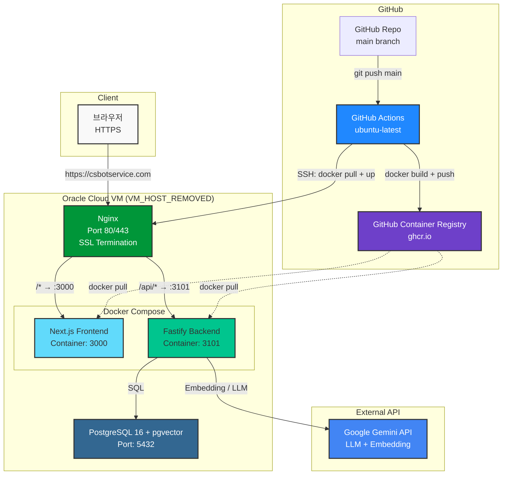
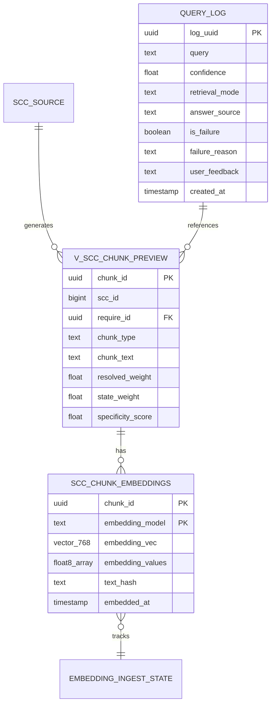
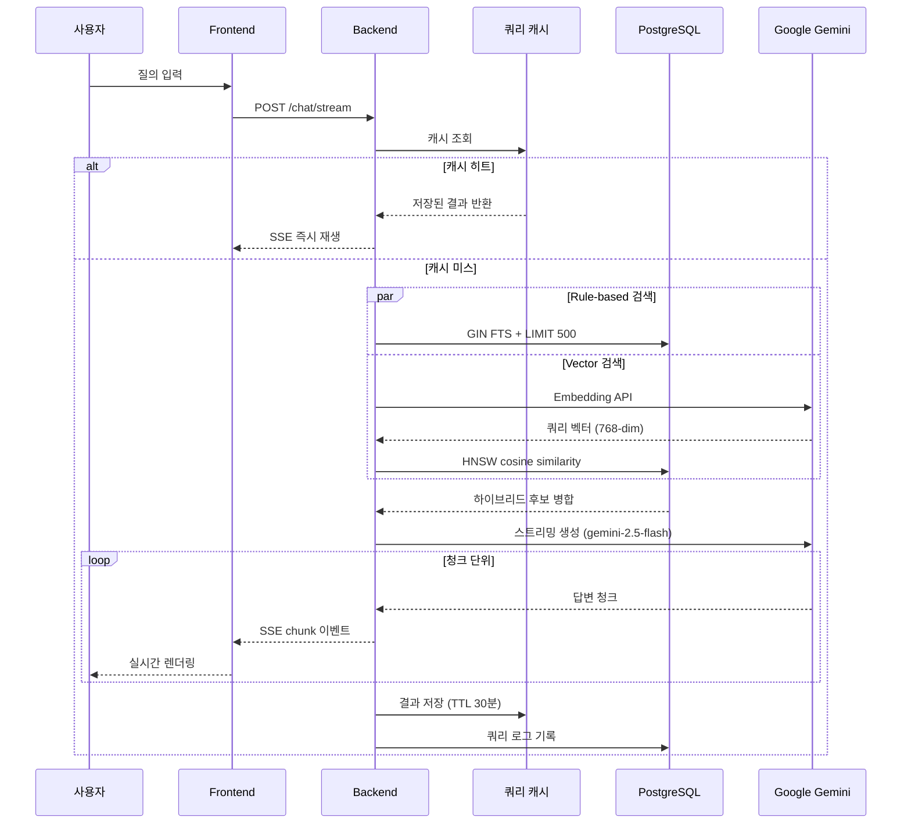

# CoviAI - AI Core 챗봇 시스템

코비전 사내 지원 시스템을 위한 AI 기반 질의응답 챗봇 플랫폼


---

## 🌐 테스트 접속

> Oracle Cloud VM에 배포 완료. 아래 주소에서 바로 사용해볼 수 있습니다.

| 환경 | 주소 |
|------|------|
| **운영 (HTTPS)** | **https://csbotservice.com** |
| API Health | https://csbotservice.com/health |
| 유사 이력 검색 | https://csbotservice.com/search |

**질의 예시:**
- `휴가신청서 상신이 불가해`
- `다국어 코드 추가하는 방법`
- `팝업 차단 설정 해제`
- `결재함이 보이지 않아`

---

## 📋 프로젝트 개요

CoviAI는 사내 매뉴얼, 이력 데이터, FAQ 등을 기반으로 사용자 질의에 대해 실시간으로 답변을 제공하는 RAG(Retrieval-Augmented Generation) 기반 챗봇 시스템입니다.

### 🤖 CS ChatBot
- 📄 [개요 문서 보기](./docs/CS-ChatBot_개요.pdf)

### 현재 데이터 규모
- **임베딩 벡터**: 44,955개 청크 / 44,955개 적재 완료 (100%)
- **벡터 차원**: 768 (Google Gemini Embedding 2)
- **임베딩 커버리지**: 100%
- **청크 타입**: issue, action, resolution, qa_pair
- **검색 방식**: Hybrid (Rule-based + Vector Similarity)

### 평가 결과 (2026-04-11 기준)

#### 50건 운영성 질의셋
| 지표 | 결과 |
|---|---|
| Top1 정확도 | 37/37 (100%) |
| Top3 정확도 | 37/37 (100%) |
| 청크 타입 정확도 | 37/37 (100%) |
| 부정 질의 차단 | 13/13 (100%) |

#### 운영 Smoke 평가 (`csbotservice.com`)
| 지표 | 결과 |
|---|---|
| 대표 질문 | 4건 |
| 통과 | 4/4 |
| 실패 | 0 |
| 확인 항목 | HTTP 200, 답변 본문, 유사 이력 링크, `hybrid` 검색 |

## 🏗️ 시스템 아키텍처

### 전체 구조



### 기술 스택

#### Frontend
- **Framework**: Next.js 16.2.0 (App Router)
- **UI**: React 19, Tailwind CSS
- **마크다운**: react-markdown + remark-gfm
- **상태 관리**: React Hooks
- **저장소**: 서버 DB 대화 이력 hydrate + localStorage optimistic 보조 저장
- **운영 API 호출 규칙**: `/api/chat/stream`, `/api/retrieval/search`, `/api/admin/logs` 등 백엔드 실경로 호환 기준

#### Backend
- **Framework**: Fastify (Node.js)
- **언어**: TypeScript
- **스트리밍**: Server-Sent Events (SSE)
- **데이터베이스**: PostgreSQL + pgvector 0.8.2
- **LLM**: Google Gemini 2.5 Flash
- **Embedding**: Google Gemini Embedding 2 (768-dim)
- **캐시**: 인메모리 Map (TTL 30분, 최대 500 엔트리)

#### Infrastructure
- **클라우드**: Oracle Cloud VM (Ubuntu 22.04, 1GB RAM + 4GB Swap)
- **컨테이너화**: Docker Compose (backend + frontend + nginx)
- **리버스 프록시**: Nginx (HTTPS 443, HTTP→HTTPS 301 리다이렉트, CORS 해결)
- **SSL 인증서**: Let's Encrypt / Certbot (90일 자동 갱신)
- **도메인**: csbotservice.com
- **이미지 최적화**: Multi-stage build, Alpine Linux
- **컨테이너 레지스트리**: GitHub Container Registry (ghcr.io)

#### CI/CD
- **파이프라인**: GitHub Actions (`main` 브랜치 push 시 자동 트리거)
- **빌드 환경**: GitHub Actions runner (ubuntu-latest, 7GB RAM) — VM에서 빌드하지 않음
- **회귀 검사**: 프론트 API 경로 검사 (`npm run check:api-routes`)로 운영 nginx 라우팅과 맞지 않는 `/api/chat`, `/api/search`, `/api/logs` 사용 방지
- **레이어 캐시**: Registry cache (`ghcr.io` cache manifest) 활용으로 반복 빌드 가속
- **배포 방식**: SSH → `docker pull` + `docker compose up -d` (이미지 교체만)
- **배포 버전 표시**: deploy 단계에서 `APP_COMMIT_SHA`, `APP_BUILD_TIME`, `APP_GITHUB_RUN_ID`를 컨테이너에 주입하고 `/health`, `/logs`에서 확인
- **배포 검증**: Production Smoke가 `/health.build.commitSha`와 GitHub Actions 실행 commit을 비교해 이전 컨테이너 잔존 여부 검증
- **단절 시간**: ~10초 (빌드 시간 VM 부담 없음)

## ✨ 주요 기능

### 1. 실시간 스트리밍 응답
- Server-Sent Events (SSE) 기반 실시간 응답 스트리밍
- 단계별 상태 표시: **검색 중** → **생성 중** → **스트리밍**
- 마크다운 렌더링으로 구조화된 답변 표시

### 2. 하이브리드 RAG 검색
- **Rule-based 검색**: 키워드 기반 정확한 매칭 + GIN FTS 2-pass 샘플링
- **Vector 검색**: 시맨틱 유사도 기반 검색 (pgvector HNSW 인덱스)
- **Reranking**: LLM 기반 최종 후보 재정렬

### 3. 대화 이력 관리
- 서버 DB 기반 대화 이력 저장/복원 (`conversation_session`, `conversation_message`)
- localStorage는 optimistic UI 및 임시 보조 저장으로만 사용
- 대화 제목 자동 생성 / 직접 편집 / 삭제 / 전환
- 대화 제목·로드된 메시지 검색, 서버 저장 본문 검색, 검색어 하이라이트, 대화 이력 더보기, 오늘/어제/지난 7일/지난 30일/월별 그룹핑
- 사이드바 삭제 UX 안정화 (중복 삭제 방지, 삭제 중 상태 표시, 빈 대화 강제 생성 방지)
- 대화 이력 hydrate/삭제 동기화 상태 표시
- 멀티턴 컨텍스트 (최근 6개 메시지 LLM에 전달)

### 4. 유사 이력 참조
- Top1 링크 버튼: 최우선 유사 SCC 이력 바로가기
- Top3 유사 이력 카드: 접기/펼치기 토글로 추가 후보 확인
- 관련 질문 추천 chips: 클릭 시 즉시 질문 전송

### 5. 사용자 편의 기능
- 답변 복사 버튼 (클립보드)
- 피드백 버튼 (👍👎 → query_log 업데이트)
- 채팅 내보내기 (`.txt`, `.md`, PDF 저장용 인쇄 화면)
- 다크모드 (localStorage 영속화)

### 6. 운영 기능
- 쿼리 로그 자동 기록 (`ai_core.query_log`)
- 운영 smoke 평가 (`npm run smoke:prod`)
- 배포 후 운영 smoke 자동화 (GitHub Actions에서 `csbotservice.com` 공개 도메인 검증)
- 실패/싫어요 케이스 eval 후보 자동 추출 (`npm run eval:candidates`)
- 관리자 운영 로그 대시보드 (`/logs`) 요약/필터/검색
- 사용자 피드백 분석 (`/logs`) 답변 경로별 분포와 싫어요 Top 질의
- JSP AJAX 연동용 `display` 응답 계약 문서화
- 인메모리 쿼리 캐시 (동일 질문 반복 시 즉시 응답)
- 자동 인제스트 스케줄러 (미임베딩 청크 주기적 동기화)
- 보안 차단 키워드 필터 (SQL Injection, 해킹, 개인정보 등)
- API Rate Limiting (`/chat/stream`, `/retrieval/search`, `/feedback`, `/admin/logs`, `/conversations*`)
- Rate Limit 운영 모니터링 (`/logs`에서 429 차단 요약/최근 이벤트 확인)
- 대화 이력 서버 저장 안정화 (DB hydrate 우선, 로컬 optimistic 대화 보존)
- Query Embedding cooldown 모니터링 (`/logs`에서 429/cooldown 상태 확인)
- Embedding 커버리지 모니터링 (`/logs`에서 모델별 적재율, 미임베딩 수, ingest 상태 확인)
- Embedding 커버리지 자동 알림 (`/health`, `/logs`에서 warning/critical 상태 확인)
- 스트리밍 응답 타이밍 분석 (`/logs`에서 rewrite/TTFT/LLM stream/persistence 확인)
- 관리자 로그 상세 드릴다운 (`/logs`에서 후보 Top3, vector/LLM 진단, 응답 미리보기 확인)
- 배포 버전 확인 (`/health`, `/logs`에서 현재 commit SHA/build time/GitHub Actions run 확인)

## 🚀 성능 최적화

### 최근 적용된 최적화 (2026-03-31)

#### 인메모리 쿼리 캐시
- **목적**: 동일/유사 질문 반복 입력 시 LLM·임베딩 API 호출 제거
- **구현**: Map 기반 TTL 캐시 (TTL 30분, 최대 500 엔트리)
- **효과**: 캐시 히트 시 응답 시간 수백 ms → 즉시 응답
- **확인**: `/health` 응답의 `cache.size`로 현재 엔트리 수 확인 가능

#### 단계별 상태 표시
- **목적**: 첫 SSE 이벤트 도착 전 공백 시간 제거
- **구현**: 메시지 전송 즉시 "유사 이력을 검색하고 있습니다..." 표시 → metadata 수신 시 "답변 생성 중..." → 스트리밍 시작

#### GIN FTS 기반 Rule 검색 (2026-04-07)
- **목적**: LIMIT 500 blind scan → FTS require_id 필터링으로 교체
- **구현**: GIN 인덱스로 관련 require_id 먼저 조회 → 뷰를 id로 필터링 → FTS 결과 < 20건일 때만 LIMIT 150 보완
- **효과**: 44,955행 환경에서 `ruleMs 5000ms → ~300ms` 예상

### 이전 최적화 (2026-03-26)

#### LLM 개인정보 노출 방지
- SCC 원문 내 이름/회사명/내선번호가 답변에 포함되지 않도록 PROMPT_RULESET 규칙 추가

#### 검색 임계값 부동소수점 수정
- `best.score >= 0.45` 비교를 `round2(score) >= 0.45`로 변경하여 벡터 전용 후보 누락 문제 해결

#### 검색 속도 개선 (2026-03-23)
- ruleMs: 3.4초 → **0.3~1.3초** (약 70-90% 개선)

```json
{
  "retrievalMs": 1442,
  "timings": {
    "ruleMs": 297,
    "embeddingMs": 884,
    "vectorMs": 36,
    "rerankMs": 213
  }
}
```

## 📁 프로젝트 구조

```
coviAI/                             # Monorepo 루트
│
├── frontend/                       # Next.js 프론트엔드
│   ├── app/
│   │   ├── page.tsx               # 메인 챗봇 페이지
│   │   ├── search/                # SCC 이력 검색 페이지
│   │   └── api/
│   │       ├── chat/stream/       # 로컬 dev 보조 프록시 (/chat/stream)
│   │       ├── retrieval/search/  # 로컬 dev 보조 프록시 (/retrieval/search)
│   │       ├── admin/logs/        # 로컬 dev 보조 프록시 (/admin/logs)
│   │       ├── feedback/          # 피드백 API 프록시
│   │       └── conversations/     # 대화 이력 API 프록시
│   ├── components/
│   │   └── chatbot/               # 챗봇 UI 컴포넌트
│   │       ├── chat-message.tsx   # 메시지 + Top3 카드 + 재전송/질문수정
│   │       ├── chat-area.tsx      # 채팅 영역
│   │       ├── chat-header.tsx    # 헤더 (검색·내보내기 버튼)
│   │       └── chat-input.tsx     # 입력창 (prefill 지원)
│   ├── hooks/
│   │   ├── use-chat.ts            # 채팅 스트리밍/상태 관리
│   │   └── use-conversations.ts   # 서버 대화 이력 hydrate/삭제 UX
│   ├── lib/
│   │   └── conversations.ts       # 대화 이력 변환/보조 유틸
│   └── package.json
│
├── workspace-fastify/              # Fastify 백엔드
│   ├── src/
│   │   ├── app/
│   │   │   └── server.ts          # 라우트 + 캐시 + 스케줄러 통합
│   │   ├── modules/chat/
│   │   │   ├── chat.service.ts    # RAG 검색 + GIN FTS + 하이브리드 랭킹
│   │   │   ├── llm.service.ts     # Gemini LLM 스트리밍
│   │   │   └── chat.types.ts      # 타입 정의
│   │   └── platform/
│   │       ├── cache/
│   │       │   └── queryCache.ts  # 인메모리 쿼리 캐시 (Map + TTL)
│   │       ├── scheduler/
│   │       │   └── ingestScheduler.ts  # 자동 인제스트 스케줄러
│   │       └── db/
│   │           └── vectorClient.ts     # PostgreSQL 연결 풀
│   ├── scripts/                   # DB 초기화 · 임베딩 적재 스크립트
│   └── docs/
│       ├── eval/                  # 평가셋 및 smoke seed
│       └── integration/           # JSP 연동 계약/샘플
│
├── nginx/                         # Nginx 리버스 프록시 설정 (SSL 포함)
├── docs/
│   └── architecture/
│       └── api-routing.md         # 운영 API 라우팅 규칙
├── .github/workflows/
│   └── deploy.yml                 # CI/CD: 빌드 → ghcr.io 푸시 → VM 배포
├── docker-compose.yml             # Docker Compose 오케스트레이션
├── CLAUDE.md                      # AI 에이전트 인수인계 문서
└── README.md
```

## 🚢 CI/CD 파이프라인

### 전체 흐름

```
git push origin main
        │
        ▼
[GitHub Actions] build job
  ├─ 프론트 API 경로 회귀 검사 (check:api-routes)
  ├─ frontend Dockerfile 빌드 (Next.js)
  ├─ backend Dockerfile 빌드 (Fastify + TypeScript)
  ├─ 레이어 캐시 적용 (ghcr.io cache manifest)
  └─ ghcr.io/jdhert/coviai-frontend:latest 푸시
     ghcr.io/jdhert/coviai-backend:latest 푸시
        │
        ▼
[GitHub Actions] deploy job (build 성공 시)
  SSH → Oracle Cloud VM (VM_HOST_REMOVED)
  ├─ git pull origin main
  ├─ docker compose pull  (새 이미지 수신)
  ├─ docker compose up -d (컨테이너 교체 ~10초 단절)
  └─ curl /health 헬스체크
        │
        ▼
https://csbotservice.com 자동 반영 ✅
```

### GitHub Secrets 구성

| Secret | 설명 |
|---|---|
| `VM_HOST` | Oracle Cloud VM IP (`VM_HOST_REMOVED`) |
| `VM_USER` | SSH 접속 계정 (`ubuntu`) |
| `VM_SSH_KEY` | VM 배포 전용 ed25519 개인키 |

### 빌드 최적화

| 항목 | 내용 |
|---|---|
| 빌드 위치 | GitHub Actions runner (2 vCPU / 7GB RAM) |
| VM 작업 | `docker pull` + `docker compose up -d` 만 수행 |
| 레이어 캐시 | ghcr.io registry cache — `package.json` 미변경 시 `npm ci` 스킵 |
| 이미지 빌드 방식 | Multi-stage (deps → builder → runner) |

### 워크플로우 파일

[`.github/workflows/deploy.yml`](.github/workflows/deploy.yml)

---

## 🔀 운영 API 라우팅 규칙

운영에서는 nginx가 `/api/*` 요청을 Next.js API Route가 아니라 Fastify 백엔드로 직접 전달합니다.

| 브라우저 경로 | 백엔드 실제 경로 |
|---|---|
| `/api/chat/stream` | `/chat/stream` |
| `/api/retrieval/search` | `/retrieval/search` |
| `/api/admin/logs` | `/admin/logs` |
| `/api/feedback` | `/feedback` |
| `/api/conversations*` | `/conversations*` |

주의:
- 운영 프론트에서 `/api/chat`, `/api/search`, `/api/logs`는 사용하지 않습니다.
- 로컬 `frontend/app/api/*`는 개발 편의용 프록시이며 운영 nginx 규칙과 같은 의미를 유지해야 합니다.
- 관련 문서: [docs/architecture/api-routing.md](docs/architecture/api-routing.md)

## 🔧 설치 및 실행

### 방법 1: Docker Compose (권장) 🐳

```bash
# 1. 환경변수 설정
cp .env.example .env
# .env 파일을 열어서 GOOGLE_API_KEY 입력

# 2. 전체 스택 실행
docker compose --env-file .env up -d --build

# 3. 접속
# 브라우저: http://localhost (로컬)
# 운영: https://csbotservice.com
```

**📖 상세 가이드**: [docs/docker.md](docs/docker.md)

---

### 운영 Smoke 평가

배포 후 `csbotservice.com`에서 대표 질문이 정상 답변과 유사 이력 링크를 반환하는지 확인합니다.

```bash
cd workspace-fastify
npm run smoke:prod -- --delay-ms 500
```

GitHub Actions 배포 workflow는 VM 재배포 후 `Production Smoke` job에서 공개 도메인 기준 smoke를 자동 실행하고 결과 JSON을 artifact로 남깁니다.

기본 대상:
- `https://csbotservice.com/health`
- `https://csbotservice.com/api/chat/stream`

평가 기준:
- HTTP 200
- `/health.build.commitSha`가 GitHub Actions 실행 commit SHA와 일치할 것
- `NO_MATCH` 등 오류 응답이 아닐 것
- 답변 본문이 최소 길이 이상일 것
- 대표 질문에는 유사 이력 링크가 붙을 것

`production_smoke.latest.json` 같은 실행 결과 산출물은 Git 추적 대상에서 제외하고, `production_smoke.seed.json`만 기준 데이터로 관리합니다.

---

### 방법 2: 로컬 개발 환경

```bash
# 환경 변수 설정 (workspace-fastify/.env)
GOOGLE_API_KEY=your_google_api_key
GOOGLE_MODEL=gemini-2.5-flash
VECTOR_DB_HOST=VM_HOST_REMOVED   # Oracle Cloud DB
VECTOR_DB_PORT=5432
VECTOR_DB_NAME=ai2
VECTOR_DB_USER=novian
VECTOR_DB_PASSWORD=<db_password_secret>

# 프론트엔드
cd frontend && npm install && npm run dev   # Port 3000

# 백엔드 (별도 터미널)
cd workspace-fastify && npm install && npm run dev   # Port 3101
```

## 📊 데이터베이스 스키마



**📖 상세 문서**: [docs/database.md](docs/database.md)

## 🔄 RAG 검색 흐름



## 📚 문서

| 문서 | 설명 |
|------|------|
| [docs/docker.md](docs/docker.md) | 🐳 Docker 배포 가이드 |
| [docs/API.md](docs/API.md) | API 엔드포인트 명세서 |
| [docs/database.md](docs/database.md) | 데이터베이스 스키마 및 ERD |
| [docs/architecture/api-routing.md](docs/architecture/api-routing.md) | 운영 nginx/API 라우팅 규칙 |
| [workspace-fastify/README.md](workspace-fastify/README.md) | 백엔드 상세 운영 가이드 |
| [workspace-fastify/docs/integration/jsp-chat-contract.md](workspace-fastify/docs/integration/jsp-chat-contract.md) | JSP AJAX 연동 계약 |
| [workspace-fastify/docs/integration/chat_widget.sample.jsp](workspace-fastify/docs/integration/chat_widget.sample.jsp) | JSP 샘플 위젯 |
| [CLAUDE.md](CLAUDE.md) | AI 에이전트 인수인계 문서 |

## 📈 향후 개선 계획

### 완료
- [x] Docker 컨테이너화 (docker-compose.yml, Nginx 리버스 프록시)
- [x] SSE 스트리밍 응답
- [x] 하이브리드 검색 (Rule + Vector + GIN FTS)
- [x] 마크다운 렌더링
- [x] 멀티턴 대화 컨텍스트
- [x] 쿼리 로그 및 피드백 시스템
- [x] Top3 유사 이력 카드 (접기/펼치기)
- [x] 관련 질문 추천 chips
- [x] 채팅 내보내기 (.txt)
- [x] 인메모리 쿼리 캐시 (Map + TTL 30분)
- [x] 자동 인제스트 스케줄러
- [x] 다크모드 영속화
- [x] 단계별 응답 상태 표시
- [x] 모바일 반응형 레이아웃 (햄버거 메뉴, 사이드바 오버레이)
- [x] 메시지 재전송 버튼 및 질문 수정하기
- [x] SCC 이력 검색 페이지 (`/search`, 점수·청크타입·벡터 신호 시각화)
- [x] Oracle Cloud VM 이관 (PostgreSQL + Docker 전체 스택)
- [x] SSL/HTTPS 적용 (Let's Encrypt, csbotservice.com)
- [x] Rule 검색 FTS 필터링 최적화 (ruleMs 5000ms → ~300ms)
- [x] 운영 API 라우팅 규칙 문서화 및 CI 회귀 검사 (`check:api-routes`)
- [x] 운영 smoke 평가 스크립트 (`npm run smoke:prod`)
- [x] 배포 후 운영 smoke 자동화 — GitHub Actions에서 `/health`와 대표 질문 smoke 검증
- [x] 배포 버전 smoke 검증 — `/health.build.commitSha`와 GitHub Actions 실행 commit 비교
- [x] 실패/싫어요 케이스 eval 후보 자동 추출 — `query_log` 기반 수동 검토 후보 JSON 생성
- [x] 대화 이력 DB hydrate 및 삭제 UX 안정화
- [x] JSP AJAX `display` 응답 계약 문서화
- [x] `query_log` 운영 스키마 보정 (`log_uuid`, `is_failure`, `failure_reason`, `user_feedback`)
- [x] 관리자 운영 로그 강화 (`/logs` 요약 카드, 검색어/기간/피드백/느린쿼리 필터)
- [x] 사용자 피드백 분석 강화 (`/logs` 답변 경로별 피드백 분포, 싫어요 Top 질의)
- [x] API Rate Limiting — 운영 노출 API 경로별 요청 제한 적용
- [x] Rate Limit 운영 모니터링 — `/logs`에서 차단 수, 경로 그룹, 최근 이벤트 확인
- [x] 대화 이력 서버 저장 안정화 — 서버 hydrate와 로컬 optimistic 대화 병합, 메시지 append 충돌 방지
- [x] Query Embedding 429/cooldown 대응 강화 — `Retry-After` 반영, `/health`·`/logs` 런타임 상태 노출
- [x] Embedding 커버리지 운영 모니터링 — `/admin/logs`와 `/logs`에서 모델별 coverage, pending chunk, ingest 상태 확인
- [x] Embedding 커버리지 자동 알림 — `/health`와 `/logs`에서 warning/critical 상태 노출
- [x] 스트리밍 응답 타이밍 세분화 — `/chat/stream`의 rewrite, TTFT, LLM stream, persistence 시간을 metadata로 기록
- [x] 관리자 로그 상세 드릴다운 — `/logs`에서 후보 Top3와 vector/LLM 진단 정보 표시
- [x] 대화 이력 UX 개선 — 제목 정제/직접 편집, 제목/내용 검색, 검색어 하이라이트, 더보기, 날짜 그룹핑, 삭제/동기화 상태 표시
- [x] 배포 버전 표시 — GitHub Actions 배포 메타데이터를 `/health`, `/logs`에서 확인

### 완료 (2026-04-02 추가)
- [x] nginx `depends_on` healthcheck 조건 추가 (502 재발 방지)
- [x] 실패 케이스 로그 저장 및 대시보드 (`/logs` 웹 UI)
- [x] 쿼리 리라이팅 (LLM 프리패스, `QUERY_REWRITE_ENABLED=true`)
- [x] 검색·로그 페이지 다크모드 연동 (StorageEvent 동기화)
- [x] 대화 이력 DB 영속화 (`conversation_session` / `conversation_message`)
- [x] DB 뷰 `s+` 버그 표시 레이어 패치 (`repairStrippedS`)

### 고도화 예정

#### 🔴 높은 우선순위
- [ ] **DB 뷰 정규식 근본 수정** — `s+` → `\s+` 수정 후 전체 재임베딩 (Google 쿼터 확보 시)
- [ ] **pgvector ANN 인덱스** — 저차원 모델(768→256)로 전환 후 HNSW 인덱스 활성화
- [x] **API Rate Limiting** — 경로 그룹별 인메모리 요청 제한 적용

#### 🟡 중간 우선순위
- [x] **대화 이력 UI 복원** — `/conversations` API 연동, 사이드바에서 이전 대화 불러오기
- [x] **대화 이력 UX 개선** — 제목 직접 편집, 제목/내용 검색, 검색어 하이라이트, 더보기, 날짜 그룹핑, 삭제/동기화 상태 표시
- [x] **사용자 피드백 수집 강화** — 👍👎 누적 통계 대시보드 (`query_log.user_feedback` 활용)
- [x] **검색 결과 URL 공유** — `/search?q=` 쿼리스트링 반영
- [x] **채팅 내보내기 토스트 알림** — 내보내기 완료/실패 피드백
- [x] **채팅 내보내기 포맷 개선** — `.txt`, Markdown, PDF 저장용 인쇄 화면 지원

#### 🟢 낮은 우선순위 (코드 품질)
- [ ] **page.tsx 커스텀 훅 분리** — `useChat`, `useConversations` 분리
- [x] **임베딩 커버리지 운영 모니터링** — `/logs`에서 모델별 적재율과 미임베딩 수 확인
- [x] **임베딩 커버리지 자동 알림** — 신규 SCC 적재/커버리지 하락 시 `/health`, `/logs` 경고 표시

## 📝 변경 이력

### 2026-04-12
- ✅ **API Rate Limiting 적용** — `/chat/stream`, `/chat`, `/retrieval/search`, `/feedback`, `/admin/logs`, `/conversations*` 경로별 요청 제한과 429 응답 헤더 추가
- ✅ **Rate Limit 운영 모니터링 추가** — `/admin/logs` 응답과 `/logs` 화면에 429 차단 요약/최근 이벤트 표시
- ✅ **대화 이력 서버 저장 안정화** — 서버 대화 hydrate 시 로컬 전용 대화를 보존하고 DB 메시지 append를 세션 단위로 직렬화
- ✅ **Query Embedding cooldown 대응 강화** — 429 발생 시 `Retry-After` 우선 반영, active cooldown과 캐시 통계를 운영 화면에 노출
- ✅ **Embedding 커버리지 모니터링 추가** — `/admin/logs` 응답과 `/logs` 화면에 모델별 coverage, 미임베딩 수, 최근 ingest 상태 표시
- ✅ **Embedding 커버리지 자동 알림 추가** — 임계치 기반 warning/critical 판정과 `/health`, `/logs` 경고 노출
- ✅ **스트리밍 응답 타이밍 세분화** — `/chat/stream` 응답의 rewrite, TTFT, LLM stream, persistence 시간을 `/logs` 드릴다운에서 확인
- ✅ **관리자 로그 상세 드릴다운 추가** — 대화 메시지 metadata 기반 Top 후보, 진단값, 응답 미리보기 표시
- ✅ **대화 이력 UX 개선** — 사이드바 제목 직접 편집, 제목/로드된 메시지 검색, 서버 본문 검색, 검색어 하이라이트, 더보기, 날짜 그룹핑, 서버 hydrate/삭제 동기화 상태 표시
- ✅ **채팅 내보내기 포맷 개선** — 헤더 다운로드 메뉴에서 `.txt`, Markdown, PDF 저장용 인쇄 화면 선택 지원
- ✅ **배포 후 운영 smoke 자동화** — GitHub Actions 배포 완료 후 공개 `/health`와 `production_smoke.seed.json` 대표 질문 자동 검증
- ✅ **실패/싫어요 eval 후보 자동 추출** — `query_log`에서 실패, no-match, 싫어요, 저신뢰 질의를 `query_log_eval_candidates.latest.json`으로 생성
- ✅ **배포 버전 표시 추가** — GitHub Actions commit/build time/run id를 컨테이너에 주입하고 `/health`, `/logs`에서 확인
- ✅ **배포 버전 smoke 검증 추가** — Production Smoke에서 `/health.build.commitSha`가 현재 GitHub Actions commit과 일치하는지 검증

### 2026-04-11
- ✅ **운영 API 라우팅 규칙 고정** — nginx `/api/* → backend` 구조 기준으로 프론트 호출 경로 정리 (`/api/chat/stream`, `/api/retrieval/search`, `/api/admin/logs`)
- ✅ **프론트 API 경로 CI 회귀 검사 추가** — 운영에서 깨지는 `/api/chat`, `/api/search`, `/api/logs` 사용을 배포 전 차단
- ✅ **대화 이력 DB hydrate 안정화** — 사이드바 UI는 유지하면서 초기 복원은 DB에서 수행, localStorage는 optimistic 보조 용도로 축소
- ✅ **대화 삭제 UX 안정화** — 삭제 중 상태 표시, 중복 삭제 방지, 빈 새 대화 강제 생성 방지
- ✅ **운영 smoke 평가 추가** — `npm run smoke:prod`로 `csbotservice.com` 대표 질문 4건 검증, 현재 4/4 통과
- ✅ **JSP AJAX 연동 계약 문서화** — `/chat` JSON 응답의 `display` 객체 기준으로 렌더링 계약 고정
- ✅ **query_log 운영 스키마 보정** — `log_uuid`, `is_failure`, `failure_reason`, `user_feedback` 보장 및 `db:migrate:query-log` 추가
- ✅ **관리자 운영 로그 강화** — `/logs`에서 기간/검색어/피드백/느린쿼리/검색모드 필터와 요약 카드 제공
- ✅ **사용자 피드백 분석 강화** — 답변 경로별 좋아요/싫어요 분포와 싫어요 Top 질의를 운영 화면에서 확인
- ✅ **평가 산출물 관리 정리** — `*.latest.json`은 실행 결과로 보고 Git 추적 제외, seed 파일만 기준 데이터로 관리

### 2026-04-07
- ✅ **Oracle Cloud VM 이관 완료** — PostgreSQL 16 + pgvector 0.8.2 + Docker 전체 스택 이관
- ✅ **SSL/HTTPS 적용** — Let's Encrypt 인증서, HTTP→HTTPS 자동 리다이렉트, HSTS 헤더
- ✅ **도메인 오픈** — https://csbotservice.com 에서 서비스 접속 가능
- ✅ **Rule 검색 성능 최적화** — LIMIT 500 blind scan → FTS require_id 필터링으로 교체 (ruleMs ~5000ms → ~300ms 목표)
- ✅ **임베딩 데이터 확장** — 44,955 청크 적재 완료 (기존 13,255 → 44,955)

### 2026-04-02
- ✅ **대화 이력 DB 영속화** — `/chat/stream` 완료 후 `conversation_session` / `conversation_message` 자동 저장
- ✅ **대화 조회 API** — `GET /conversations`, `GET /conversations/:sessionId/messages` 추가
- ✅ **server.ts 한글 인코딩 수정** — UTF-8 BOM 제거, mojibake 전수 복원
- ✅ **DB 뷰 `s+` 버그 표시 레이어 패치** — `repairStrippedS()` 함수로 BaseConfig 등 답변 텍스트 복원
- ✅ **쿼리 리라이팅 활성화** — docker-compose.yml에 `QUERY_REWRITE_ENABLED=true` 기본값 추가

### 2026-04-03
- ✅ **대화 이력 저장 1차 연결** — 프론트 `conversationId`를 `/chat/stream`에 전달하고 서버에서 세션/메시지 저장
- ✅ **대화 저장 스키마 초기화 스크립트** — `workspace-fastify/scripts/init-conversation-schema.mjs`
- ✅ **대화 조회 API 1차 준비** — 세션 목록/메시지 조회 엔드포인트 추가

### 2026-04-01
- ✅ **모바일 반응형 사이드바** — 햄버거 메뉴 버튼, 오버레이 배경, 사이드바 열기/닫기 상태 관리
- ✅ **메시지 재전송** — 오류 발생 시 마지막 bot 메시지에 '다시 시도' 버튼 표시
- ✅ **질문 수정하기** — 결과 없음(no_match) 시 입력창에 기존 질문 자동 채우기
- ✅ **SCC 이력 검색 페이지** — `/search` 신규 추가, LLM 없이 유사 이력 후보·점수·벡터 신호 시각화
- ✅ **헤더 검색 버튼** — 챗봇 헤더에서 `/search` 페이지로 바로 이동
- ✅ **다크모드 하이드레이션 오류 수정** — `isDarkMode` 초기값 SSR 안전하게 처리, `suppressHydrationWarning` 추가
- ✅ **파비콘 추가** — `public/favicon.ico` 및 `layout.tsx` 메타 등록

### 2026-03-31
- ✅ **단계별 응답 상태 표시** — 메시지 전송 즉시 "유사 이력 검색 중" 표시, metadata/chunk 이벤트에 따라 상태 전환
- ✅ **Top3 유사 이력 접기/펼치기** — 기본 접힘 상태, 토글 버튼으로 카드 목록 표시
- ✅ **관련 질문 추천 chips** — Top2/3 후보 previewText 기반 chip, 클릭 시 즉시 전송
- ✅ **채팅 내보내기** — 헤더 다운로드 버튼으로 대화 전체를 .txt 파일로 저장
- ✅ **다크모드 영속화** — localStorage 저장으로 새로고침 후에도 상태 유지
- ✅ **인메모리 쿼리 캐시** — Map + TTL 30분, 동일 질문 즉시 응답, /health에 cache.size 노출
- ✅ **자동 인제스트 스케줄러** — INGEST_AUTO_ENABLED=true 시 서버 기동 시 미임베딩 청크 자동 동기화

### 2026-03-30
- ✅ **멀티턴 대화 컨텍스트** — 최근 6개 메시지를 LLM 프롬프트에 전달
- ✅ **Top3 유사 이력 카드** — SSE metadata에서 top3Candidates 수신, 카드 형태로 표시
- ✅ **답변 복사 버튼** — 클립보드 복사 + 2초 체크마크 피드백
- ✅ **마크다운 렌더링** — react-markdown + remark-gfm 적용
- ✅ **피드백 버튼** — 👍👎 클릭 시 query_log.user_feedback 업데이트
- ✅ **쿼리 로그** — /chat/stream 응답마다 ai_core.query_log 자동 기록
- ✅ **GIN FTS 2-pass 샘플링** — LIMIT 500 샘플링 미포함 케이스 보완

### 2026-03-26
- ✅ LLM 개인정보 노출 방지
- ✅ 검색 임계값 부동소수점 수정
- ✅ LLM 답변 품질 개선 (프롬프트 텍스트 길이 제한 확장)
- ✅ 캐시 메모리 관리 (만료 항목 주기적 자동 정리)

### 2026-03-23
- ✅ Deterministic UUID 전환 (chunk_id 안정화)
- ✅ 임베딩 데이터 확장: 3,243 → 13,255 rows
- ✅ 프론트엔드 챗봇 UI 구현 (Next.js)
- ✅ Fastify 기반 스트리밍 API 구현
- ✅ 검색 속도 최적화 (70-90% 개선)

## 📄 라이선스

Copyright (c) 2026 Covision. All rights reserved.

---

**개발 문의**: AI Core Team

