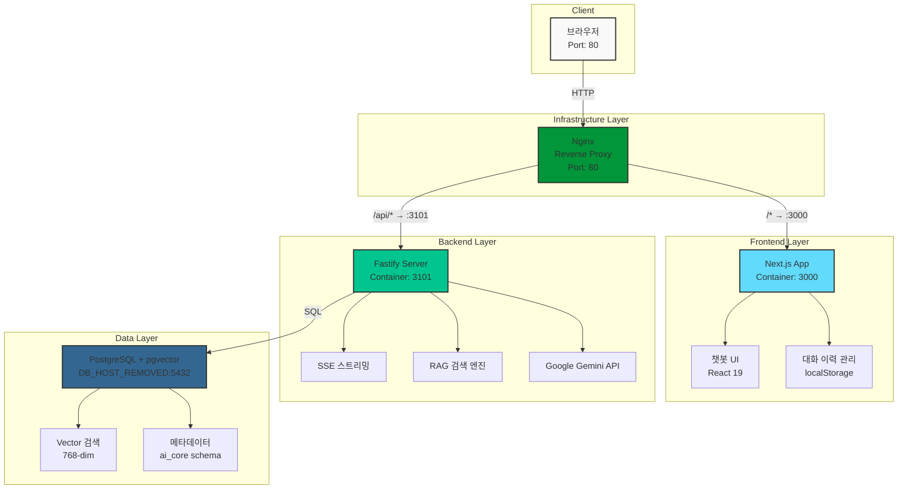
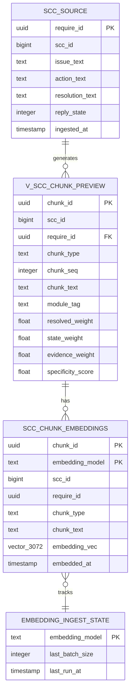
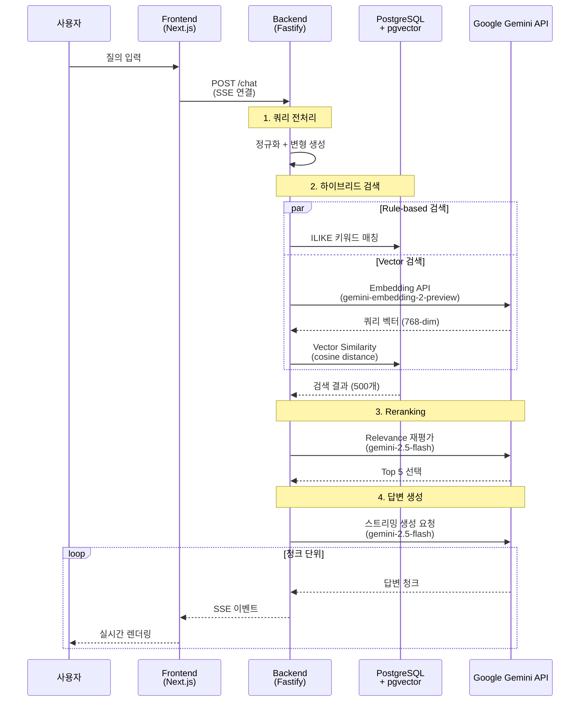

# CoviAI - AI Core 챗봇 시스템

코비전 사내 지원 시스템을 위한 AI 기반 질의응답 챗봇 플랫폼

## 📋 프로젝트 개요

CoviAI는 사내 매뉴얼, 이력 데이터, FAQ 등을 기반으로 사용자 질의에 대해 실시간으로 답변을 제공하는 RAG(Retrieval-Augmented Generation) 기반 챗봇 시스템입니다.

### 현재 데이터 규모
- **임베딩 벡터**: 13,255개 청크
- **벡터 차원**: 768 (Google Gemini Embedding 2)
- **임베딩 커버리지**: 100%
- **청크 타입**: issue, action, resolution, qa_pair
- **검색 방식**: Hybrid (Rule-based + Vector Similarity)

## 🏗️ 시스템 아키텍처

### 전체 구조



### 기술 스택

#### Frontend
- **Framework**: Next.js 16.2.0 (App Router)
- **UI**: React 19, Tailwind CSS
- **상태 관리**: React Hooks
- **저장소**: localStorage (대화 이력 영구 보관)

#### Backend
- **Framework**: Fastify (Node.js)
- **언어**: TypeScript
- **스트리밍**: Server-Sent Events (SSE)
- **데이터베이스**: PostgreSQL + pgvector 0.8.2
- **LLM**: Google Gemini 2.5 Flash
- **Embedding**: Google Gemini Embedding 2 (768-dim)

#### Infrastructure
- **컨테이너화**: Docker, Docker Compose
- **리버스 프록시**: Nginx (CORS 해결, 80 포트 통합)
- **배포 환경**: 온프레미스 → 클라우드 마이그레이션 준비
- **이미지 최적화**: Multi-stage build, Alpine Linux

## ✨ 주요 기능

### 1. 실시간 스트리밍 응답
- Server-Sent Events (SSE) 기반 실시간 응답 스트리밍
- 타이핑 애니메이션으로 자연스러운 UX 제공
- 청크 단위 점진적 렌더링

### 2. 하이브리드 RAG 검색
- **Rule-based 검색**: 키워드 기반 정확한 매칭
- **Vector 검색**: 시맨틱 유사도 기반 검색 (pgvector)
- **Reranking**: 최종 결과 재정렬로 정확도 향상

### 3. 대화 이력 관리
- localStorage 기반 영구 보관 (최대 50개 대화)
- 날짜별 그룹화 (오늘, 어제, 지난 7일, 이전)
- 대화 제목 자동 생성
- 대화 삭제 및 전환 기능

### 4. 메타데이터 기반 링크 제공
- 유사 이력 바로가기 링크 자동 생성
- 답변 출처 표시 (Manual/SCC)
- 신뢰도(Confidence) 점수 표시

## 🚀 성능 최적화

### 최근 적용된 최적화 (2026-03-23)

#### 문제점
- 초기 질의 응답 시간: ~10초 (ruleMs: 3.4초)
- Focus tokens 경로 사용 시: ~20초 (ruleMs: 9.8초)

#### 해결 방안
1. **Focus tokens 경로 비활성화**
   - 일반적인 토큰 매칭 시 너무 많은 require_ids 반환 (400개)
   - 오히려 성능 저하 발생

2. **ORDER BY 절 제거**
   - 4개 컬럼 정렬이 3.4초 소요
   - 후속 scoring/reranking 단계에서 정렬하므로 불필요
   - LIMIT 500만 사용하여 DB가 최적 인덱스 선택 가능

3. **결과**
   - ruleMs: 3.4초 → **0.3~1.3초** (약 70-90% 개선)
   - 총 응답 시간: ~10초 → **~8초**

#### 성능 측정 로그
```json
{
  "retrievalMs": 1442,
  "timings": {
    "ruleMs": 297,        // 3.4s → 0.3s (90% 개선)
    "embeddingMs": 884,   // 벡터 임베딩 생성
    "vectorMs": 36,       // 벡터 검색
    "rerankMs": 213       // 재정렬
  }
}
```

## 📁 프로젝트 구조

```
coviAI/                       # Monorepo 루트
│
├── frontend/                 # Next.js 프론트엔드
│   ├── app/
│   │   ├── page.tsx         # 메인 챗봇 페이지
│   │   └── api/chat/        # API 라우트
│   ├── components/
│   │   └── chatbot/         # 챗봇 UI 컴포넌트
│   ├── lib/
│   │   └── conversations.ts # 대화 이력 관리
│   └── package.json         # Frontend 의존성
│
├── workspace-fastify/        # Fastify 백엔드
│   ├── src/
│   │   ├── app/
│   │   │   ├── index.ts     # 서버 진입점
│   │   │   └── server.ts    # 라우트 정의
│   │   ├── modules/
│   │   │   └── chat/
│   │   │       └── chat.service.ts  # RAG 검색 로직
│   │   └── db/
│   │       ├── mariadb.ts   # Source DB 연결
│   │       └── postgres.ts  # Vector DB 연결
│   ├── scripts/
│   │   ├── check-chunk-stability.mjs
│   │   └── fix-stable-chunk-view.mjs
│   ├── .env.example
│   └── package.json         # Backend 의존성
│
├── docs/                     # 프로젝트 문서
│   ├── docker.md            # Docker 배포 가이드
│   ├── API.md               # API 명세서
│   └── DATABASE.md          # 데이터베이스 스키마
│
├── nginx/                    # Nginx 리버스 프록시 설정
│   └── nginx.conf           # CORS 해결, 80 포트 통합
│
├── docker-compose.yml        # Docker Compose 오케스트레이션
├── .env.example              # 환경 변수 템플릿
├── .dockerignore             # Docker 빌드 최적화
├── CLAUDE.md                 # AI 에이전트 프로젝트 컨텍스트
│
├── .gitignore
└── README.md
```

## 🔧 설치 및 실행

### 방법 1: Docker Compose (권장) 🐳

**사전 요구사항**
- Docker Desktop (또는 Docker Engine + Docker Compose)
- Google API Key

**빠른 시작**
```bash
# 1. 환경변수 설정
cp .env.example .env
# .env 파일을 열어서 GOOGLE_API_KEY 입력

# 2. 전체 스택 실행 (Frontend + Backend + Nginx)
docker-compose up -d --build

# 3. 로그 확인
docker-compose logs -f

# 4. 접속
# 브라우저: http://localhost
```

**장점**
- ✅ **한 번에 전체 스택 실행** (Frontend, Backend, Nginx)
- ✅ **CORS 문제 완전 해결** (Nginx 리버스 프록시)
- ✅ **환경 일관성** (개발/스테이징/프로덕션 동일)
- ✅ **쉬운 스케일링** (`docker-compose up -d --scale backend=3`)
- ✅ **클라우드 마이그레이션 준비 완료**

**📖 상세 가이드**: [docs/docker.md](docs/docker.md)

---

### 방법 2: 로컬 개발 환경

**사전 요구사항**
- Node.js 18+
- PostgreSQL 15+ (pgvector 0.8.2 확장 설치 필요)
- Google API Key (Gemini LLM + Embedding)

**환경 변수 설정**
```bash
# workspace-fastify/.env (템플릿: .env.example 참고)
NODE_ENV=development
PORT=3101

# Database
VECTOR_DB_HOST=DB_HOST_REMOVED
VECTOR_DB_PORT=5432
VECTOR_DB_NAME=ai2
VECTOR_DB_USER=novian
VECTOR_DB_PASSWORD=REMOVED
VECTOR_DB_SCHEMA=ai_core

# AI APIs (Google Gemini)
GOOGLE_API_KEY=your_google_api_key
GOOGLE_MODEL=gemini-2.5-flash
LLM_PROVIDER=google
```

**설치 및 실행**
```bash
# 프론트엔드 의존성 설치 및 실행
cd frontend
npm install
npm run dev  # Port 3000

# 백엔드 의존성 설치 및 실행 (별도 터미널)
cd workspace-fastify
npm install
npm run dev  # Port 3101
```

**접속**
- 프론트엔드: http://localhost:3000
- 백엔드 API: http://localhost:3101

**주의**: 로컬 개발 환경에서는 CORS 설정이 필요할 수 있습니다.

## 📊 데이터베이스 스키마

### ERD (Entity Relationship Diagram)



### 주요 뷰: `ai_core.v_scc_chunk_preview`
- `require_id`: 요구사항 ID (UUID)
- `chunk_id`: 청크 ID (Deterministic UUID)
- `chunk_text`: 검색 대상 텍스트
- `embedding_vec`: 벡터 임베딩 (pgvector, 768-dim)
- `state_weight`: 상태 가중치
- `resolved_weight`: 해결 여부 가중치
- `evidence_weight`: 증거 가중치
- `specificity_score`: 구체성 점수

**📖 상세 문서**: [docs/DATABASE.md](docs/DATABASE.md)

## 🔄 RAG 검색 흐름



**📖 상세 문서**: [docs/API.md](docs/API.md)

## 📚 문서

| 문서 | 설명 |
|------|------|
| [docs/docker.md](docs/docker.md) | 🐳 **Docker 배포 가이드** (docker-compose, Nginx 프록시, 클라우드 마이그레이션) |
| [docs/API.md](docs/API.md) | API 엔드포인트 명세서 (SSE 스트리밍, RAG 검색) |
| [docs/DATABASE.md](docs/DATABASE.md) | 데이터베이스 스키마 및 ERD, 쿼리 예시 |
| [.env.example](.env.example) | 환경 변수 템플릿 (루트 디렉토리) |
| [CLAUDE.md](CLAUDE.md) | AI 에이전트 인수인계 문서 (프로젝트 컨텍스트) |

## 📈 향후 개선 계획

- [x] **Docker 컨테이너화** (docker-compose.yml, Nginx 리버스 프록시)
- [x] **클라우드 마이그레이션 준비** (온프레미스 → AWS/GCP/Azure)
- [ ] 캐싱 전략 도입 (Redis)
- [ ] 데이터베이스 인덱스 최적화 (chunk_type, require_id)
- [ ] 답변 품질 피드백 시스템
- [ ] 다국어 지원
- [ ] 대화 컨텍스트 유지 (멀티턴)
- [ ] 모니터링 및 로깅 (Prometheus, Grafana)

## 📝 변경 이력

### 2026-03-26
- ✅ **Docker Compose 배포 환경 구축** (Frontend + Backend + Nginx)
- ✅ **Nginx 리버스 프록시 설정** (80 포트 통합, CORS 완전 해결)
- ✅ **Multi-stage Dockerfile 작성** (이미지 크기 최적화)
- ✅ **클라우드 마이그레이션 준비** (온프레미스 → AWS/GCP/Azure)
- ✅ **배포 문서 작성** ([docs/docker.md](docs/docker.md))
- ✅ **CLAUDE.md 추가** (AI 에이전트 프로젝트 컨텍스트 파일)

### 2026-03-25
- ✅ 프로젝트 문서화 완료 (API.md, DATABASE.md)
- ✅ README.md 시각화 개선 (Mermaid 다이어그램)
- ✅ 레거시 코드 정리 (ARCHIVE/ 이동)
- ✅ GitHub 원격 저장소 연결 (Monorepo)
- ✅ 스트리밍 응답 최적화 (타이핑 애니메이션 제거하여 SSE 정상화)
- ✅ LLM 출력 토큰 제한 증가 (2048 → 8192)
- ✅ 임베딩 캐시 TTL 1시간으로 증가 (성능 최적화)
- ✅ 다국어 관련 도메인 토큰 추가

### 2026-03-23
- ✅ Deterministic UUID 전환 (chunk_id 안정화)
- ✅ 임베딩 데이터 확장: 3,243 → 13,255 rows
- ✅ 프론트엔드: Next.js 기반 챗봇 UI 구현
- ✅ 백엔드: Fastify 기반 스트리밍 API 구현
- ✅ 성능 최적화: RAG 검색 속도 70-90% 개선

## 📄 라이선스

Copyright (c) 2026 Covision. All rights reserved.

---

**개발 문의**: AI Core Team
