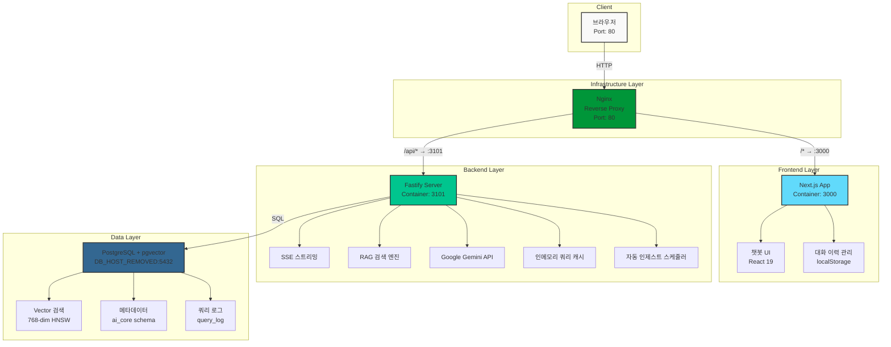
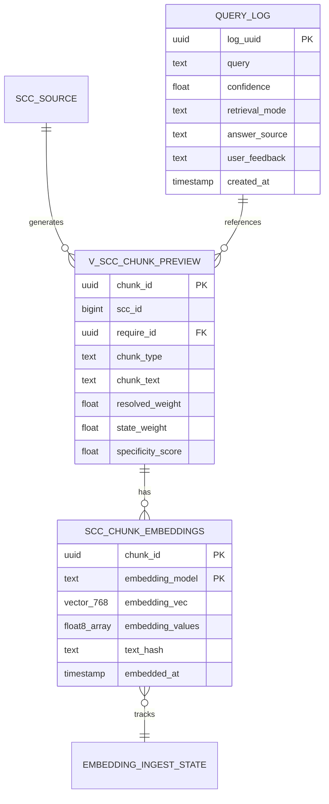
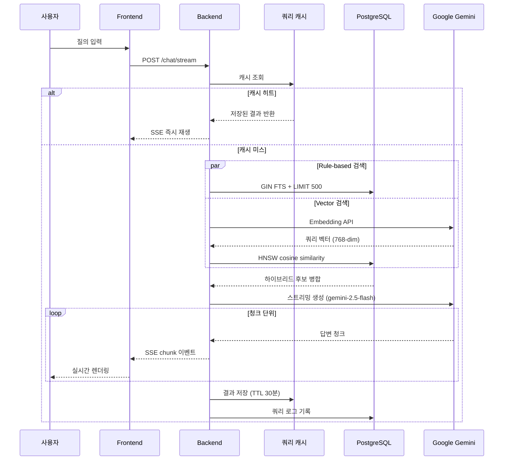

# CoviAI - AI Core 챗봇 시스템

코비전 사내 지원 시스템을 위한 AI 기반 질의응답 챗봇 플랫폼


## 📋 프로젝트 개요

CoviAI는 사내 매뉴얼, 이력 데이터, FAQ 등을 기반으로 사용자 질의에 대해 실시간으로 답변을 제공하는 RAG(Retrieval-Augmented Generation) 기반 챗봇 시스템입니다.

### 🤖 CS ChatBot
- 📄 [개요 문서 보기](./docs/CS-ChatBot_개요.pdf)

### 현재 데이터 규모
- **임베딩 벡터**: 44,955개 청크 (소스 기준) / 17,355개 적재 완료
- **벡터 차원**: 768 (Google Gemini Embedding 2)
- **임베딩 커버리지**: ~38.6% (증분 적재 진행 중)
- **청크 타입**: issue, action, resolution, qa_pair
- **검색 방식**: Hybrid (Rule-based + Vector Similarity)

### 평가 결과 (2026-03-31 기준, 50건 운영성 질의셋)
| 지표 | 결과 |
|---|---|
| Top1 정확도 | 37/37 (100%) |
| Top3 정확도 | 37/37 (100%) |
| 청크 타입 정확도 | 37/37 (100%) |
| 부정 질의 차단 | 13/13 (100%) |

## 🏗️ 시스템 아키텍처

### 전체 구조



### 기술 스택

#### Frontend
- **Framework**: Next.js 16.2.0 (App Router)
- **UI**: React 19, Tailwind CSS
- **마크다운**: react-markdown + remark-gfm
- **상태 관리**: React Hooks
- **저장소**: localStorage (대화 이력 · 다크모드 영구 보관)

#### Backend
- **Framework**: Fastify (Node.js)
- **언어**: TypeScript
- **스트리밍**: Server-Sent Events (SSE)
- **데이터베이스**: PostgreSQL + pgvector 0.8.2
- **LLM**: Google Gemini 2.5 Flash
- **Embedding**: Google Gemini Embedding 2 (768-dim)
- **캐시**: 인메모리 Map (TTL 30분, 최대 500 엔트리)

#### Infrastructure
- **컨테이너화**: Docker, Docker Compose
- **리버스 프록시**: Nginx (CORS 해결, 80 포트 통합)
- **배포 환경**: 온프레미스 → 클라우드 마이그레이션 준비
- **이미지 최적화**: Multi-stage build, Alpine Linux

## ✨ 주요 기능

### 1. 실시간 스트리밍 응답
- Server-Sent Events (SSE) 기반 실시간 응답 스트리밍
- 단계별 상태 표시: **검색 중** → **생성 중** → **스트리밍**
- 마크다운 렌더링으로 구조화된 답변 표시

### 2. 하이브리드 RAG 검색
- **Rule-based 검색**: 키워드 기반 정확한 매칭 + GIN FTS 2-pass 샘플링
- **Vector 검색**: 시맨틱 유사도 기반 검색 (pgvector HNSW 인덱스)
- **Reranking**: LLM 기반 최종 후보 재정렬

### 3. 대화 이력 관리
- localStorage 기반 영구 보관 (최대 50개 대화)
- 대화 제목 자동 생성 / 삭제 / 전환
- 멀티턴 컨텍스트 (최근 6개 메시지 LLM에 전달)

### 4. 유사 이력 참조
- Top1 링크 버튼: 최우선 유사 SCC 이력 바로가기
- Top3 유사 이력 카드: 접기/펼치기 토글로 추가 후보 확인
- 관련 질문 추천 chips: 클릭 시 즉시 질문 전송

### 5. 사용자 편의 기능
- 답변 복사 버튼 (클립보드)
- 피드백 버튼 (👍👎 → query_log 업데이트)
- 채팅 내보내기 (.txt 파일 다운로드)
- 다크모드 (localStorage 영속화)

### 6. 운영 기능
- 쿼리 로그 자동 기록 (`ai_core.query_log`)
- 인메모리 쿼리 캐시 (동일 질문 반복 시 즉시 응답)
- 자동 인제스트 스케줄러 (미임베딩 청크 주기적 동기화)
- 보안 차단 키워드 필터 (SQL Injection, 해킹, 개인정보 등)

## 🚀 성능 최적화

### 최근 적용된 최적화 (2026-03-31)

#### 인메모리 쿼리 캐시
- **목적**: 동일/유사 질문 반복 입력 시 LLM·임베딩 API 호출 제거
- **구현**: Map 기반 TTL 캐시 (TTL 30분, 최대 500 엔트리)
- **효과**: 캐시 히트 시 응답 시간 수백 ms → 즉시 응답
- **확인**: `/health` 응답의 `cache.size`로 현재 엔트리 수 확인 가능

#### 단계별 상태 표시
- **목적**: 첫 SSE 이벤트 도착 전 공백 시간 제거
- **구현**: 메시지 전송 즉시 "유사 이력을 검색하고 있습니다..." 표시 → metadata 수신 시 "답변 생성 중..." → 스트리밍 시작

#### GIN FTS 2-pass 샘플링
- **목적**: LIMIT 500 샘플링 시 특정 SCC가 누락되는 문제 해결
- **구현**: `scc_request` / `scc_reply` GIN tsvector 인덱스 기반 병렬 FTS → synthetic ChunkRow 병합

### 이전 최적화 (2026-03-26)

#### LLM 개인정보 노출 방지
- SCC 원문 내 이름/회사명/내선번호가 답변에 포함되지 않도록 PROMPT_RULESET 규칙 추가

#### 검색 임계값 부동소수점 수정
- `best.score >= 0.45` 비교를 `round2(score) >= 0.45`로 변경하여 벡터 전용 후보 누락 문제 해결

#### 검색 속도 개선 (2026-03-23)
- ruleMs: 3.4초 → **0.3~1.3초** (약 70-90% 개선)

```json
{
  "retrievalMs": 1442,
  "timings": {
    "ruleMs": 297,
    "embeddingMs": 884,
    "vectorMs": 36,
    "rerankMs": 213
  }
}
```

## 📁 프로젝트 구조

```
coviAI/                             # Monorepo 루트
│
├── frontend/                       # Next.js 프론트엔드
│   ├── app/
│   │   ├── page.tsx               # 메인 챗봇 페이지
│   │   ├── search/                # SCC 이력 검색 페이지
│   │   └── api/
│   │       ├── chat/              # API 라우트 (SSE stream proxy)
│   │       └── search/            # API 라우트 (/retrieval/search proxy)
│   ├── components/
│   │   └── chatbot/               # 챗봇 UI 컴포넌트
│   │       ├── chat-message.tsx   # 메시지 + Top3 카드 + 재전송/질문수정
│   │       ├── chat-area.tsx      # 채팅 영역
│   │       ├── chat-header.tsx    # 헤더 (검색·내보내기 버튼)
│   │       └── chat-input.tsx     # 입력창 (prefill 지원)
│   ├── lib/
│   │   └── conversations.ts       # 대화 이력 관리
│   └── package.json
│
├── workspace-fastify/              # Fastify 백엔드
│   ├── src/
│   │   ├── app/
│   │   │   └── server.ts          # 라우트 + 캐시 + 스케줄러 통합
│   │   ├── modules/chat/
│   │   │   ├── chat.service.ts    # RAG 검색 + GIN FTS + 하이브리드 랭킹
│   │   │   ├── llm.service.ts     # Gemini LLM 스트리밍
│   │   │   └── chat.types.ts      # 타입 정의
│   │   └── platform/
│   │       ├── cache/
│   │       │   └── queryCache.ts  # 인메모리 쿼리 캐시 (Map + TTL)
│   │       ├── scheduler/
│   │       │   └── ingestScheduler.ts  # 자동 인제스트 스케줄러
│   │       └── db/
│   │           └── vectorClient.ts     # PostgreSQL 연결 풀
│   ├── scripts/                   # DB 초기화 · 임베딩 적재 스크립트
│   └── docs/eval/                 # 평가셋 및 결과 산출물
│
├── nginx/                         # Nginx 리버스 프록시 설정
├── docker-compose.yml             # Docker Compose 오케스트레이션
├── CLAUDE.md                      # AI 에이전트 인수인계 문서
└── README.md
```

## 🔧 설치 및 실행

### 방법 1: Docker Compose (권장) 🐳

```bash
# 1. 환경변수 설정
cp .env.example .env
# .env 파일을 열어서 GOOGLE_API_KEY 입력

# 2. 전체 스택 실행
docker-compose up -d --build

# 3. 접속
# 브라우저: http://localhost
```

**📖 상세 가이드**: [docs/docker.md](docs/docker.md)

---

### 방법 2: 로컬 개발 환경

```bash
# 환경 변수 설정 (workspace-fastify/.env)
GOOGLE_API_KEY=your_google_api_key
GOOGLE_MODEL=gemini-2.5-flash
VECTOR_DB_HOST=DB_HOST_REMOVED
VECTOR_DB_PORT=5432
VECTOR_DB_NAME=ai2
VECTOR_DB_USER=novian
VECTOR_DB_PASSWORD=REMOVED

# 프론트엔드
cd frontend && npm install && npm run dev   # Port 3000

# 백엔드 (별도 터미널)
cd workspace-fastify && npm install && npm run dev   # Port 3101
```

## 📊 데이터베이스 스키마



**📖 상세 문서**: [docs/DATABASE.md](docs/DATABASE.md)

## 🔄 RAG 검색 흐름



## 📚 문서

| 문서 | 설명 |
|------|------|
| [docs/docker.md](docs/docker.md) | 🐳 Docker 배포 가이드 |
| [docs/API.md](docs/API.md) | API 엔드포인트 명세서 |
| [docs/DATABASE.md](docs/DATABASE.md) | 데이터베이스 스키마 및 ERD |
| [workspace-fastify/README.md](workspace-fastify/README.md) | 백엔드 상세 운영 가이드 |
| [CLAUDE.md](CLAUDE.md) | AI 에이전트 인수인계 문서 |

## 📈 향후 개선 계획

### 완료
- [x] Docker 컨테이너화 (docker-compose.yml, Nginx 리버스 프록시)
- [x] SSE 스트리밍 응답
- [x] 하이브리드 검색 (Rule + Vector + GIN FTS)
- [x] 마크다운 렌더링
- [x] 멀티턴 대화 컨텍스트
- [x] 쿼리 로그 및 피드백 시스템
- [x] Top3 유사 이력 카드 (접기/펼치기)
- [x] 관련 질문 추천 chips
- [x] 채팅 내보내기 (.txt)
- [x] 인메모리 쿼리 캐시 (Map + TTL 30분)
- [x] 자동 인제스트 스케줄러
- [x] 다크모드 영속화
- [x] 단계별 응답 상태 표시
- [x] 모바일 반응형 레이아웃 (햄버거 메뉴, 사이드바 오버레이)
- [x] 메시지 재전송 버튼 및 질문 수정하기
- [x] SCC 이력 검색 페이지 (`/search`, 점수·청크타입·벡터 신호 시각화)

### 고도화 예정

#### 프론트엔드
- [ ] 검색 페이지 다크모드 연동 (챗봇 다크모드 상태와 동기화)
- [ ] 채팅 내보내기 완료 토스트 알림 (sonner 활용)
- [ ] 검색 결과 URL 공유 (`?q=` 쿼리스트링 반영)
- [ ] page.tsx 커스텀 훅 분리 (`useChat`, `useConversations`)
- [ ] 대화 이력 서버 저장 (localStorage 휘발 방지)

#### 백엔드 / 인프라
- [ ] Docker nginx `depends_on` healthcheck 조건 추가 (502 재발 방지)
- [ ] `/chat` 실패 케이스 로그 저장 및 대시보드 (웹 UI)
- [ ] API Rate Limiting (`@fastify/rate-limit`)
- [ ] 쿼리 리라이팅 (LLM 프리패스)

#### 데이터
- [ ] 임베딩 커버리지 100% 달성 (현재 38.6%)
- [ ] 저차원 임베딩 모델 검토 (pgvector ANN 인덱스 활성화 목적)

## 📝 변경 이력

### 2026-04-01 (최신)
- ✅ **모바일 반응형 사이드바** — 햄버거 메뉴 버튼, 오버레이 배경, 사이드바 열기/닫기 상태 관리
- ✅ **메시지 재전송** — 오류 발생 시 마지막 bot 메시지에 '다시 시도' 버튼 표시
- ✅ **질문 수정하기** — 결과 없음(no_match) 시 입력창에 기존 질문 자동 채우기
- ✅ **SCC 이력 검색 페이지** — `/search` 신규 추가, LLM 없이 유사 이력 후보·점수·벡터 신호 시각화
- ✅ **헤더 검색 버튼** — 챗봇 헤더에서 `/search` 페이지로 바로 이동
- ✅ **다크모드 하이드레이션 오류 수정** — `isDarkMode` 초기값 SSR 안전하게 처리, `suppressHydrationWarning` 추가
- ✅ **파비콘 추가** — `public/favicon.ico` 및 `layout.tsx` 메타 등록

### 2026-03-31
- ✅ **단계별 응답 상태 표시** — 메시지 전송 즉시 "유사 이력 검색 중" 표시, metadata/chunk 이벤트에 따라 상태 전환
- ✅ **Top3 유사 이력 접기/펼치기** — 기본 접힘 상태, 토글 버튼으로 카드 목록 표시
- ✅ **관련 질문 추천 chips** — Top2/3 후보 previewText 기반 chip, 클릭 시 즉시 전송
- ✅ **채팅 내보내기** — 헤더 다운로드 버튼으로 대화 전체를 .txt 파일로 저장
- ✅ **다크모드 영속화** — localStorage 저장으로 새로고침 후에도 상태 유지
- ✅ **인메모리 쿼리 캐시** — Map + TTL 30분, 동일 질문 즉시 응답, /health에 cache.size 노출
- ✅ **자동 인제스트 스케줄러** — INGEST_AUTO_ENABLED=true 시 서버 기동 시 미임베딩 청크 자동 동기화

### 2026-03-30
- ✅ **멀티턴 대화 컨텍스트** — 최근 6개 메시지를 LLM 프롬프트에 전달
- ✅ **Top3 유사 이력 카드** — SSE metadata에서 top3Candidates 수신, 카드 형태로 표시
- ✅ **답변 복사 버튼** — 클립보드 복사 + 2초 체크마크 피드백
- ✅ **마크다운 렌더링** — react-markdown + remark-gfm 적용
- ✅ **피드백 버튼** — 👍👎 클릭 시 query_log.user_feedback 업데이트
- ✅ **쿼리 로그** — /chat/stream 응답마다 ai_core.query_log 자동 기록
- ✅ **GIN FTS 2-pass 샘플링** — LIMIT 500 샘플링 미포함 케이스 보완

### 2026-03-26
- ✅ LLM 개인정보 노출 방지
- ✅ 검색 임계값 부동소수점 수정
- ✅ LLM 답변 품질 개선 (프롬프트 텍스트 길이 제한 확장)
- ✅ 캐시 메모리 관리 (만료 항목 주기적 자동 정리)

### 2026-03-23
- ✅ Deterministic UUID 전환 (chunk_id 안정화)
- ✅ 임베딩 데이터 확장: 3,243 → 13,255 rows
- ✅ 프론트엔드 챗봇 UI 구현 (Next.js)
- ✅ Fastify 기반 스트리밍 API 구현
- ✅ 검색 속도 최적화 (70-90% 개선)

## 📄 라이선스

Copyright (c) 2026 Covision. All rights reserved.

---

**개발 문의**: AI Core Team

