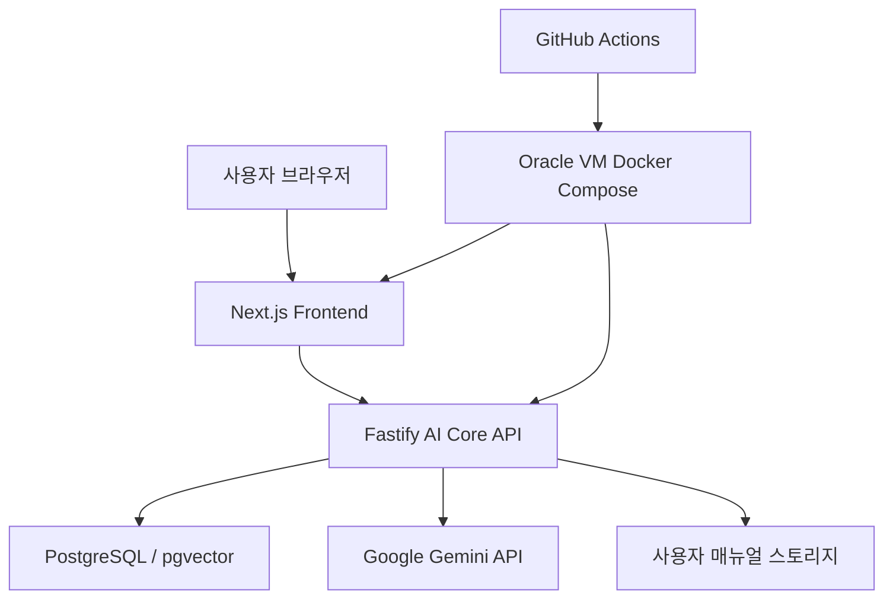

# CoviAI - AI Core 챗봇 시스템

코비전 사내 지원 시스템을 위한 AI 기반 질의응답 챗봇 플랫폼


---

## 2026-04-15 Update

### 대화 내보내기 UX 정리
- 대화 내보내기 메뉴를 `PDF 4종 + 기타 2종` 구조로 재정리했습니다.
- 사용자용 PDF를 `핵심 PDF`와 `상담 PDF`로 분리했습니다.
- 운영자용 PDF는 진단 정보 중심, 보고용 PDF는 공유 브리핑 중심으로 역할을 구분했습니다.
- 다크모드에서 카드 문구와 아이콘 가독성이 무너지던 문제를 수정했습니다.
- 모바일에서 카드 터치 영역과 간격을 다시 조정해 선택 피로도를 줄였습니다.
- 내보내기 메뉴에 템플릿별 썸네일 느낌의 미리보기를 넣어 선택성을 높였습니다.

### PDF 템플릿 고도화
- 사용자용 / 운영자용 / 보고용 PDF의 표지, 헤더, 요약 카드, 본문 구성을 분리했습니다.
- 보고용 PDF는 부서명, 배포 대상, 승인자, 문서 번호, 배포 버전 메타를 담도록 확장했습니다.
- 운영자용 PDF는 진단 우선순위와 상태를 빠르게 읽을 수 있도록 강조 표현을 보강했습니다.
- 사용자용 PDF는 핵심 요약형과 일반 상담형을 분리해 사용 목적에 맞게 선택할 수 있습니다.
- PDF 출력본 기준으로 여백, 카드 밀도, 헤더 폰트 크기를 템플릿별로 미세 조정했습니다.
- 사용자용 / 운영자용 / 보고용 첫 페이지 구조 차이를 더 크게 벌려 한눈에 구분되도록 보강했습니다.

### 매뉴얼 기반 답변 보강
- 사용자 매뉴얼을 별도 수집 대상으로 연결해 SCC 이력 외의 사용자 문서도 검색할 수 있도록 확장했습니다.
- 매뉴얼 미리보기 이미지 생성 스크립트와 커버리지 리포트를 추가했습니다.
- 매뉴얼 검색 품질을 높이기 위해 chunk 분할 품질과 랭킹 보정 로직을 계속 개선 중입니다.

### 운영 로그 / 진단 기능 보강
- Query 로그 화면을 운영 지표 중심으로 재구성했습니다.
- 배포 버전, Rate Limit 상태, Query Embedding 상태, Embedding 커버리지 정보를 한 화면에서 확인할 수 있습니다.
- 사용자 피드백 통계와 답변 경로별 진단 정보를 운영 화면에 반영했습니다.

---

## 테스트 접속

### 로컬
- Frontend: `http://localhost:3001`
- Backend Health: `http://localhost:3101/health`
- Backend Test Page: `http://localhost:3101/test/chat`

### 운영
- 서비스 URL: `https://csbotservice.com`
- GitHub Actions 기반 CI/CD로 Oracle VM에 자동 배포됩니다.

---

## 프로젝트 개요

CoviAI는 코비전 사내 지원 이력과 사용자 매뉴얼을 기반으로 답변을 제공하는 RAG 기반 챗봇 시스템입니다.

핵심 목표는 다음과 같습니다.

1. 운영 이슈 대응 시간을 줄입니다.
2. 유사 장애 및 처리 이력을 빠르게 찾습니다.
3. 절차형 질문에는 설명형 답변을 제공합니다.
4. 사용자 매뉴얼과 운영 이력을 함께 활용합니다.
5. 운영자 관점에서 진단 가능한 로그와 리포트를 제공합니다.

---

## 주요 성과 요약

### 검색/답변 품질
- SCC 이력 기반 RAG 검색 파이프라인 구축
- rule search + vector search + LLM 설명 생성 결합
- 후속 질문 감지, 맥락 보정 query, 부정 표현 반영 로직 적용
- 매뉴얼 chunk 검색 및 화면 미리보기 연결

### 운영 안정성
- Oracle VM 기반 Docker 배포 환경 구성
- GitHub Actions CI/CD 구축
- 운영 smoke 평가 아티팩트 생성 자동화
- Query 로그, 배포 버전, Rate Limit, Embedding 상태 모니터링 추가

### 사용자 경험
- 대화 이력 서버 저장 및 복원 안정화
- 대화 목록 제목/검색/그룹핑/삭제 UX 개선
- 채팅 내보내기 토스트, URL 공유, PDF 내보내기 고도화
- 모바일 화면 대응 및 카드 레이아웃 개선 지속 진행

---

## 시스템 아키텍처



### 처리 흐름
1. 사용자가 질문을 입력합니다.
2. Frontend가 `/chat` 또는 관련 API를 호출합니다.
3. Backend가 SCC chunk / 매뉴얼 chunk 후보를 검색합니다.
4. rule score와 vector score를 결합합니다.
5. 필요한 경우 LLM으로 설명형 답변을 생성합니다.
6. 결과를 답변 카드, 유사 이력, 참고 링크, 매뉴얼 미리보기와 함께 반환합니다.

---

## 기술 스택

### Frontend
- Next.js App Router
- TypeScript
- React Hooks
- Tailwind CSS

### Backend
- Fastify
- TypeScript
- PostgreSQL
- pgvector
- Google Gemini API

### Infra
- Docker / Docker Compose
- Oracle VM
- Nginx
- GitHub Actions CI/CD

### 문서 / 평가
- Markdown 기반 문서화
- Smoke 평가 JSON 아티팩트
- Retrieval / Chat 품질 평가 스크립트

---

## 핵심 기능

### 1. SCC 이력 기반 질의응답
- `issue`, `action`, `resolution`, `qa_pair` chunk를 기반으로 검색합니다.
- 증상형 질문과 방법형 질문을 구분해 다른 검색 가중치를 적용합니다.
- 유사 이력 바로가기 링크를 제공합니다.

### 2. Hybrid Retrieval
- rule search와 vector search를 결합합니다.
- query embedding 실패 시 rule-only fallback으로 안전하게 동작합니다.
- embedding cooldown / 429 상황에서도 서비스 응답이 끊기지 않도록 설계했습니다.

### 3. LLM 설명형 답변
- 설명형 질문은 LLM을 강제로 사용해 절차형 안내를 생성합니다.
- 핵심 답변 / 적용 방법 / 확인 포인트 / 참고 링크 형식을 유지합니다.
- answer source를 `llm`, `deterministic_fallback`, `rule_only`로 구분합니다.

### 4. 사용자 매뉴얼 연동
- `stor` 또는 운영 VM의 매뉴얼 디렉터리를 기준으로 문서를 연결합니다.
- 매뉴얼 chunk를 별도 수집하고 답변에 반영합니다.
- 미리보기 이미지와 문서 링크를 함께 내려줄 수 있도록 확장했습니다.

### 5. 운영 로그 페이지
- 최근 7일 로그, 실패/결과 없음 건수, 피드백 통계, 평균 응답 시간을 요약합니다.
- 배포 버전, Rate Limit 상태, Query Embedding 상태, Embedding 커버리지를 보여줍니다.
- 운영자가 현재 배포와 검색 상태를 빠르게 파악할 수 있습니다.

### 6. 대화 내보내기
- 텍스트 / Markdown / PDF 인쇄를 지원합니다.
- PDF는 현재 다음 4종으로 분리되어 있습니다.
  - 핵심 PDF: 핵심 안내 1페이지형
  - 상담 PDF: 질문과 답변 흐름 전체 정리
  - 운영 PDF: 진단 정보 포함
  - 보고 PDF: 공유용 브리핑
- 내보내기 메뉴에는 각 템플릿의 성격을 보여주는 미리보기 썸네일이 포함됩니다.
- 모바일에서는 카드 높이와 터치 영역을 키워 PDF 유형을 더 쉽게 고를 수 있도록 조정했습니다.

---

## 현재 데이터 및 검색 상태

### SCC 데이터
- source chunk rows: 약 `44,955`
- embedding 커버리지는 시점별 batch 진행 상태에 따라 달라집니다.
- 운영 기준 추천 batch는 `100 x 8`, `answer_first`, `minIntervalMs=1500` 입니다.

### 매뉴얼 데이터
- 사용자 매뉴얼 PDF / 원본 문서 / preview 이미지 디렉터리 운영
- preview coverage 스크립트로 생성 가능 여부와 누락 상태를 확인합니다.
- 예시 실행 결과 기준 `287 chunk`, `277 generated`, `coverage 96.52%`를 확인했습니다.

---

## 평가 결과

### Retrieval 평가
- 50개 평가셋 기준
  - Top1Hit: `35/37 (94.59%)`
  - Top3Hit: `37/37 (100%)`
  - ChunkTypeHit: `37/37 (100%)`
  - NegativeCorrect: `13/13 (100%)`

### Chat 품질 평가
- exactBestHit: `35/37 (94.59%)`
- top3SupportHit: `37/37 (100%)`
- answerFormatOk: `37/37 (100%)`
- linkAttached: `37/37 (100%)`
- negativeGuarded: `13/13 (100%)`

### 운영 smoke
- GitHub Actions에서 production smoke를 수행합니다.
- 아티팩트는 저장소 내 `docs/eval/*.latest.json` 형태로 관리합니다.

---

## 운영 API 라우팅 규칙

운영 환경에서는 프론트 내부 API와 실제 운영 API 경로를 명확히 구분합니다.

### 원칙
1. 운영에서 실제 호출되는 경로를 기준으로 프론트 호출을 정렬합니다.
2. `frontend/app/api/*` 경로는 로컬 프록시 또는 보조 용도로만 사용합니다.
3. Oracle VM / Nginx / Docker Compose 구조에서 동작하는 경로를 우선 기준으로 삼습니다.

### 관련 문서
- `docs/architecture/api-routing.md`

---

## 프로젝트 구조

```text
coviAI/
├─ frontend/                    # Next.js 프론트엔드
├─ workspace-fastify/           # Fastify 기반 AI Core 백엔드
├─ docs/                        # 아키텍처 / 평가 / 운영 문서
├─ .github/workflows/           # CI/CD 및 smoke workflow
├─ docker-compose.yml           # 로컬 / 운영 compose 설정
├─ README.md                    # 루트 문서
└─ stor/                        # 사용자 문서 원본 저장 디렉터리(로컬/운영 환경별 관리)
```

### backend 주요 경로
- `workspace-fastify/src/app/server.ts`
- `workspace-fastify/src/modules/chat/chat.service.ts`
- `workspace-fastify/src/modules/chat/llm.service.ts`
- `workspace-fastify/src/platform/db/vectorClient.ts`
- `workspace-fastify/scripts/*`

### frontend 주요 경로
- `frontend/app/page.tsx`
- `frontend/hooks/use-chat.ts`
- `frontend/components/chatbot/*`
- `frontend/lib/chat-export.ts`
- `frontend/app/logs/page.tsx`

---

## 설치 및 실행

### 1. Backend 실행

```powershell
cd workspace-fastify
npm ci
npm run build
npm run dev
```

### 2. Frontend 실행

```powershell
cd frontend
npm ci
npm run dev -- --port 3001
```

### 3. 확인
- Frontend: `http://localhost:3001`
- Backend Health: `http://localhost:3101/health`

---

## Docker / 배포

### Docker Compose
루트 `docker-compose.yml` 기준으로 Oracle VM에서 재배포합니다.

```bash
docker compose --env-file .env build
docker compose --env-file .env up -d --no-build
```

### 참고
- Compose `version` 필드는 현재 obsolete 안내가 발생하므로 제거해 혼선을 줄였습니다.
- 운영 VM에서는 `.env`, 매뉴얼 디렉터리, preview 디렉터리, DB 접속 정보가 실제 값으로 세팅되어 있어야 합니다.

---

## GitHub Actions / CI-CD

### 주요 동작
- `push` 시 자동 배포
- `workflow_dispatch`로 수동 배포 가능
- production smoke 수행

### 확인 방법
1. GitHub 저장소의 Actions 탭에서 실행 이력을 확인합니다.
2. 배포 workflow의 SSH 단계 로그를 확인합니다.
3. smoke 결과와 Oracle VM health check를 함께 확인합니다.

### 배포 workflow 관련 주의
- SSH secret은 `VM_HOST`, `VM_USER`, `VM_SSH_KEY`처럼 개별 secret으로 넣어야 합니다.
- 하나의 secret에 여러 줄 `KEY=VALUE` 형태로 넣으면 action 입력으로 분리되지 않습니다.

---

## 데이터베이스 / 벡터 검색

### PostgreSQL / pgvector
- PostgreSQL + pgvector 기반 검색
- ANN index는 embedding dimension 제약 때문에 아직 미적용
- 현재는 full scan 기반 cosine 유사도 검색과 fallback 전략을 사용합니다.

### 주요 객체
- `ai_core.v_scc_chunk_preview`
- `ai_core.scc_chunk_embeddings`
- `ai_core.embedding_ingest_state`
- `ai_core.v_scc_embedding_status`
- `ai_core.v_scc_embedding_coverage`

### 관련 스크립트
- `npm run db:init:vector`
- `npm run db:fix:stable-chunk-view`
- `npm run db:enable:pgvector`
- `npm run ingest:sync:scc-embeddings`
- `npm run ingest:sync:user-manual`
- `npm run manual:preview:generate`

---

## 매뉴얼 운영 방식

### 1차 MVP 방향
- 사용자 매뉴얼을 답변 근거로 연결합니다.
- 원문 다운로드 / 링크 / preview 이미지를 통해 보조 증거를 제공합니다.
- 모든 문서를 임의 공개하지 않도록 운영 경로와 노출 정책을 별도로 관리합니다.

### 운영 VM에서 필요한 사항
1. `.env`에 매뉴얼 관련 경로를 실제 경로로 설정합니다.
2. 원본 문서와 PDF, preview 이미지 디렉터리를 준비합니다.
3. 필요 시 `manual:preview:generate`를 실행해 preview coverage를 생성합니다.
4. 사용자에게 직접 노출할 범위와 다운로드 허용 범위를 정책적으로 정합니다.

### preview 생성 예시

```bash
npm run manual:preview:generate -- \
  --source-dir ../manuals/user \
  --pdf-dir ../manuals/pdf \
  --preview-dir ../manuals/preview
```

---

## Query 로그 / 운영 화면

### 제공 지표
- 최근 7일 로그 수
- 실패 / 결과 없음 건수
- 사용자 피드백 비율
- 평균 응답 시간
- 배포 버전 정보
- Rate Limit 차단 현황
- Query Embedding 상태
- Embedding 커버리지

### 개선 방향
- 카드 섹션을 접거나 탭으로 나눠 한 화면 길이를 줄이는 작업을 진행했습니다.
- 운영자 관점에서 가장 필요한 지표가 먼저 보이도록 순서를 계속 조정하고 있습니다.

---

## 대화 UX 개선 내역

### 완료된 항목
- 대화 이력 서버 저장 안정화
- 대화 목록 제목 / 검색 / 그룹핑 / 삭제 동기화 표시
- 채팅 내보내기 토스트 알림
- 검색 결과 URL 공유
- 모바일 상단 / 하단 UX 일부 개선
- 답변 카드 정보 구조 재정리

### 현재 계속 다듬는 항목
- 모바일에서 답변 카드와 내보내기 메뉴 가독성
- 매뉴얼 답변 전용 UI
- 빈 상태 화면 고도화
- PDF 템플릿별 시각 차이 확대

---

## 로컬 개발 팁

### 타입 검사
```powershell
cd workspace-fastify
npm run typecheck

cd ..\frontend
npx tsc --noEmit
```

### Frontend build
```powershell
cd frontend
npm run build
```

### 주의
- `frontend/next-env.d.ts`는 build 시점에 변경되는 경우가 있어 커밋 대상에서 제외하는 경우가 많습니다.
- `stor/`, `db_export/` 등 사용자 로컬 자산 디렉터리는 기본적으로 저장소 커밋 대상이 아닙니다.

---

## 문서

### 루트 문서
- `README.md`

### 백엔드 문서
- `workspace-fastify/README.md`
- `AGENTS.md`

### 아키텍처 / 평가 문서
- `docs/architecture/api-routing.md`
- `docs/eval/README.md`
- `docs/eval/*.json`
- `docs/integration/chat_widget.sample.jsp`

---

## 향후 개선 예정 항목

### 검색/답변 품질
1. 매뉴얼 chunk 분할 품질 개선
2. 매뉴얼 전용 랭킹 튜닝 일반화
3. 매뉴얼/이력 source 선택 정책 정교화
4. 후속 질문 맥락 연결 강화

### UX / 화면
1. 모바일 레이아웃 마감
2. 매뉴얼 답변 전용 카드 UI
3. 빈 상태 / 오류 상태 화면 개선
4. PDF 템플릿별 첫 페이지 차별화 확대

### 운영 / 관측성
1. 로그 필터 고도화
2. 진단 정보 drill-down 확대
3. Smoke / Eval 자동화 강화
4. 운영자용 리포트 메타데이터 정교화

---

## 최근 작업 흐름 요약

이번 사이클에서 주로 진행한 작업은 다음과 같습니다.

1. Oracle VM 기준 운영 경로 정렬
2. GitHub Actions CI/CD 안정화
3. 운영 smoke 평가 정리
4. 사용자 매뉴얼 연결 MVP 구축
5. 매뉴얼 preview 생성 스크립트 및 coverage 리포트 추가
6. 대화 내보내기 PDF 템플릿 4종 체계 확립
7. 로그 화면 / 운영 진단 화면 강화
8. 루트 README 상세 문서 복구 및 최신화

---

## 라이선스 / 비고

사내 프로젝트 기준으로 관리됩니다.
외부 공개 저장소로 전환할 경우 매뉴얼 경로, DB 접속 정보, 운영 상세 설정은 별도 정리가 필요합니다.
