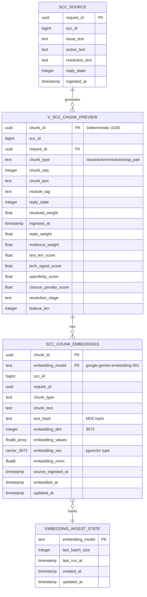
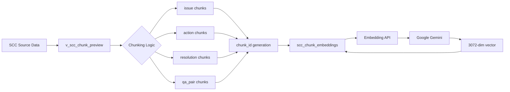

# 데이터베이스 명세서

CS 챗봇 시스템의 데이터베이스 구조와 스키마 문서입니다.

## 목차
- [개요](#개요)
- [ERD](#erd)
- [테이블 구조](#테이블-구조)
- [뷰](#뷰)
- [인덱스](#인덱스)
- [쿼리 예시](#쿼리-예시)

---

## 개요

**DBMS:** PostgreSQL 15+

**Extensions:**
- `pgvector 0.8.2` - Vector similarity search
- `uuid-ossp` - UUID generation

**Schema:** `ai_core`

**데이터 규모:**
- Source chunks: 13,255개
- Embeddings: 13,255개
- Embedding dimension: 3,072 (Google Gemini)

---

## ERD

### 전체 구조



### 데이터 플로우



---

## 테이블 구조

### 1. scc_chunk_embeddings

임베딩 벡터를 저장하는 메인 테이블입니다.

#### 스키마

```sql
CREATE TABLE ai_core.scc_chunk_embeddings (
  chunk_id          UUID NOT NULL,
  embedding_model   TEXT NOT NULL,
  scc_id            BIGINT,
  require_id        UUID,
  chunk_type        TEXT,
  chunk_text        TEXT,
  text_hash         TEXT,
  embedding_dim     INTEGER,
  embedding_values  FLOAT8[],
  embedding_vec     VECTOR(3072),
  embedding_norm    FLOAT8,
  source_ingested_at TIMESTAMPTZ,
  embedded_at       TIMESTAMPTZ DEFAULT NOW(),
  updated_at        TIMESTAMPTZ DEFAULT NOW(),

  PRIMARY KEY (chunk_id, embedding_model)
);
```

#### 컬럼 설명

| 컬럼 | 타입 | NULL | 설명 |
|------|------|------|------|
| `chunk_id` | UUID | NOT NULL | 청크 고유 ID (deterministic) |
| `embedding_model` | TEXT | NOT NULL | 임베딩 모델명 (예: `google:gemini-embedding-001`) |
| `scc_id` | BIGINT | NULL | SCC 원본 ID |
| `require_id` | UUID | NULL | 요구사항 ID |
| `chunk_type` | TEXT | NULL | 청크 타입 (issue/action/resolution/qa_pair) |
| `chunk_text` | TEXT | NULL | 청크 텍스트 (원본) |
| `text_hash` | TEXT | NULL | 텍스트 MD5 해시 (변경 감지용) |
| `embedding_dim` | INTEGER | NULL | 임베딩 차원 (3072) |
| `embedding_values` | FLOAT8[] | NULL | 임베딩 배열 (fallback) |
| `embedding_vec` | VECTOR(3072) | NULL | pgvector 타입 (검색용) |
| `embedding_norm` | FLOAT8 | NULL | 벡터 노름 |
| `source_ingested_at` | TIMESTAMPTZ | NULL | 소스 데이터 수집 시각 |
| `embedded_at` | TIMESTAMPTZ | NOT NULL | 임베딩 생성 시각 |
| `updated_at` | TIMESTAMPTZ | NOT NULL | 마지막 업데이트 시각 |

#### 제약 조건

**Primary Key:**
```sql
PRIMARY KEY (chunk_id, embedding_model)
```
- 동일한 청크를 다른 모델로 임베딩 가능
- 모델별로 별도 row 저장

**Unique Constraint:**
없음 (복합 PK로 충분)

#### 현재 데이터 상태

```sql
SELECT
  embedding_model,
  embedding_dim,
  COUNT(*) as row_count
FROM ai_core.scc_chunk_embeddings
GROUP BY embedding_model, embedding_dim;
```

**결과:**
| embedding_model | embedding_dim | row_count |
|-----------------|---------------|-----------|
| `google:gemini-embedding-001` | 3072 | 13,255 |

---

### 2. embedding_ingest_state

임베딩 동기화 상태를 추적하는 테이블입니다.

#### 스키마

```sql
CREATE TABLE ai_core.embedding_ingest_state (
  embedding_model   TEXT PRIMARY KEY,
  last_batch_size   INTEGER,
  last_run_at       TIMESTAMPTZ,
  created_at        TIMESTAMPTZ DEFAULT NOW(),
  updated_at        TIMESTAMPTZ DEFAULT NOW()
);
```

#### 컬럼 설명

| 컬럼 | 타입 | 설명 |
|------|------|------|
| `embedding_model` | TEXT | 임베딩 모델명 (PK) |
| `last_batch_size` | INTEGER | 마지막 배치 크기 |
| `last_run_at` | TIMESTAMPTZ | 마지막 실행 시각 |
| `created_at` | TIMESTAMPTZ | 생성 시각 |
| `updated_at` | TIMESTAMPTZ | 업데이트 시각 |

---

## 뷰

### 1. v_scc_chunk_preview

SCC 데이터를 청킹한 프리뷰 뷰입니다.

#### 정의

```sql
CREATE OR REPLACE VIEW ai_core.v_scc_chunk_preview AS
SELECT
  ai_core.make_stable_chunk_uuid(
    b.require_id,
    b.chunk_type,
    b.chunk_seq,
    b.reply_state,
    b.chunk_text
  ) AS chunk_id,
  b.scc_id,
  b.require_id,
  b.chunk_type,
  b.chunk_seq,
  b.chunk_text,
  b.module_tag,
  b.reply_state,
  b.resolved_weight,
  b.ingested_at,
  b.state_weight,
  b.evidence_weight,
  b.text_len_score,
  b.tech_signal_score,
  b.specificity_score,
  b.closure_penalty_score,
  b.resolution_stage,
  b.feature_len
FROM ai_core.v_scc_chunk_preview_base b;
```

#### 주요 특징

**Deterministic chunk_id:**
- `make_stable_chunk_uuid()` 함수 사용
- 입력값: `require_id`, `chunk_type`, `chunk_seq`, `reply_state`, `chunk_text`
- MD5 해시 기반 UUID 생성
- **항상 동일한 입력 → 동일한 chunk_id**

**청크 타입:**
- `issue`: 문제 설명
- `action`: 처리 조치
- `resolution`: 해결 방법
- `qa_pair`: 질의응답 쌍

#### 스코어 필드

| 필드 | 설명 | 범위 |
|------|------|------|
| `resolved_weight` | 해결 여부 가중치 | 0~1 |
| `state_weight` | 상태 가중치 | 0~1 |
| `evidence_weight` | 증거 가중치 | 0~1 |
| `text_len_score` | 텍스트 길이 점수 | 0~1 |
| `tech_signal_score` | 기술 신호 점수 | 0~1 |
| `specificity_score` | 구체성 점수 | 0~1 |
| `closure_penalty_score` | 종료 패널티 점수 | 0~1 |

---

### 2. v_scc_embedding_status

임베딩 커버리지 상태를 확인하는 뷰입니다.

```sql
SELECT
  embedding_model,
  (SELECT COUNT(*) FROM ai_core.v_scc_chunk_preview) AS source_chunk_rows,
  COUNT(*) AS embedded_chunks,
  ROUND(100.0 * COUNT(*) /
    (SELECT COUNT(*) FROM ai_core.v_scc_chunk_preview), 2
  ) AS coverage_pct
FROM ai_core.scc_chunk_embeddings
GROUP BY embedding_model;
```

**결과 예시:**
| embedding_model | source_chunk_rows | embedded_chunks | coverage_pct |
|-----------------|-------------------|-----------------|--------------|
| `google:gemini-embedding-001` | 13,255 | 13,255 | 100.00 |

---

### 3. v_scc_embedding_coverage

커버리지 세부 정보를 제공하는 뷰입니다.

---

## 인덱스

### 현재 인덱스 상태

**Primary Key Index:**
```sql
-- scc_chunk_embeddings_pkey
CREATE UNIQUE INDEX ON ai_core.scc_chunk_embeddings (chunk_id, embedding_model);
```

**ANN Index (Vector Search):**
현재 없음 (3072 차원은 HNSW 인덱스 미지원)

### 권장 인덱스

향후 추가 권장:

```sql
-- chunk_type 필터링용
CREATE INDEX idx_embeddings_chunk_type
ON ai_core.scc_chunk_embeddings (chunk_type);

-- require_id 조회용
CREATE INDEX idx_embeddings_require_id
ON ai_core.scc_chunk_embeddings (require_id);

-- text_hash 중복 체크용
CREATE INDEX idx_embeddings_text_hash
ON ai_core.scc_chunk_embeddings (text_hash);
```

---

## 함수

### make_stable_chunk_uuid()

Deterministic UUID를 생성하는 함수입니다.

#### 정의

```sql
CREATE OR REPLACE FUNCTION ai_core.make_stable_chunk_uuid(
  p_require_id UUID,
  p_chunk_type TEXT,
  p_chunk_seq INTEGER,
  p_reply_state INTEGER,
  p_chunk_text TEXT
) RETURNS UUID
LANGUAGE plpgsql
IMMUTABLE
AS $$
DECLARE
  raw_key TEXT;
  h TEXT;
BEGIN
  raw_key := concat_ws(
    '|',
    COALESCE(p_require_id::TEXT, ''),
    COALESCE(p_chunk_type, ''),
    COALESCE(p_chunk_seq::TEXT, ''),
    COALESCE(p_reply_state::TEXT, ''),
    MD5(COALESCE(p_chunk_text, ''))
  );

  h := MD5(raw_key);

  RETURN (
    SUBSTR(h, 1, 8) || '-' ||
    SUBSTR(h, 9, 4) || '-' ||
    SUBSTR(h, 13, 4) || '-' ||
    SUBSTR(h, 17, 4) || '-' ||
    SUBSTR(h, 21, 12)
  )::UUID;
END;
$$;
```

#### 특징

- **IMMUTABLE**: 동일 입력 → 동일 출력 보장
- MD5 해시 기반
- 청크 텍스트는 해시값만 사용 (전체 텍스트 포함 시 키가 너무 길어짐)

---

## 쿼리 예시

### 1. 특정 요구사항의 모든 청크 조회

```sql
SELECT
  chunk_id,
  chunk_type,
  chunk_seq,
  chunk_text
FROM ai_core.v_scc_chunk_preview
WHERE require_id = '6c11c32e-df4d-4b38-bc93-06df653b46a9'
ORDER BY chunk_seq;
```

### 2. 임베딩이 없는 청크 찾기

```sql
SELECT
  v.chunk_id,
  v.require_id,
  v.chunk_type,
  v.chunk_text
FROM ai_core.v_scc_chunk_preview v
LEFT JOIN ai_core.scc_chunk_embeddings e
  ON e.chunk_id = v.chunk_id
  AND e.embedding_model = 'google:gemini-embedding-001'
WHERE e.chunk_id IS NULL
LIMIT 10;
```

### 3. Vector Similarity Search

```sql
SELECT
  chunk_id,
  chunk_text,
  1 - (embedding_vec <=> $1::VECTOR) AS similarity
FROM ai_core.scc_chunk_embeddings
WHERE embedding_model = 'google:gemini-embedding-001'
  AND chunk_type IN ('issue', 'action', 'resolution', 'qa_pair')
ORDER BY embedding_vec <=> $1::VECTOR
LIMIT 10;
```

### 4. 임베딩 커버리지 확인

```sql
SELECT
  (SELECT COUNT(*) FROM ai_core.v_scc_chunk_preview) AS total_chunks,
  COUNT(*) AS embedded_chunks,
  ROUND(100.0 * COUNT(*) /
    (SELECT COUNT(*) FROM ai_core.v_scc_chunk_preview), 2
  ) AS coverage_pct
FROM ai_core.scc_chunk_embeddings
WHERE embedding_model = 'google:gemini-embedding-001';
```

### 5. 중복 chunk_id 검사

```sql
SELECT
  chunk_id,
  COUNT(*) AS dup_count
FROM ai_core.v_scc_chunk_preview
GROUP BY chunk_id
HAVING COUNT(*) > 1;
```

**결과:** 0 rows (중복 없음 보장)

---

## 데이터 정합성

### Chunk ID 안정성

**테스트:**
```sql
-- 첫 번째 조회
SELECT chunk_id FROM ai_core.v_scc_chunk_preview
ORDER BY require_id, chunk_type, chunk_seq LIMIT 5;

-- 두 번째 조회 (동일해야 함)
SELECT chunk_id FROM ai_core.v_scc_chunk_preview
ORDER BY require_id, chunk_type, chunk_seq LIMIT 5;
```

**결과:** ✅ 항상 동일 (Deterministic UUID)

### Stale Embeddings 검사

```sql
-- 임베딩은 있지만 소스가 없는 경우
SELECT COUNT(*) AS stale_rows
FROM ai_core.scc_chunk_embeddings e
WHERE NOT EXISTS (
  SELECT 1
  FROM ai_core.v_scc_chunk_preview v
  WHERE v.chunk_id = e.chunk_id
);
```

**결과:** 0 rows (Stale 없음)

---

## 마이그레이션

### chunk_id 안정화 마이그레이션

기존 뷰를 deterministic UUID로 전환:

```bash
# 스크립트 실행
node workspace-fastify/scripts/fix-stable-chunk-view.mjs
```

**작업 내용:**
1. `make_stable_chunk_uuid()` 함수 생성
2. `v_scc_chunk_preview_base` 스냅샷 생성
3. `v_scc_chunk_preview` 뷰 교체
4. Stale embeddings 삭제

---

## 변경 이력

### 2026-03-25
- ✅ 데이터베이스 문서 초안 작성
- ✅ ERD 다이어그램 추가
- ✅ 쿼리 예시 추가

### 2026-03-23
- ✅ Deterministic UUID 전환
- ✅ 데이터 확장: 3,243 → 13,255 rows
- ✅ 임베딩 커버리지 100% 달성

---

**문의:** AI Core Team
