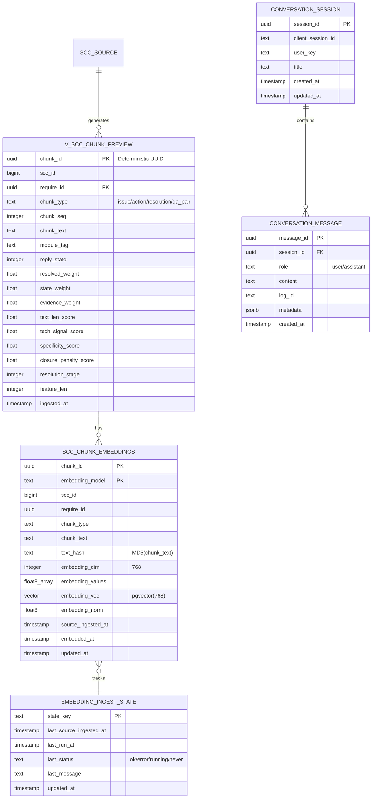

# 데이터베이스 명세서

CS 챗봇 시스템의 데이터베이스 구조와 스키마 문서입니다.

## 개요

| 항목 | 값 |
|------|-----|
| **DBMS** | PostgreSQL 16 |
| **호스트** | Oracle Cloud VM (VM_HOST_REMOVED:5432) |
| **Extensions** | `pgvector 0.8.2`, `uuid-ossp` |
| **Schema** | `ai_core` (RAG 데이터), `public` (SCC 원본) |
| **임베딩 모델** | `google:gemini-embedding-2-preview` (768-dim) |

### 현재 데이터 규모

| 객체 | 행 수 |
|------|-----:|
| `ai_core.v_scc_chunk_preview` (소스 청크) | 44,955 |
| `ai_core.scc_chunk_embeddings` (임베딩 적재) | 44,955 (100% 완료) |
| `ai_core.embedding_ingest_state` | 1 |
| `ai_core.conversation_session` | 운영 중 누적 |
| `ai_core.conversation_message` | 운영 중 누적 |

---

## ERD



---

## 테이블 / 뷰 상세

### 1. ai_core.mv_scc_chunk_preview (Materialized View)

`v_scc_chunk_preview`를 기반으로 생성한 Materialized View입니다. 검색 쿼리 성능 최적화를 위해 사용합니다.

```sql
-- 갱신 (신규 SCC 데이터 반영 시)
REFRESH MATERIALIZED VIEW ai_core.mv_scc_chunk_preview;
```

**인덱스:**
```sql
idx_mv_scc_chunk_require   -- btree(require_id)
```

> **알려진 이슈:** `v_scc_chunk_preview_base`의 정규식 패턴이 `'s+'`로 잘못 설정되어 텍스트 내 's' 문자가 제거됩니다 (`Base` → `Ba e`). 수정 시 전체 재임베딩 필요로 인해 보류 중.

---

### 2. ai_core.v_scc_chunk_preview

MV의 원본 뷰입니다. 검색 코드는 MV를 사용하며, 이 뷰는 임베딩 인제스트 기준 소스로 사용됩니다.

**청크 타입:**

| 타입 | 설명 |
|------|------|
| `issue` | 문제 증상 설명 |
| `action` | 처리 조치 내용 |
| `resolution` | 해결 방법 |
| `qa_pair` | 질의응답 쌍 |

**chunk_id 생성 방식:**

```sql
-- make_stable_chunk_uuid() 함수 사용
-- require_id + chunk_type + chunk_seq + reply_state + MD5(chunk_text) → UUID
-- 동일 입력 → 항상 동일한 chunk_id (Deterministic)
```

**주요 스코어 컬럼:**

| 컬럼 | 설명 |
|------|------|
| `state_weight` | 처리 상태 가중치 |
| `resolved_weight` | 해결 완료 가중치 |
| `evidence_weight` | 증거 데이터 가중치 |
| `text_len_score` | 텍스트 길이 점수 |
| `tech_signal_score` | 기술 신호 점수 |
| `specificity_score` | 구체성 점수 |
| `closure_penalty_score` | 종료 패널티 (음수 가중치) |

---

### 2. ai_core.scc_chunk_embeddings

각 청크의 임베딩 벡터를 저장하는 메인 테이블입니다.

```sql
CREATE TABLE ai_core.scc_chunk_embeddings (
  chunk_id           UUID          NOT NULL,
  embedding_model    TEXT          NOT NULL,
  scc_id             BIGINT,
  require_id         UUID,
  chunk_type         TEXT,
  chunk_text         TEXT,
  text_hash          TEXT,                    -- MD5(chunk_text), 변경 감지용
  embedding_dim      INTEGER,                 -- 768
  embedding_values   FLOAT8[],               -- 배열 fallback
  embedding_vec      VECTOR(768),             -- pgvector 검색용
  embedding_norm     FLOAT8,
  source_ingested_at TIMESTAMPTZ,
  embedded_at        TIMESTAMPTZ DEFAULT NOW(),
  updated_at         TIMESTAMPTZ DEFAULT NOW(),
  PRIMARY KEY (chunk_id, embedding_model)
);
```

**현재 상태:**

| embedding_model | embedding_dim | 행 수 |
|---|---:|---:|
| `google:gemini-embedding-2-preview` | 768 | 44,955 (100%) |

**pgvector 인덱스:**

```sql
-- HNSW 인덱스 (cosine similarity, 768-dim)
CREATE INDEX idx_scc_chunk_embeddings_hnsw
  ON ai_core.scc_chunk_embeddings
  USING hnsw ((embedding_vec::vector(768)) vector_cosine_ops)
  WITH (m = 16, ef_construction = 64);
```

- 서버 시작 3초 후 warmup 쿼리 자동 실행 (버퍼 캐시 프리로드)
- 첫 요청 vectorMs ~500ms, 이후 ~15ms (캐시 warm 상태)

---

### 3. ai_core.embedding_ingest_state

임베딩 동기화 잡의 상태를 추적합니다.

```sql
CREATE TABLE ai_core.embedding_ingest_state (
  state_key                TEXT PRIMARY KEY,
  last_source_ingested_at  TIMESTAMPTZ,
  last_run_at              TIMESTAMPTZ,
  last_status              TEXT,   -- ok / error / running / never
  last_message             TEXT,
  updated_at               TIMESTAMPTZ DEFAULT NOW()
);
```

**state_key 예시:** `scc_chunk_embeddings:google:gemini-embedding-2-preview`

---

### 4. ai_core.conversation_session

사용자 대화 세션을 저장합니다. `/chat/stream` 응답 후 자동 저장(fire-and-forget)됩니다.

```sql
CREATE TABLE ai_core.conversation_session (
  session_id        UUID PRIMARY KEY DEFAULT gen_random_uuid(),
  client_session_id TEXT,        -- 프론트엔드 로컬 UUID
  user_key          TEXT,        -- 사용자 식별자
  title             TEXT,
  created_at        TIMESTAMPTZ DEFAULT NOW(),
  updated_at        TIMESTAMPTZ DEFAULT NOW()
);
```

---

### 5. ai_core.conversation_message

각 대화 세션의 메시지를 저장합니다.

```sql
CREATE TABLE ai_core.conversation_message (
  message_id  UUID PRIMARY KEY DEFAULT gen_random_uuid(),
  session_id  UUID REFERENCES ai_core.conversation_session(session_id),
  role        TEXT,        -- user / assistant
  content     TEXT,
  log_id      UUID,        -- query_log 연결
  metadata    JSONB,       -- 추가 진단 정보
  created_at  TIMESTAMPTZ DEFAULT NOW()
);
```

---

### 6. ai_core.query_log

모든 `/chat/stream` 요청의 로그를 자동 기록합니다.

| 컬럼 | 설명 |
|------|------|
| `log_uuid` | 로그 ID (UUID) |
| `query` | 사용자 질문 |
| `confidence` | 최종 신뢰도 |
| `retrieval_mode` | `hybrid` / `rule_only` |
| `answer_source` | `llm` / `deterministic_fallback` / `rule_only` |
| `user_feedback` | 👍👎 피드백 (`positive` / `negative`) |
| `created_at` | 기록 시각 |

---

## 인덱스

```sql
-- mv_scc_chunk_preview (Materialized View)
idx_mv_scc_chunk_require               -- btree(require_id)

-- scc_chunk_embeddings
scc_chunk_embeddings_pkey              -- (chunk_id, embedding_model)
idx_scc_chunk_embeddings_require       -- require_id
idx_scc_chunk_embeddings_scc           -- scc_id
idx_scc_chunk_embeddings_chunk_type    -- chunk_type
idx_scc_chunk_embeddings_model         -- embedding_model
idx_scc_chunk_embeddings_model_dim     -- (embedding_model, embedding_dim)
idx_scc_chunk_embeddings_embedded_at   -- embedded_at
idx_scc_chunk_embeddings_hnsw          -- hnsw((embedding_vec::vector(768)) vector_cosine_ops)

-- public.scc_request / scc_reply (GIN FTS - Rule 검색 핵심)
idx_scc_request_fts                    -- gin(to_tsvector('simple', title || context))
idx_scc_reply_fts                      -- gin(to_tsvector('simple', reply))
```

---

## 주요 SQL

### 임베딩 현황 확인

```sql
-- 모델별 임베딩 수
SELECT embedding_model, embedding_dim, COUNT(*)
FROM ai_core.scc_chunk_embeddings
GROUP BY embedding_model, embedding_dim;

-- 소스 대비 커버리지
SELECT
  (SELECT COUNT(*) FROM ai_core.v_scc_chunk_preview) AS source_chunks,
  COUNT(*) AS embedded_chunks,
  ROUND(100.0 * COUNT(*) /
    (SELECT COUNT(*) FROM ai_core.v_scc_chunk_preview), 2) AS coverage_pct
FROM ai_core.scc_chunk_embeddings
WHERE embedding_model = 'google:gemini-embedding-2-preview';
```

### 임베딩 안 된 청크 찾기

```sql
SELECT v.chunk_id, v.require_id, v.chunk_type
FROM ai_core.v_scc_chunk_preview v
LEFT JOIN ai_core.scc_chunk_embeddings e
  ON e.chunk_id = v.chunk_id
  AND e.embedding_model = 'google:gemini-embedding-2-preview'
WHERE e.chunk_id IS NULL
LIMIT 20;
```

### Vector Similarity Search

```sql
SELECT
  chunk_id,
  chunk_text,
  1 - (embedding_vec <=> $1::VECTOR) AS similarity
FROM ai_core.scc_chunk_embeddings
WHERE embedding_model = 'google:gemini-embedding-2-preview'
  AND chunk_type IN ('issue', 'action', 'resolution', 'qa_pair')
ORDER BY embedding_vec <=> $1::VECTOR
LIMIT 10;
```

### 인제스트 상태 확인

```sql
SELECT * FROM ai_core.embedding_ingest_state ORDER BY updated_at DESC;
```

### pgvector 확장 확인

```sql
SELECT extname, extversion FROM pg_extension WHERE extname = 'vector';
```

---

## DB 운영 스크립트

| 명령 | 역할 |
|------|------|
| `npm run db:init:vector` | ai_core 스키마 / 테이블 / 뷰 초기화 |
| `npm run db:fix:stable-chunk-view` | Deterministic chunk_id 적용 |
| `npm run db:enable:pgvector` | embedding_vec 컬럼 backfill 및 pgvector 활성화 |
| `npm run ingest:sync:scc-embeddings` | 미임베딩 청크 증분 적재 |
| `npm run db:check:vector` | 현재 모델 / 차원 / 커버리지 확인 |

---

## 변경 이력

### 2026-04-09 (최신)
- ✅ 데이터 규모 업데이트: 44,955 소스 청크, 임베딩 커버리지 100%
- ✅ mv_scc_chunk_preview Materialized View 섹션 추가
- ✅ HNSW 인덱스 생성 완료 반영 (m=16, ef_construction=64)
- ✅ GIN FTS 인덱스 목록 추가 (scc_request / scc_reply)
- ✅ 알려진 이슈 (`s+` 정규식 버그) 문서화

### 2026-03-25
- ✅ 초기 데이터베이스 문서 작성
- ✅ ERD 다이어그램 추가

### 2026-03-23
- ✅ Deterministic UUID 전환
- ✅ 임베딩 데이터 확장: 3,243 → 13,255
