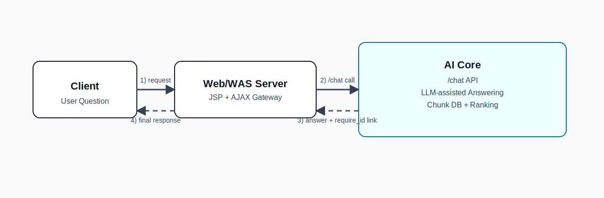
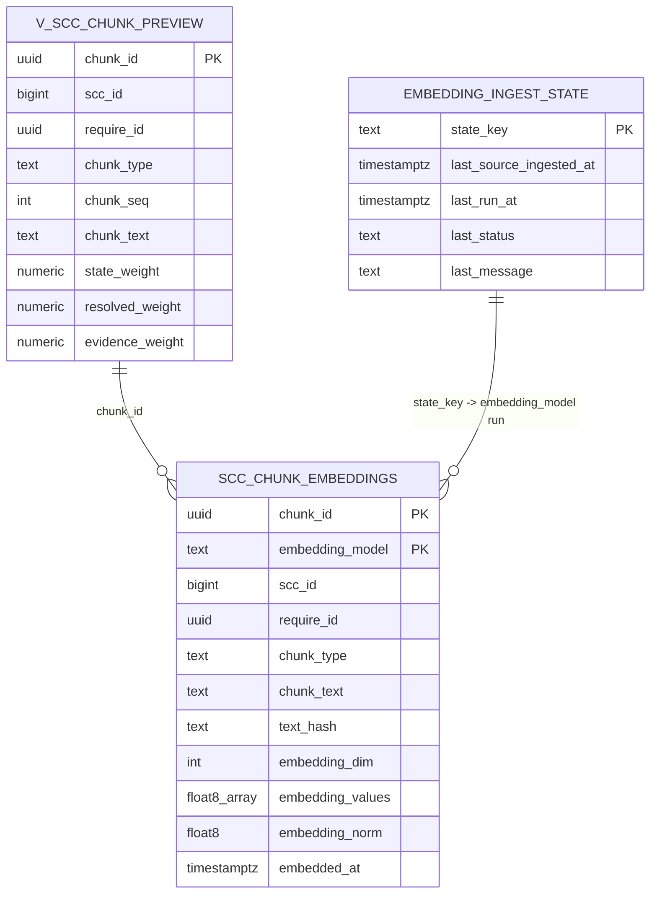

# AI Core (workspace-fastify)

Covision AI Core MVP runtime based on Fastify + TypeScript.


## 프로젝트 개요

이 프로젝트는 Web/WAS와 분리된 독립 AI Core 서비스입니다.  
SCC 유지보수 이력 데이터를 기반으로 유사 이슈를 검색하고, LLM 답변 생성에 필요한 근거를 제공합니다.

핵심 목표:
- 1단계: AI Core 단독 API 검증 (curl, Postman, `/test/chat`)
- 2단계: Web/WAS(JSP ajax) 연동
- 3단계: 하이브리드 검색 + LLM 재랭킹 고도화

## 아키텍처



```text
Client
  -> Web/WAS Server (JSP + AJAX)
  -> AI Core (/chat)
     - Chunk DB 기반 검색/랭킹
     - LLM 기반 답변 생성/후보 대조
  -> Web/WAS Server
  -> Client
```

## 현재 구축 단계 (2026-03-12 기준)

### 1) 검색/랭킹
- `ai_core.v_scc_chunk_preview` 기반 검색
- `chunk_type(issue/action/resolution/qa_pair)`별 점수 반영
- focus token 기반 후보 선별 강화
  - query 핵심 토큰 추출
  - `issue/qa_pair` 우선 require 후보군 축소
  - 동의어 확장(휴가/연차/근태, 상신/기안/결재, 조직/부서/동기화 등)
- generic 인사말/서명성 문구 패널티 적용

### 2) LLM 생성
- Google Gemini 호출 지원 (`gemini-2.5-flash` 권장)
- 상위 후보(Top-K) 대조 후 구조화 판단 시도
- LLM 응답 파싱 실패 시 안전 fallback 처리
- `how-to`/가이드형 질의는 LLM 강제 경로로 설명형 답변 품질 보강
- 답변 포맷: `핵심 답변 / 적용 방법 / 확인 포인트 / 참고 링크`

### 3) 벡터 추적/적재 기반
- `ai_core` 스키마에 임베딩 추적 테이블/상태 테이블/뷰 생성
- 임베딩 백필/증분 스크립트 추가
- 현재 DB 권한 이슈로 `pgvector extension` 미설치 환경 대응
  - `float8[]` 저장 방식으로 안전 운용
  - 확장 권한 확보 시 pgvector 전환 가능하도록 구조 설계

## 주요 API

### GET `/health`
```json
{
  "status": "ok",
  "service": "workspace-fastify"
}
```

### POST `/chat`
요청:
```json
{
  "query": "나 지금 휴가신청서가 상신이 불가능한 오류가 있어",
  "retrievalScope": "scc"
}
```

응답(요약 필드):
- `bestRequireId`, `bestSccId`, `confidence`
- `bestChunkType`, `bestAnswerText`
- `similarIssueUrl`
- `display` (`status`, `title`, `answerText`, `linkUrl`, `requireId`, `sccId`, `confidence`, `answerSource`, `retrievalMode`)
- `candidates[]` (Top-K)
- `retrievalMode` (`hybrid` | `rule_only`)
- `vectorUsed`, `vectorError`
- `answerSource`, `answerSourceReason`
- `generatedAnswer`, `llmUsed`, `llmModel`, `llmError`
- `llmSelectedRequireId`, `llmSelectedSccId`, `llmReRanked`
- `llmSkipped`, `llmSkipReason`
- `timings` (`ruleMs`, `embeddingMs`, `vectorMs`, `rerankMs`, `retrievalMs`, `llmMs`, `totalMs`, `cacheHit`)

JSP 연동 기준:
- 화면 렌더링은 `display.answerText`, `display.linkUrl`, `display.title`, `display.status`를 우선 사용
- 원시 진단 필드(`candidates`, `timings`, `llm*`, `vector*`)는 운영 분석/디버그 용도로 유지
- JSP 샘플: `docs/integration/chat_widget.sample.jsp`

### GET `/test/chat`
브라우저에서 `/chat` 수동 검증 가능한 테스트 UI.

## 데이터 모델링 (핵심)

### 소스 View
- `ai_core.v_scc_chunk_preview`
- 주요 컬럼: `chunk_id`, `scc_id`, `require_id`, `chunk_type`, `chunk_text`, `state_weight`, `resolved_weight`, `evidence_weight`, `specificity_score` 등

### 임베딩 추적 테이블
- `ai_core.scc_chunk_embeddings`
  - `chunk_id`, `require_id`, `embedding_model`, `embedding_values`, `embedding_norm`, `text_hash`, `source_ingested_at` 등
- `ai_core.embedding_ingest_state`
  - 적재 워터마크/상태 추적
- 모니터링 View
  - `ai_core.v_scc_embedding_status`
  - `ai_core.v_scc_embedding_coverage`

### ERD (Mermaid)


## 실행 및 배포(로컬 기준)

```bash
npm ci
npm run typecheck
npm run build
npm run dev
```

기본 포트: `3101`

기본 확인:
- `GET http://localhost:3101/health`
- `GET http://localhost:3101/test/chat`
- `POST http://localhost:3101/chat`

## 구축용 스크립트

```bash
npm run db:init:vector
npm run db:enable:pgvector
npm run ingest:sync:scc-embeddings -- --dry-run --batch-size 200 --max-batches 2
```

실제 임베딩 적재(키 필요):
```bash
npm run ingest:sync:scc-embeddings -- --batch-size 100 --max-batches 50
```

Google 임베딩으로 적재:
```bash
npm run ingest:sync:scc-embeddings -- --provider google --batch-size 100 --max-batches 50
```

Google 임베딩 운영 권장 배치(2026-03-30 검증):
```bash
npm run ingest:sync:scc-embeddings -- --provider google --batch-size 100 --max-batches 8 --priority-mode answer_first
```

운영 메모:
- `answer_first` 모드는 `qa_pair -> resolution -> issue -> action` 순으로 우선 적재
- `100 x 10`은 처리 가능하지만 free tier 기준 `429`/abort가 발생할 수 있어 기본 운영값으로는 `100 x 8`을 권장
- `GOOGLE_EMBEDDING_MIN_INTERVAL_MS=1500` 설정 시 현재 환경에서 안정적으로 완료됨
- 증분 적재이므로 실패해도 앞선 batch는 유지되고 다음 실행에서 이어서 진행됨

벡터 상태 점검:
```bash
npm run db:check:vector
```

## 환경 변수

주요 변수:
- 서버: `HOST`, `PORT`, `LOG_LEVEL`
- 검색: `RETRIEVAL_SCOPE_DEFAULT`, `RETRIEVAL_TOP_K`
- DB: `VECTOR_DB_HOST`, `VECTOR_DB_PORT`, `VECTOR_DB_NAME`, `VECTOR_DB_USER`, `VECTOR_DB_PASSWORD`
- LLM: `LLM_PROVIDER`, `GOOGLE_API_KEY`, `GOOGLE_MODEL`, `LLM_TIMEOUT_MS`, `LLM_CANDIDATE_TOP_N`, `LLM_SKIP_ON_HIGH_CONFIDENCE`, `LLM_SKIP_MIN_CONFIDENCE`
- 속도 튜닝 기본값:
  - `LLM_CANDIDATE_TOP_N=3`
  - `LLM_MAX_OUTPUT_TOKENS=256`
  - LLM prompt preview는 후보당 약 `120/90`자 수준으로 축소
- 임베딩: `EMBEDDING_PROVIDER`, `EMBEDDING_MODEL`, `OPENAI_EMBEDDING_MODEL`, `GOOGLE_EMBEDDING_MODEL`, `EMBEDDING_MODEL_AUTO_ALIGN`, `EMBEDDING_MODEL_RESOLVE_TTL_MS`, `OPENAI_API_KEY`, `GOOGLE_API_KEY`
- 벡터 검색 모드: `PGVECTOR_SEARCH_ENABLED` (`true` 권장)
- Google 임베딩 속도/재시도: `GOOGLE_EMBEDDING_MIN_INTERVAL_MS`, `GOOGLE_EMBEDDING_MAX_RETRIES`

권장 설정 예시:
- Google 임베딩 테스트: `EMBEDDING_PROVIDER=google`, `GOOGLE_API_KEY=...`, `GOOGLE_EMBEDDING_MODEL=gemini-embedding-2-preview`
- free tier 429 대응: `GOOGLE_EMBEDDING_MIN_INTERVAL_MS=700` 권장, 429 발생 시 자동 재시도
- 모델 자동 정렬: `EMBEDDING_MODEL_AUTO_ALIGN=true` 권장, 런타임 설정 모델에 적재 데이터가 없으면 DB 주력 모델로 자동 전환
- OpenAI 전환 시: `EMBEDDING_PROVIDER=openai`, `OPENAI_API_KEY=...`, `OPENAI_EMBEDDING_MODEL=text-embedding-3-small`

참고:
- 현재 코드에서 `.env.example`는 샘플 문서입니다(자동 로딩 아님).
- 실제 실행 프로세스 환경변수에 값을 주입해야 합니다.

## 현재 한계와 다음 단계

현재 한계:
- 도메인 데이터 품질(인사말/서명/반복 문구)에 따라 후보 왜곡 가능
- Google free tier quota 초과 시 질문 임베딩 경로가 cooldown 후 `rule_only`로 fallback
- vector 경로는 `gemini-embedding-2-preview`(768차원) 기준으로 정렬되었고, 실제 운영에서는 quota 안정화 검증이 더 필요

다음 단계:
1. query intent별 가중치 테이블 분리(정책화)
2. 후보 추출 평가셋 기반 정량 튜닝(Top1/Top3 정확도)
3. pgvector 권한 확보 후 벡터 검색 성능/정확도 고도화
4. JSP ajax 연동 계약 고정 및 운영 로깅 강화

## 임베딩 운영 현황 (2026-03-30)

- source chunk rows: `44,955`
- embedded rows (`google:gemini-embedding-2-preview`): `17,355`
- pending rows: `27,600`
- current coverage: `38.61%`

최근 검증 결과:
- `50 x 5` 안정적으로 완료
- `50 x 10` 안정적으로 완료
- `100 x 10`은 처리 가능하지만 후반에 `429` retry가 관측됨
- `100 x 8 + GOOGLE_EMBEDDING_MIN_INTERVAL_MS=1500`는 성공적으로 완료됨

현재 권장 운영 패턴:
1. `EMBEDDING_PRIORITY_MODE=answer_first`
2. `GOOGLE_EMBEDDING_MIN_INTERVAL_MS=1500`
3. `batch-size=100`
4. `max-batches=8`
5. 동일 명령 반복 실행으로 누적 적재

## 레벨 3 로드맵

현재 수준 평가는 `레벨 2 후반 ~ 레벨 3 초입`입니다.  
레벨 3 완료 기준은 "검색 정확도, 답변 일관성, 장애 대응, 운영 튜닝이 가능한 엔터프라이즈 RAG"입니다.

### 체크리스트

1. Retrieval 안정화
- `query rewrite` 중복 치환 버그 수정
- synonym 사전 정리
- rule/vector/fusion 가중치 재조정
- `relevance filter` 임계값 튜닝
- `qa_pair`, `resolution`, `issue`, `action` 타입 우선순위 재정의

2. Vector 검색 정상화
- 질문 임베딩 API 안정화
- `vectorUsed=true`, `retrievalMode=hybrid` 실운영 검증
- pgvector 인덱스 전략 확정
- quota 초과 시 fallback 정책 유지

3. Answer 조립 품질
- fallback 답변을 사용자 안내형으로 일관화
- `similarIssueUrl` 링크를 답변과 응답 필드에 모두 유지
- `answerSource` 구분(`llm`, `deterministic_fallback`, `rule_only`) 검토
- raw 운영 문구 제거 강화

4. 평가체계 구축
- 대표 질문셋 20~50개 작성
- `expectedRequireId`, `expectedChunkType`, `answerable` 정의
- Top1 / Top3 적중률 측정 가능 상태 확보

5. 운영 관측성
- `timings` 세분화 (`ruleMs`, `embeddingMs`, `vectorMs`, `llmMs`)
- `/retrieval/search`로 후보 선정 근거 확인 가능 상태 유지
- `vectorError`, `llmError`, `llmSkipReason` 로그 일관화

6. 성능/장애 대응
- LLM skip 정책 고정
- timeout, cache TTL, Top-K 튜닝
- 외부 임베딩/LLM 장애 시에도 `/chat` 정상 응답 유지

### 단계별 진행 순서

1. Step 1: query rewrite 버그 수정
2. Step 2: 평가셋 작성
3. Step 3: vector 경로 정상화
4. Step 4: answer source / fallback 포맷 정리
5. Step 5: timings 세분화
6. Step 6: 가중치 튜닝 반복

평가셋 자산:
- `docs/eval/README.md`
- `docs/eval/scc_eval_set.seed.json`

### Step 6 1차 결과

현재 Step 6 1차 평가는 `rule_only` 기준으로 완료했다.

- 평가 명령: `npm run eval:retrieval`
- 평가 스크립트: `scripts/eval-scc-retrieval.mjs`
- 평가셋: `docs/eval/scc_eval_set.seed.json`

1차 결과:
- `Top1Hit`: `13/13 (100%)`
- `Top3Hit`: `13/13 (100%)`
- `ChunkTypeHit`: `13/13 (100%)`
- `NegativeCorrect`: `4/4 (100%)`

주의:
- 현재 `.env` 기준으로 `GOOGLE_API_KEY`는 로드되지만, 질문 임베딩 단계에서 `GOOGLE_EMBEDDING_HTTP_429`가 발생해 실제 벡터 검색은 타지 못하고 있다.
- 따라서 현재 수치는 `hybrid`가 아닌 `rule_only` fallback 기준이다.
- hybrid 재측정은 Google embedding quota 회복 후 다시 진행해야 한다.

### Step 6 2차 결과

Step 6 2차에서는 Google embedding API 복구 후 `hybrid` 기준 재측정을 완료했다.

- 평가 명령: `npm run eval:retrieval`
- 평가 스크립트: `scripts/eval-scc-retrieval.mjs`
- 평가셋: `docs/eval/scc_eval_set.seed.json`
- 재검증 결과 저장: `docs/eval/hybrid_recheck.latest.json`

2차 결과:
- `Top1Hit`: `13/13 (100%)`
- `Top3Hit`: `13/13 (100%)`
- `ChunkTypeHit`: `13/13 (100%)`
- `NegativeCorrect`: `4/4 (100%)`
- `hybridCount`: `17`
- `vectorUsedCount`: `17`

해석:
- 평가셋 전건에서 `vectorUsed=true`, `retrievalMode=hybrid`로 확인되었다.
- Step 6 2차 시점에서는 오탐/정탐 비교 기준으로 추가 점수식 보정이 필요하지 않았다.
- 따라서 현재 가중치 테이블은 유지하고, 다음 튜닝은 운영성 질의셋 확대 후 진행하는 것이 맞다.

### Step 6 3차 결과

Step 6 3차에서는 운영성 한글 질의셋을 `38건`으로 확장하고, hybrid 기준 추가 튜닝을 진행했다.

- 확장 평가셋: `29` answerable + `9` negative
- 튜닝 포인트:
  - `chat.service.ts` 도메인 동의어/핵심 토큰 확장
  - 운영형 키워드(`브라우저캐시여부`, `팝업`, `message-id`, `HTML`, `전표승인서`, `전자세금계산서`, `관리자 비밀번호` 등) 추가
  - `eval-scc-retrieval.mjs`에 `EVAL_QUERY_DELAY_MS` 지원 추가

3차 결과(확장 질의셋 기준):
- `Top1Hit`: `27/29 (93.1%)`
- `Top3Hit`: `29/29 (100%)`
- `ChunkTypeHit`: `28/29 (96.55%)`
- `NegativeCorrect`: `9/9 (100%)`

해석:
- 확장 질의셋 기준으로도 retrieval precision은 유지되며, miss가 발생해도 Top3 안에는 정답 후보가 유지된다.
- 남은 miss는 완전한 오탐보다 동일 주제의 인접 SCC가 앞서는 케이스가 중심이다.
- Google embedding 호출이 짧은 시간에 반복되면 `QUERY_EMBEDDING_COOLDOWN_ACTIVE`로 `rule_only` fallback이 발생할 수 있으므로, 반복 평가 시에는 `EVAL_QUERY_DELAY_MS`를 주고 fresh quota window에서 재측정하는 것이 맞다.

### Step 6 평가 정책

- 일반 운영 질의는 동일 주제의 중복 SCC가 존재할 수 있으므로 `대표 SCC` 기준으로 평가한다.
- 회사명, 양식명, SCC ID, 특정 문서번호처럼 식별자가 포함된 질의만 `정확 SCC 일치`를 요구한다.
- 짧은 시간 안에 대량 평가를 반복할 때 발생하는 `QUERY_EMBEDDING_COOLDOWN_ACTIVE`는 retrieval 정책 miss가 아니라 운영 제약으로 분리해서 본다.
- 대표 SCC 허용 확정:
  - `EV-039`는 `251382` 후속 건과 `251364` 선행 건이 동일 증상/동일 조치 축이라 대표 SCC 허용
- exact SCC 유지:
  - `EV-032`는 rule_only cooldown 구간에서 다른 주제 SCC가 1위로 오르므로 대표 SCC로 인정하지 않음

### /chat 품질 점검

- 평가 스크립트: `npm run eval:chat`
- 산출물: `docs/eval/chat_quality.phase3.latest.json`

품질 결과(38건 기준):
- `exactBestHit`: `27/29 (93.1%)`
- `top3SupportHit`: `29/29 (100%)`
- `answerFormatOk`: `29/29 (100%)`
- `linkAttached`: `28/29 (96.55%)`
- `negativeGuarded`: `9/9 (100%)`

해석:
- answerable 질의는 전건에서 답변 본문이 생성되었고, Top3 안에는 정답 후보가 유지된다.
- negative 질의는 링크 없이 안전 응답으로 정리되도록 보정되었다.
- 현재 남은 `/chat` 품질 이슈는 `EV-029` 한 건으로, fresh hybrid window에서는 해결되지만 cooldown 구간에서는 링크 없이 safe default로 내려간다.

### Step 6 4차 결과 (50건 운영성 질의셋)

- 질의셋 크기: `50`건 (`37` answerable, `13` negative)
- retrieval 산출물: `docs/eval/retrieval.phase4.latest.json`
- chat 산출물: `docs/eval/chat_quality.phase4.latest.json`

retrieval 결과:
- `Top1Hit`: `37/37 (100%)`
- `Top3Hit`: `37/37 (100%)`
- `ChunkTypeHit`: `37/37 (100%)`
- `NegativeCorrect`: `13/13 (100%)`

`/chat` 결과:
- `exactBestHit`: `37/37 (100%)`
- `top3SupportHit`: `37/37 (100%)`
- `answerFormatOk`: `37/37 (100%)`
- `linkAttached`: `37/37 (100%)`
- `negativeGuarded`: `13/13 (100%)`

해석:
- 현재 active key 기준 50건 전량이 `hybrid`로 동작했고 `vectorUsedCount=50`, `hybridCount=50`을 확인했다.
- `EV-039`는 대표 SCC 허용 정책으로 평가했고, `EV-032`는 exact SCC 유지 기준으로도 통과한다.
- `EV-049`는 보안 ruleset에 `주민등록번호/개인정보` 패턴을 추가해 negative guard를 복구했다.

### EV-029 Cooldown 완화 정책

- 목적: 임베딩 cooldown 동안 `EV-029`처럼 `confidence`가 임계값 바로 아래에서 끊기는 케이스 보정
- 적용 조건:
  - vector 경로가 `429` 또는 `QUERY_EMBEDDING_COOLDOWN_ACTIVE`
  - Top1 chunk가 `qa_pair`
  - `score >= 0.43`
  - `strongestLexicalCoverage >= 0.30`
  - `answerTrackScore >= 0.35`
  - 2위와 점수 차 `>= 0.12`
- 결과:
  - `EV-029` 단건 `rule_only` 재현 시 `Top1Hit 1/1`로 보정 완료
  - negative 질의 링크 누수 없이 유지

### 레벨 3 완료 판정 기준

1. 대표 질문셋으로 Top1 / Top3 적중률 측정 가능
2. `/retrieval/search`로 후보 선정 근거 확인 가능
3. `generatedAnswer`가 일정한 사용자 안내형 포맷 유지
4. vector 장애 시에도 `/chat` 서비스 유지
5. 응답시간과 실패 원인을 로그/응답에서 추적 가능
6. 운영자가 오답과 지연 원인을 재현할 수 있음

## 운영 경계

- 레거시 코드는 참조 전용
- 직접 import 금지
- 세부 경계 정책은 `BOUNDARIES.md` 참조
