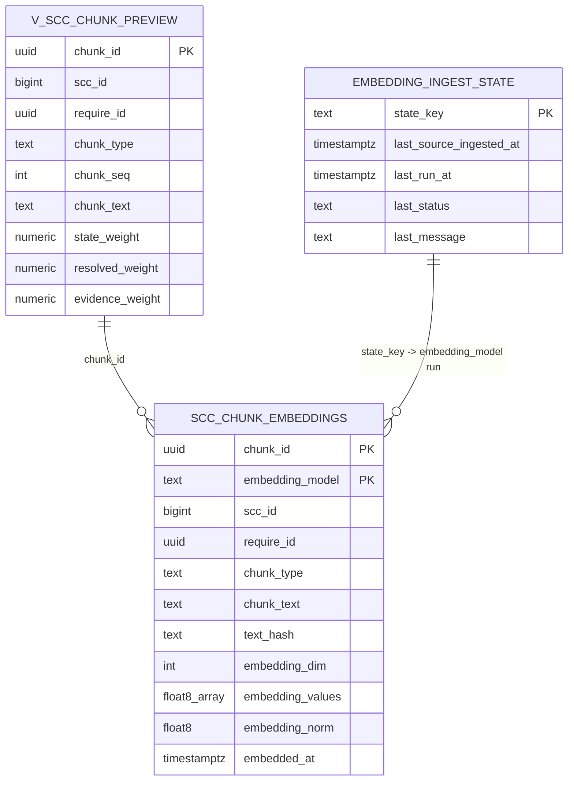

# 코비전 CS Bot (workspace-fastify)

Covision CS Bot — Fastify + TypeScript 기반 RAG AI Core 서비스.


## 프로젝트 개요

SCC 유지보수 이력 데이터를 기반으로 유사 이슈를 검색하고, Google Gemini LLM으로 구조화된 답변을 생성하는 하이브리드 RAG 서비스입니다.

**운영 환경:** https://csbotservice.com  
**서버:** Oracle Cloud VM (Ubuntu 22.04)  
**CI/CD:** GitHub Actions → ghcr.io → VM 자동 배포

## 아키텍처

```text
사용자 브라우저
  ↓ HTTPS (443)
Nginx (SSL 종료 / 리버스 프록시)
  ├─→ /api/*  → Backend  (Fastify:3101)
  └─→ /*      → Frontend (Next.js:3000)

Backend RAG Pipeline:
  1. GIN FTS 인덱스로 require_id 후보 필터링
  2. mv_scc_chunk_preview (Materialized View) 조회
  3. Rule 기반 점수 계산 (lexical + 가중치)
  4. pgvector HNSW 인덱스로 벡터 유사도 검색
  5. Rule + Vector 퓨전 랭킹
  6. Google Gemini LLM 답변 생성 (SSE 스트리밍)
```

## 현재 구축 단계 (2026-04-09 기준)

### 1) 검색/랭킹 (완료)
- `ai_core.mv_scc_chunk_preview` (Materialized View) 기반 검색
- GIN FTS 인덱스로 require_id 사전 필터링 (전체 스캔 제거)
- `chunk_type(issue/action/resolution/qa_pair)`별 점수 반영
- focus token 기반 후보 선별 + 동의어 확장
- generic 인사말/서명성 문구 패널티 적용

### 2) LLM 생성 (완료)
- Google Gemini (`gemini-2.5-flash-lite`) SSE 스트리밍 답변
- 상위 후보(Top-3) 대조 후 구조화 답변 생성
- LLM 응답 파싱 실패 시 안전 fallback
- `how-to`/가이드형 질의는 LLM 강제 경로
- 답변 포맷: `핵심 답변 / 적용 방법 / 확인 포인트 / 참고 링크`

### 3) 벡터 검색 (완료)
- `pgvector 0.8.2` + HNSW 인덱스 (768차원 cosine)
- 쿼리 임베딩: `google:gemini-embedding-2-preview` (768-dim)
- 44,955건 전량 임베딩 완료 (커버리지 100%)
- 서버 시작 시 HNSW 버퍼 워밍업 자동 실행

## 주요 API

### POST `/chat/stream` (메인)
SSE 스트리밍으로 답변을 반환합니다.

```bash
curl -X POST https://csbotservice.com/api/chat/stream \
  -H "Content-Type: application/json" \
  -d '{"query":"휴가신청서 상신 불가","retrievalScope":"scc"}'
```

SSE 이벤트 순서: `metadata` → `chunk` × N → `done`

**metadata 주요 필드:**
- `display` (`title`, `answerText`, `linkUrl`, `linkLabel`, `status`)
- `top3Candidates[]`, `confidence`, `retrievalMode`
- `timings` (`ruleMs`, `embeddingMs`, `vectorMs`, `rerankMs`, `retrievalMs`, `llmMs`, `totalMs`)
- `answerSource` (`llm` / `deterministic_fallback` / `rule_only`)

JSP 연동 기준:
- 화면 렌더링은 `display.*` 필드만 사용
- 진단 필드(`timings`, `llm*`, `vector*`)는 운영 분석 전용
- JSP 샘플: `docs/integration/chat_widget.sample.jsp`

### POST `/retrieval/search` (디버그)
LLM 없이 RAG 검색 결과 + 타이밍만 반환합니다.

```bash
curl -X POST https://csbotservice.com/api/retrieval/search \
  -H "Content-Type: application/json" \
  -d '{"query":"결재선 지정 방법","retrievalScope":"scc"}'
```

### GET `/health`
```json
{
  "status": "ok",
  "service": "workspace-fastify",
  "build": {
    "commitSha": "8a38aab...",
    "buildTime": "2026-04-12T12:00:00Z",
    "refName": "main",
    "runId": "123456789",
    "repository": "jdhert/CS-ChatBot",
    "imageTag": "latest"
  },
  "embeddingCoverage": {
    "available": true,
    "minCoveragePct": 99.2,
    "pendingChunks": 120,
    "alert": {
      "level": "ok",
      "message": "임베딩 커버리지가 정상 범위입니다."
    }
  }
}
```

## 운영 API 라우팅 규칙

현재 운영 환경은 `Nginx -> Backend` 직결 구조입니다.

- 브라우저의 `/api/*` 요청은 Next `app/api/*`가 아니라 **Nginx를 통해 backend로 직접 전달**됩니다.
- 따라서 프론트 코드는 운영 기준으로 아래 경로만 사용해야 합니다.

| 프론트 호출 경로 | 실제 백엔드 경로 |
| --- | --- |
| `/api/chat/stream` | `/chat/stream` |
| `/api/retrieval/search` | `/retrieval/search` |
| `/api/admin/logs` | `/admin/logs` |
| `/api/feedback` | `/feedback` |
| `/api/conversations` | `/conversations` |
| `/api/conversations/:sessionId` | `/conversations/:sessionId` |
| `/api/conversations/:sessionId/messages` | `/conversations/:sessionId/messages` |

운영에서 사용하면 안 되는 경로:

- `/api/chat`
- `/api/logs`
- `/api/search`

이 경로들은 로컬 Next 프록시 관점에서는 동작할 수 있어도, 현재 운영 Nginx 라우팅 구조에서는 응답 계약이 달라질 수 있습니다.

상세 정리:
- [docs/architecture/api-routing.md](../docs/architecture/api-routing.md)

## 운영 Smoke 평가

배포 후 `csbotservice.com`에서 대표 질문이 정상 답변/링크를 반환하는지 빠르게 확인할 수 있습니다.

```bash
npm run smoke:prod
```

GitHub Actions 배포 workflow는 VM 재배포 후 별도 `Production Smoke` job에서 공개 도메인 기준 smoke를 자동 실행합니다.

기본 대상:
- `https://csbotservice.com/health`
- `https://csbotservice.com/api/chat/stream`

평가 기준:
- HTTP 200
- `/health.build.commitSha`가 GitHub Actions 실행 commit SHA와 일치할 것
- `NO_MATCH` 등 오류 응답이 아닐 것
- 답변 본문이 최소 길이 이상일 것
- 대표 질문에는 유사 이력 링크가 붙을 것

설정:
- seed: `docs/eval/production_smoke.seed.json`
- latest artifact: `docs/eval/production_smoke.latest.json`
- GitHub Actions artifact: `health.json`, `production_smoke.latest.json`
- base URL 변경: `npm run smoke:prod -- --base-url https://example.com/api`
- 일부만 실행: `npm run smoke:prod -- --limit 2`

## 운영 로그 기반 eval 후보 추출

`query_log`의 실패/싫어요/no-match/저신뢰 질의를 수동 검토용 eval 후보로 추출합니다.

```bash
npm run eval:candidates -- --days 14 --limit 50
```

기본 산출물:
- `docs/eval/query_log_eval_candidates.latest.json`

이 파일은 실행 결과 산출물이므로 Git 추적 대상에서 제외합니다. `draftEvalItem.expectedRequireId`는 당시 검색 결과일 뿐 정답 확정값이 아니므로, SCC 이력 검토 후 `scc_eval_set.seed.json`으로 승격합니다.

## API Rate Limiting

운영 노출 API는 Fastify `onRequest` 훅에서 경로 그룹별 인메모리 rate limit을 적용합니다.

기본값:
- `/chat/stream`: 20 req/min/IP
- `/chat`: 30 req/min/IP
- `/retrieval/search`: 60 req/min/IP
- `/feedback`: 120 req/min/IP
- `/admin/logs`: 120 req/min/IP
- `/conversations*`: 120 req/min/IP
- 기타 API: 300 req/min/IP
- `/health`, `/test/chat`: 제한 제외

주요 환경변수:
- `RATE_LIMIT_ENABLED`
- `RATE_LIMIT_TIME_WINDOW_MS`
- `RATE_LIMIT_CHAT_STREAM_MAX`
- `RATE_LIMIT_CHAT_MAX`
- `RATE_LIMIT_RETRIEVAL_MAX`
- `RATE_LIMIT_FEEDBACK_MAX`
- `RATE_LIMIT_ADMIN_MAX`
- `RATE_LIMIT_CONVERSATION_MAX`
- `RATE_LIMIT_DEFAULT_MAX`
- `RATE_LIMIT_EVENT_LOG_SIZE`
- `RATE_LIMIT_ALLOW_LIST`

차단된 요청은 프로세스 메모리에 최근 이벤트로 보관되며 `/admin/logs` 응답의 `rateLimit` 블록과 프론트 `/logs` 화면에서 확인할 수 있습니다. 이 값은 재배포/재기동 시 초기화되므로 장기 보관용 감사 로그가 아니라 운영 튜닝용 지표입니다.

## Query Embedding Cooldown

쿼리 임베딩 API가 429를 반환하면 `Retry-After` 헤더를 우선 사용해 모델 단위 cooldown을 설정합니다. 헤더가 없으면 `EMBEDDING_FAILURE_COOLDOWN_MS` 값을 사용합니다.

운영 확인 위치:
- `GET /health`의 `queryEmbedding` 블록
- `GET /admin/logs`의 `queryEmbedding` 블록
- 프론트 `/logs` 화면의 `Query Embedding 상태` 패널

주요 환경변수:
- `QUERY_EMBEDDING_CACHE_TTL_MS`
- `EMBEDDING_FAILURE_COOLDOWN_MS`
- `EMBEDDING_MODEL_RESOLVE_TTL_MS`
- `GOOGLE_EMBEDDING_OUTPUT_DIM`

## Embedding Coverage Monitoring

`/admin/logs` 응답은 `embeddingCoverage` 블록을 함께 반환합니다. 이 값은 운영자가 신규 SCC 데이터 적재 후 임베딩 누락 여부를 빠르게 확인하기 위한 모니터링 지표입니다.

조회 기준:
- `ai_core.mv_scc_chunk_preview`: 운영 검색 기준 source chunk 수 (`mv`가 없으면 `v_scc_chunk_preview` fallback)
- `ai_core.scc_chunk_embeddings`: 모델별 embedded chunk 수와 최근 갱신 시각
- `ai_core.embedding_ingest_state`: 최근 ingest 실행 상태와 메시지

프론트 `/logs` 화면의 `Embedding 커버리지` 패널에서 다음 정보를 확인할 수 있습니다.
- 전체 source chunk 수
- 모델별 coverage %
- 미임베딩 chunk 추정 수
- 최근 ingest 상태와 메시지

커버리지 조회에 실패해도 `/admin/logs` 전체 응답은 실패하지 않고 `embeddingCoverage.available=false`와 `error`만 내려보냅니다.

## Admin Log Drilldown

`/admin/logs`는 `query_log` 목록과 함께 같은 `log_uuid`를 가진 `conversation_message.metadata`를 조회합니다. 프론트 `/logs`의 개별 로그 펼침 영역에서 다음 정보를 확인할 수 있습니다.

- 후보 Top3 (`top3Candidates`)
- `vectorError`, `vectorStrategy`, `vectorModelTag`, `vectorCandidateCount`
- `llmError`, `llmSkipReason`, `answerSourceReason`
- rewrite 여부와 rewrite query
- `/chat/stream` 세부 타이밍 (`streamTimings.rewriteMs`, `llmFirstTokenMs`, `llmStreamMs`, `persistenceMs`)
- assistant 응답 미리보기

별도 DB 스키마 변경 없이 기존 `conversation_message.metadata`를 사용합니다.

## Conversation Persistence

프론트는 초기 로딩 시 `/api/conversations?userKey=...&includeMessages=true`로 서버 저장 대화를 hydrate합니다. 서버 결과가 있더라도 로컬에만 남아 있는 optimistic 대화는 병합해서 보존합니다.

Next.js 채팅 사이드바는 hydrate된 대화 이력을 제목/로드된 메시지 기준으로 즉시 필터링하고, 2글자 이상 검색어는 `/conversations?search=...&includeMessages=true`로 서버 저장 본문까지 검색합니다. 결과는 로컬 optimistic 대화와 병합되며, 검색어는 제목과 본문 스니펫에서 하이라이트됩니다. `offset` 기반 더보기로 최근 목록과 검색 결과를 추가 로드합니다. 대화 제목은 사이드바에서 직접 편집할 수 있고 `PATCH /conversations/:clientSessionId`로 서버에 동기화합니다. 오늘/어제/지난 7일/지난 30일/월별 그룹으로 묶어 표시하고, 삭제 중에는 해당 항목에 진행 상태를 표시하며, hydrate 실패 시에는 로컬 optimistic 이력을 사용 중임을 footer에서 안내합니다.

백엔드는 같은 세션에 메시지를 append할 때 `conversation_session` row를 트랜잭션에서 `for update`로 잠근 뒤 `turn_index`를 계산합니다. 병렬 요청이 들어와도 `(session_id, turn_index)` 충돌 가능성을 줄이고 `message_count`는 실제 메시지 수 기준으로 재계산합니다.

## JSP AJAX 연동 계약

운영 JSP/WAS에서 AI Core를 직접 호출하는 경우에는 JSON 응답을 반환하는 `/chat` 엔드포인트와 `display` 객체를 기준으로 화면을 구성합니다.

- 계약 문서: [docs/integration/jsp-chat-contract.md](docs/integration/jsp-chat-contract.md)
- 샘플 JSP: [docs/integration/chat_widget.sample.jsp](docs/integration/chat_widget.sample.jsp)
- 운영 Next/nginx 프론트 경로 규칙: [docs/architecture/api-routing.md](../docs/architecture/api-routing.md)

관련 운영 로그 스키마를 보정해야 하는 경우:

```bash
npm run db:migrate:query-log
```

## 데이터 모델링 (핵심)

### 소스 View
- `ai_core.v_scc_chunk_preview`
- 주요 컬럼: `chunk_id`, `scc_id`, `require_id`, `chunk_type`, `chunk_text`, `state_weight`, `resolved_weight`, `evidence_weight`, `specificity_score` 등

### 임베딩 추적 테이블
- `ai_core.scc_chunk_embeddings`
  - `chunk_id`, `require_id`, `embedding_model`, `embedding_values`, `embedding_norm`, `text_hash`, `source_ingested_at` 등
- `ai_core.embedding_ingest_state`
  - 적재 워터마크/상태 추적
- 모니터링 View
  - `ai_core.v_scc_embedding_status`
  - `ai_core.v_scc_embedding_coverage`

### ERD (Mermaid)


## 실행 및 배포(로컬 기준)

```bash
npm ci
npm run typecheck
npm run build
npm run dev
```

기본 포트: `3101`

기본 확인:
- `GET http://localhost:3101/health`
- `GET http://localhost:3101/test/chat`
- `POST http://localhost:3101/chat`

## 구축용 스크립트

```bash
npm run db:init:vector
npm run db:enable:pgvector
npm run ingest:sync:scc-embeddings -- --dry-run --batch-size 200 --max-batches 2
```

실제 임베딩 적재(키 필요):
```bash
npm run ingest:sync:scc-embeddings -- --batch-size 100 --max-batches 50
```

Google 임베딩으로 적재:
```bash
npm run ingest:sync:scc-embeddings -- --provider google --batch-size 100 --max-batches 50
```

Google 임베딩 운영 권장 배치(2026-03-30 검증):
```bash
npm run ingest:sync:scc-embeddings -- --provider google --batch-size 100 --max-batches 8 --priority-mode answer_first
```

운영 메모:
- `answer_first` 모드는 `qa_pair -> resolution -> issue -> action` 순으로 우선 적재
- `100 x 10`은 처리 가능하지만 free tier 기준 `429`/abort가 발생할 수 있어 기본 운영값으로는 `100 x 8`을 권장
- `GOOGLE_EMBEDDING_MIN_INTERVAL_MS=1500` 설정 시 현재 환경에서 안정적으로 완료됨
- 증분 적재이므로 실패해도 앞선 batch는 유지되고 다음 실행에서 이어서 진행됨

벡터 상태 점검:
```bash
npm run db:check:vector
```

## 환경 변수

주요 변수:
- 서버: `HOST`, `PORT`, `LOG_LEVEL`
- 검색: `RETRIEVAL_SCOPE_DEFAULT`, `RETRIEVAL_TOP_K`
- DB: `VECTOR_DB_HOST`, `VECTOR_DB_PORT`, `VECTOR_DB_NAME`, `VECTOR_DB_USER`, `VECTOR_DB_PASSWORD`
- LLM: `LLM_PROVIDER`, `GOOGLE_API_KEY`, `GOOGLE_MODEL`, `LLM_TIMEOUT_MS`, `LLM_CANDIDATE_TOP_N`, `LLM_SKIP_ON_HIGH_CONFIDENCE`, `LLM_SKIP_MIN_CONFIDENCE`
- 속도 튜닝 기본값:
  - `LLM_CANDIDATE_TOP_N=3`
  - `LLM_MAX_OUTPUT_TOKENS=256`
  - LLM prompt preview는 후보당 약 `120/90`자 수준으로 축소
- 임베딩: `EMBEDDING_PROVIDER`, `EMBEDDING_MODEL`, `OPENAI_EMBEDDING_MODEL`, `GOOGLE_EMBEDDING_MODEL`, `EMBEDDING_MODEL_AUTO_ALIGN`, `EMBEDDING_MODEL_RESOLVE_TTL_MS`, `OPENAI_API_KEY`, `GOOGLE_API_KEY`
- 벡터 검색 모드: `PGVECTOR_SEARCH_ENABLED` (`true` 권장)
- Google 임베딩 속도/재시도: `GOOGLE_EMBEDDING_MIN_INTERVAL_MS`, `GOOGLE_EMBEDDING_MAX_RETRIES`
- 자동 인제스트 스케줄러:
  - `INGEST_AUTO_ENABLED` — `true` 시 서버 기동 시 자동 임베딩 동기화 활성 (기본: `false`)
  - `INGEST_INTERVAL_HOURS` — 실행 주기 (기본: `6`)
  - `INGEST_BATCH_SIZE` — 배치 크기 (기본: `50`)
  - `INGEST_MAX_BATCHES` — 최대 배치 수 (기본: `10`)

권장 설정 예시:
- Google 임베딩 테스트: `EMBEDDING_PROVIDER=google`, `GOOGLE_API_KEY=...`, `GOOGLE_EMBEDDING_MODEL=gemini-embedding-2-preview`
- free tier 429 대응: `GOOGLE_EMBEDDING_MIN_INTERVAL_MS=700` 권장, 429 발생 시 자동 재시도
- 모델 자동 정렬: `EMBEDDING_MODEL_AUTO_ALIGN=true` 권장, 런타임 설정 모델에 적재 데이터가 없으면 DB 주력 모델로 자동 전환
- OpenAI 전환 시: `EMBEDDING_PROVIDER=openai`, `OPENAI_API_KEY=...`, `OPENAI_EMBEDDING_MODEL=text-embedding-3-small`
- 자동 인제스트 활성화: `INGEST_AUTO_ENABLED=true`, `INGEST_INTERVAL_HOURS=6`

참고:
- 현재 코드에서 `.env.example`는 샘플 문서입니다(자동 로딩 아님).
- 실제 실행 프로세스 환경변수에 값을 주입해야 합니다.

## 프론트엔드 채팅 UI (2026-03-31 기준)

Docker Compose 환경에서 `http://localhost` 로 접근 가능한 Next.js 기반 검증 UI입니다.

### 주요 기능

| 기능 | 설명 |
|---|---|
| 스트리밍 답변 | SSE 기반 실시간 텍스트 스트리밍 |
| 단계별 상태 표시 | 검색 중 → 생성 중 → 스트리밍 순으로 진행 상태 안내 |
| 멀티턴 대화 | 최근 6개 메시지 컨텍스트 LLM에 전달 |
| 대화 관리 | 서버 DB hydrate, 대화 생성/선택/삭제, 제목/내용 검색, 날짜 그룹핑, 삭제/동기화 상태 표시 |
| 마크다운 렌더링 | 답변 본문을 react-markdown으로 렌더링 |
| Top1 링크 버튼 | 최우선 유사 이력 링크를 답변 하단에 표시 |
| Top3 유사 이력 | 접기/펼치기 토글로 추가 후보 확인 가능 |
| 관련 질문 추천 | Top2/3 previewText 기반 chip 클릭 시 즉시 질문 전송 |
| 채팅 내보내기 | 헤더 다운로드 메뉴로 `.txt`, Markdown, PDF 저장용 인쇄 화면 선택 |
| 답변 복사 | 클립보드 복사 버튼 |
| 피드백 | 👍👎 버튼으로 `query_log` 업데이트 |
| 다크모드 | 상태 localStorage 영속화 (새로고침 후 유지) |

### 임베딩 커버리지 자동 알림

`/health`와 `/admin/logs` 응답은 `embeddingCoverage.alert`를 포함합니다. 기본 임계치는 최저 커버리지 99% 미만 또는 미임베딩 500건 이상이면 `warning`, 최저 커버리지 95% 미만 또는 미임베딩 2,000건 이상이면 `critical`입니다. `/logs` 화면은 같은 값을 이용해 운영 경고 배너를 표시합니다.

### 인메모리 쿼리 캐시

동일한 `query + scope` 조합은 최초 응답 이후 캐시에서 즉시 재생됩니다.

- TTL: 30분
- 최대 엔트리: 500개
- 캐시 히트 시 SSE metadata에 `cacheHit: true` 포함
- `/health` 응답의 `cache.size`로 현재 엔트리 수 확인 가능

## 현재 한계와 다음 단계

현재 한계:
- 도메인 데이터 품질(인사말/서명/반복 문구)에 따라 후보 왜곡 가능
- Google free tier quota 초과 시 질문 임베딩 경로가 cooldown 후 `rule_only`로 fallback
- vector 경로는 `gemini-embedding-2-preview`(768차원) 기준으로 정렬되었고, 실제 운영에서는 quota 안정화 검증이 더 필요

다음 단계:
1. query intent별 가중치 테이블 분리(정책화)
2. 후보 추출 평가셋 기반 정량 튜닝(Top1/Top3 정확도)
3. pgvector 권한 확보 후 벡터 검색 성능/정확도 고도화
4. JSP ajax 연동 계약 고정 및 운영 로깅 강화

## 임베딩 운영 현황 (2026-04-09)

| 항목 | 값 |
|------|-----|
| source chunk rows | 44,955 |
| embedded rows | 44,955 (커버리지 **100%**) |
| 임베딩 모델 | `google:gemini-embedding-2-preview` (768-dim) |
| pgvector 인덱스 | HNSW (cosine, m=16, ef_construction=64) |

임베딩 재적재가 필요한 경우:
```bash
npm run ingest:sync:scc-embeddings -- --provider google --batch-size 100 --max-batches 8
```
- free tier 429 대응: `GOOGLE_EMBEDDING_MIN_INTERVAL_MS=1500` 권장

## 성능 현황 (2026-04-09 기준)

`/retrieval/search` 기준 실측 타이밍:

| 항목 | 값 | 비고 |
|------|-----|------|
| ruleMs | ~850ms | FTS + MV 조회 + JS 스코어링 |
| embeddingMs | ~1000ms | Google API 외부 호출 |
| vectorMs | ~500ms | HNSW 인덱스 cosine search |
| rerankMs | ~200ms | 퓨전 랭킹 |
| retrievalMs | ~2400ms | 전체 검색 시간 |

캐시 히트 시 (`cacheHit: true`) retrievalMs ≈ 0ms.

## 평가 결과 (50건 운영성 질의셋, Phase 4)

| 지표 | 결과 |
|------|------|
| Top1Hit | 37/37 (100%) |
| Top3Hit | 37/37 (100%) |
| ChunkTypeHit | 37/37 (100%) |
| NegativeCorrect | 13/13 (100%) |
| /chat exactBestHit | 37/37 (100%) |
| /chat linkAttached | 37/37 (100%) |

평가셋 자산:
- `docs/eval/scc_eval_set.seed.json` (50건)
- `docs/eval/retrieval.phase4.latest.json`
- `docs/eval/chat_quality.phase4.latest.json`

## 향후 과제

- [ ] `v_scc_chunk_preview_base` 정규식 버그 수정 (`s+` → `\s+`) + 전체 재임베딩
- [ ] Rate Limiting (`@fastify/rate-limit`)
- [ ] SSL 자동 갱신 cron
- [x] 대화 이력 UI 연동 (사이드바 DB 연동, 검색/그룹핑/삭제 동기화 표시)

## 운영 경계

- 레거시 코드는 참조 전용
- 직접 import 금지
- 세부 경계 정책은 `BOUNDARIES.md` 참조

## 2026-04-03 업데이트

- 대화 영속화 1차 반영
  - `ai_core.conversation_session`
  - `ai_core.conversation_message`
- 초기화 명령 추가
  - `npm run db:init:conversations`
- `/chat`, `/chat/stream`가 `conversationId`, `userKey`를 받을 수 있도록 확장
- 응답에 `conversationId`, `userMessageId`, `assistantMessageId`를 포함하도록 확장
- 세션/메시지 조회용 1차 API 추가
  - `GET /conversations`
  - `GET /conversations/:sessionId/messages`
